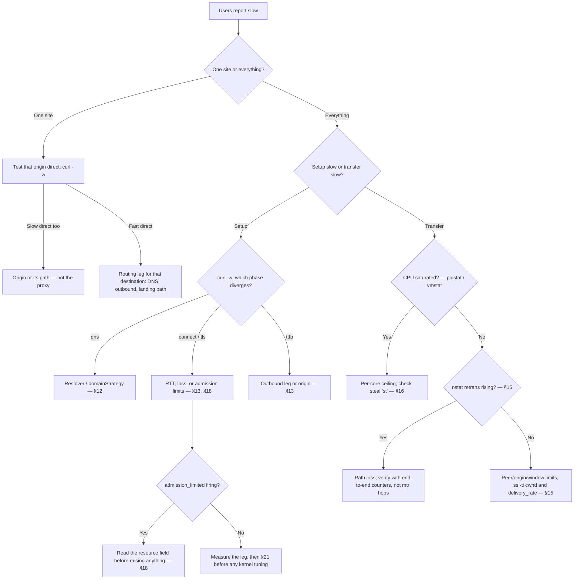

# Capacity Planning, Tuning and Troubleshooting

English | [简体中文](../zh-CN/tuning.md)

This guide is for operators who run rust-reality on a Linux VPS and need to
pick a machine size, set capacity limits safely, and diagnose slowdowns
without reading the source code. It assumes basic Linux administration
(systemd, `journalctl`, editing JSON) and nothing about the implementation.

Every load-bearing statement carries a confidence label:

- **VERIFIED** — confirmed in the v1.0.0 source tree or by the project's
  validation suite: configuration defaults, field names, reload boundaries,
  log event names, and measured runtime behavior.
- **MEASURED-LOCAL** — measured on the project's validation host (Intel Core
  i3-8100 4C/4T, 16 GiB RAM, Debian 13, kernel 6.12, cgroup v2, loopback
  client). Machine classes (1C1G, 2C2G, ...) were emulated with cgroup v2
  CPU and memory limits, so they describe budgets, not any specific
  provider's product. Your hardware and network differ; treat these numbers
  as calibrated examples, not guarantees.
- **VERIFIED-CGROUP** — a MEASURED-LOCAL result from a cgroup-constrained
  machine-class emulation; the constraint held, but no real VPS of that
  class was involved.
- **DERIVED** — arithmetic or direct reasoning from verified and measured
  inputs.
- **UNVERIFIED-EXTERNAL** — depends on real WAN paths, other providers, or
  hardware the project did not test. Validate on your own path before
  acting on these.

## 1. Sixty-second quick start

If you just rented a VPS and want a defensible starting point, use the
tuned profile for your machine class:

| Your VPS | `runtime.profile` | Set `advanced.limits.resourceGovernor.maxConnections` to | Basis (MEASURED-LOCAL) |
| --- | --- | --- | --- |
| 1 vCPU / 1 GiB ("1C1G") | `dedicated` | `8000` | 12000 sessions verified clean at ~694 MiB cgroup peak; shedding began ≈14000; 8000 ≈ 57% of the shed point |
| 1–2 vCPU / 2 GiB | `dedicated` | `16000` | 24000 verified clean at 1.12 GiB cgroup peak; recommendation = 2/3 of verified |
| 2–4 vCPU / 4 GiB | `dedicated` | `24000` | 24000 verified clean; capped at the verified level, not extrapolated |
| 4 vCPU / 8 GiB | `dedicated` | `24000` | 24000 verified clean; the loopback test port ceiling prevented testing higher |

The recommendation arithmetic is DERIVED; the clean/shed points are
MEASURED-LOCAL with `oom_kill=0` in every run.

These are **starting profiles validated on the tested standalone/Direct
workload** (setup churn + 512 MiB bulk transfer + idle-connection ladder),
on a topology where every session routes to the direct outbound. They are
not universal production capacities: a mixed-workload validation phase is
needed before stronger claims. `directBarrier.maxConcurrent` needs no
change on these profiles: it bounds concurrent Direct dial attempts, and
an established session holds no barrier permit (§3). §28 shows how to
derive every value for one specific host.

Two rules before anything else:

1. **The defaults are safe on every machine above, and the session ceiling
   is `maxConnections`.** `advanced.limits.resourceGovernor.maxConnections` defaults
   to 16384. `advanced.limits.directBarrier.maxConcurrent` (default 2048) bounds
   concurrent Direct dial attempts only: the barrier permit is released as
   soon as the dial completes, so an established session consumes no barrier
   capacity. (v1.0.0 held the permit for the whole Direct session, so on a
   standalone/Direct node session 2049 was fast-rejected even with
   `maxConnections` at 16384 — issue #26, fixed after v1.0.0.) Raising real
   session capacity means raising `maxConnections`, then restarting: it is
   a restart-required setting (see §10).
2. **A policy block, when present, must be complete.** The validator
   rejects a `advanced.limits.resourceGovernor` object that contains only the keys
   you changed (VERIFIED with `check`). Edit values inside the full block
   that `config generate` emits; do not paste a two-key fragment.

### Automatic measured starting policy

The table above is the manual, portable baseline. On the deployment host,
v1.3 can derive a more specific starting policy without touching identity or
security configuration:

```shell
sudo -u rust-reality rust-reality config autotune \
  --config /etc/rust-reality/config.json \
  --output /etc/rust-reality/config.tuned.json \
  --report /var/lib/rust-reality/autotune.json \
  --scratch-directory /var/lib/rust-reality
rust-reality check --config /etc/rust-reality/config.tuned.json
diff -u /etc/rust-reality/config.json /etc/rust-reality/config.tuned.json
```

Add `--dedicated` only when the service exclusively owns the host or its
cgroup. The command observes affinity/cgroup CPU, cgroup memory, inherited FD
limits, protocol hot paths, scratch-filesystem throughput, and both directions
of TCP loopback. It changes only `advanced.limits.resourceGovernor`,
`advanced.limits.directBarrier`, and `advanced.limits.relay`; UUIDs and their short IDs, private
keys, listeners, routing, logging, cover targets, and all timeout values remain
equivalent after JSON decoding. The original file is never overwritten, both
outputs are atomic owner-only files, and the report records every input and
selected value (VERIFIED).

Automatic tuning is a measured **starting policy**, not a production load
test. Loopback cannot observe WAN RTT/loss, provider shaping, destination
behavior, or your traffic mix. Review the diff, retain the report, validate
with `check`/`self-test`, and use the manual method in §28 plus canary load to
raise any limit further. Autotune deliberately does not enable VLESS
Encryption or change any wire/security protocol.

Quick reference — first command for each symptom:

| Symptom | First command | What to look for |
| --- | --- | --- |
| Server will not start / reload rejected | `rust-reality check --config /etc/rust-reality/config.json` | The validator-owned JSON path in the error |
| Everything is slow | `vmstat 1` (5 samples) | `us`+`sy` near 100 (CPU), `st` above ~5 (noisy neighbors), `si`/`so` non-zero (swapping) |
| Connects slow, transfers fast | `curl -w` timing breakdown (§13) | Which phase (`dns`/`connect`/`tls`/`ttfb`) dominates |
| Rejections under load | `journalctl -u rust-reality --since -15min` | `admission_limited` and its `resource` field (§18) |
| Memory climbing | `cat /sys/fs/cgroup/system.slice/rust-reality.service/memory.current` (adjust scope) | `memory.current` vs `memory.max`, trend over minutes |
| Worked yesterday, "auth failed" today | `timedatectl` | `System clock synchronized: no` or a large offset (§20) |
| Throughput below the VPS plan | `nstat -az` before/after a transfer (§15) | `TcpRetransSegs` and `TcpExtTCPLostRetransmit` deltas |
| One site slow, everything else fast | Same `curl -w` test direct and through the tunnel | Whether the slowdown exists without the proxy (§24) |

## 2. Terminology

- **1C1G, 1H1G, and friends** are colloquial size names: 1 vCPU ("core" or
  "hardware thread") and 1 GiB RAM. Providers disagree about what a vCPU
  is; treat the class as a budget, not a promise.
- **Connections are not users.** One human with one phone can hold dozens
  of concurrent connections (an app refresh storm, a browser with many
  tabs). Size for concurrent *sessions*, not subscriber count.
- **Configured UUIDs are not connections.** Adding the 1000th user to the
  configuration costs routing-table memory, not per-user runtime slots. The
  validation suite measured 1000 UUIDs with 72 routing rules at the same
  setup rate as a minimal config (896 conn/s, MEASURED-LOCAL).
- **vCPU variability is real.** On shared hosts, hypervisor *steal time*
  (the `st` column in `vmstat`) is CPU your VPS paid for but did not get.
  Two "1 vCPU" plans from different providers can differ measurably
  (UNVERIFIED-EXTERNAL — see §16 for how to check).

## 3. How capacity works

At any moment, the effective concurrent-session ceiling is:

```
min( admission ceiling,  FD budget,  memory budget,  CPU-for-your-SLO,  network )
```

Whichever term is smallest wins, and raising any other term changes
nothing. Concretely:

- **Admission ceiling** — `advanced.limits.resourceGovernor.maxConnections` (default
  16384) is the global accepted-session ceiling.
  `advanced.limits.directBarrier.maxConcurrent` (default 2048) bounds only
  *in-flight* Direct dial attempts: the permit is acquired on the
  direct-outbound path and released the moment the dial completes, so an
  established session consumes no barrier capacity, and sessions routed to
  SOCKS5 or NXR outbounds never acquire one (VERIFIED,
  `src/server/outbound.rs`). (v1.0.0 held the permit for the whole Direct
  session, making 2048 the effective session ceiling on standalone/Direct
  nodes — issue #26, fixed after v1.0.0; the measured "session 2049
  fast-rejected" plateau was recorded against that behavior.)
- **FD budget** — the server derives a descriptor budget at startup from
  `RLIMIT_NOFILE`, minus fixed reserves and safety headroom, and reports it
  once as `descriptor_budget_report` (§6). Steady state costs ≈2 FDs per
  live session (MEASURED-LOCAL: 48015 peak FDs at 24000 sessions).
- **Memory budget** — each idle session costs ≈47 KiB of cgroup memory
  (MEASURED-LOCAL). Base cost is small: ≈5.7 MiB idle RSS, ≈33 MiB with the
  geo assets loaded (assets alone ≈27 MiB). Buffer pool growth adds up to ≈200–300 MiB (DERIVED from pool ceilings)
  transiently during 32-connection bulk transfer (all MEASURED-LOCAL).
- **CPU for your SLO** — setup costs ≈0.6 ms of server CPU per connection
  and framed relay costs ≈0.55 CPU-s per GiB moved (MEASURED-LOCAL). CPU
  buys *rate* (setups per second, GiB per second); it does not buy *session
  count*.
- **Network** — your plan's bandwidth and the path's RTT/loss. Frequently
  the real ceiling on cheap plans (§24, case study 1).

The scaling consequence: **CPU and RAM buy different things.** CPU scales
handshake, crypto, and framed-relay work; RAM and FDs scale live-connection
count. A 1C4G machine is not better than 2C2G for setup rate — both have
the memory for far more sessions than one vCPU can set up, and 2C2G has
twice the CPU. Conversely, 8C1G is still memory- and FD-bound: on 1 GiB the measured
evidence is 12000 sessions clean with shedding beginning ≈14000
(MEASURED-LOCAL, 1C1G) — no matter how many cores sit idle.

Measured anchors (MEASURED-LOCAL, identical across all classes 1C1G→4C8G):
≈800 conn/s setup churn, ≈1.6 GB/s framed with 32 connections, ≈1 GB/s
single-stream. These were harness-client-bound — CPU was *not* the binding
constraint in those tests — so do not read them as per-class ceilings.

## 4. Machine profiles

VERIFIED-CGROUP **starting profiles for the tested standalone/Direct
workload** (setup churn + 512 MiB bulk transfer + idle-connection ladder on
a node where every session routes to the direct outbound), all in
`dedicated` mode inside cgroup v2 scopes, with `oom_kill=0` in every run
(MEASURED-LOCAL):

| Class | Default policy | Tuned profile (`maxConnections`) | Verified clean | First shedding/pressure | Peak cgroup memory at verified level |
| --- | --- | --- | --- | --- | --- |
| 1C1G | safe | **8000** | 12000 | ≈14000 | 694 MiB @ 12000 |
| 1C2G | safe | **16000** | 24000 | none observed | 1.12 GiB @ 24000 |
| 2C2G | safe | **16000** | 24000 | none observed | 1.12 GiB @ 24000 |
| 2C4G | safe | **24000** | 24000 | none observed | 1.12 GiB @ 24000 |
| 4C4G | safe | **24000** | 24000 | none observed | 1.13 GiB @ 24000 |
| 4C8G | safe | **24000** | 24000 | none observed | 1.12 GiB @ 24000 |

Notes on reading this table:

- **Scope of the evidence.** These are starting profiles, not universal
  production capacities, validated on a topology where every session took
  the Direct path — and recorded against the v1.0.0 session-lifetime
  barrier behavior (issue #26). After the dial-phase fix the barrier no
  longer caps established sessions, so the tuned profiles only raise
  `maxConnections`; `directBarrier.maxConcurrent` keeps its default unless
  your dial *rate* demands otherwise (§3, §28). A mixed-workload validation
  phase is needed before claims stronger than these.
- **"Verified clean"** means the full load level completed with no
  admission shedding, no pressure events, and no OOM. **Recommendations are
  deliberately below the breaking point**: 8000 ≈ 57% of the 1C1G shed
  point; 16000 = 2/3 of the 2 GiB verified level; 24000 is capped at the
  verified level and never extrapolated (DERIVED policy).
- **4C8G is not a stronger claim than 4C4G.** The loopback harness ran out
  of ephemeral ports before the server ran out of anything. Higher session
  counts on bigger memory are plausible but UNVERIFIED-EXTERNAL.
- **Conservative vs balanced.** The tuned profiles above are the balanced
  choice: they trade the synthetic maximum for headroom that absorbs
  connection bursts, kernel memory the process does not control, and noisy
  neighbors. If you value stability over peak numbers, run one class lower
  than your hardware. If you run above the tuned profile, you are in
  unverified territory — watch `resource_pressure_changed` and
  `memory.current` continuously.
- **Standard mode on 1 GiB is the trap to avoid.** It survived 23000
  sessions in testing, but pinned at `memory.max` with zero headroom
  (MEASURED-LOCAL). On small instances, use `dedicated` mode with the 1C1G
  profile instead (§5).

## 5. `standard` vs `dedicated` resource mode

`runtime.profile` (`shared`/`dedicated`, or `auto` detection) controls how
the server sizes itself. Hot-reloadable: no — changing it requires a
restart (§10).

**`standard`** is for a shared host: rust-reality is one tenant among
several. It derives every budget from the inherited limits, conservatively:
descriptor safety headroom is `limit/16` of `RLIMIT_NOFILE`, and it does
not assume it owns the machine's memory (VERIFIED).

**`dedicated`** is for a VPS or cgroup that rust-reality owns. At startup
it (VERIFIED):

- reads the cgroup v2 CPU and memory budgets: `machine_report` shows
  `cpu_quota_us`/`cpu_period_us`, `available_cpus` derived from the quota,
  `memory_total` taken from the cgroup limit with
  `memory_source: "cgroup_v2"`;
- attempts to raise the soft `RLIMIT_NOFILE` toward the hard limit
  (`fd_soft_raise_attempted`, `fd_soft_limit_raised`,
  `fd_effective_soft_limit` in `machine_report`);
- reserves a larger descriptor safety headroom, `limit/10` instead of
  `limit/16` (a bigger safety margin, not a relaxation);
- runs the memory-pressure monitor against the cgroup limit.

**`dedicated` does not disable any limit.** Every admission limit, relay
memory ceiling, and pressure watermark still applies; the mode only changes
what the budgets are derived from.

What to check at startup (VERIFIED event names):

```
journalctl -u rust-reality --since -5min | grep -E 'machine_report|descriptor_budget_report'
```

- In `machine_report`: does `memory_source` say `cgroup_v2` and does
  `memory_total` match the VPS size (or the cgroup limit, if you set one)?
  Does `available_cpus` match what you paid for? If the provider gives you
  less CPU than the plan promises, this line shows it.
- In `descriptor_budget_report`: `fd_effective_budget` is the descriptor
  pool the server will actually use; `fd_clamped: true` means your
  configured peak exceeds the derived budget (§6).

## 6. File-descriptor capacity

The real per-session accounting (MEASURED-LOCAL): a live proxied session
holds **2 sockets** (client-facing and outbound) — 48015 peak FDs at 24000
sessions. On top of that come the listener sockets, log file, geo-asset
files, DNS sockets, and the relay pipe pool, plus the fixed reserve
(`fd_fixed_reserve`) and safety headroom (`fd_safety_headroom`: limit/16 in
`standard`, limit/10 in `dedicated`) that the server subtracts before
admitting any work.

Enabled cover/Handoff/NXR/SOCKS5 warm pools add up to `maxReady` speculative
FDs per fixed endpoint and `maxConnecting` transient dials, all inside the
same measured budget and process authority. LANDING also holds accepted
zero-byte Handoff/NXR sockets under `maxPreAuthIdleConnections`. These are
latency reserves, not sessions: pressure drains them first. Account for the
number of configured endpoints rather than multiplying only by live users.

Practical rules:

- **Trust `descriptor_budget_report`, not ulimit arithmetic.** The server
  measures `RLIMIT_NOFILE` at startup, subtracts reserves it alone knows
  about, and prints the result: `fd_effective_budget` is the number that
  governs admission. If `fd_clamped` is `true`, your configured
  `maxConnections` exceeds the budget and the server clamped it;
  `fd_recommended_soft_limit` tells you the soft limit that would avoid
  clamping (VERIFIED field names).
- **The systemd unit sets the ceiling, the server sets the budget.** The
  shipped unit (`deploy/rust-reality.service`) sets
  `LimitNOFILE=1048576` (VERIFIED). Raising it further is harmless; the
  server still derives its own, smaller budget. Verify what the process
  actually has:
  ```
  systemctl show rust-reality -p LimitNOFILE
  cat /proc/$(pgrep -x rust-reality)/limits | grep 'open files'
  ls /proc/$(pgrep -x rust-reality)/fd | wc -l   # current usage
  ```
- **Descriptor pressure with free RAM means the FD budget, not memory, is
  the binding term** — see the symptom table (§23).

## 7. Memory model

Four different numbers are all called "memory"; confusing them causes bad
tuning decisions:

- **Ceilings** — configured maxima: `maxRelayMemoryBytes` (default
  536870912 = 512 MiB), the pool sizes below, the cgroup `memory.max`.
  Nothing is allocated just because a ceiling exists.
- **Retained pools** — capacity the server keeps after first use instead of
  returning it: relay buffers and pipes. Reserved, not steady-state.
- **RSS** — what the process's pages report in `/proc/PID/status`
  (`VmRSS`) or `free -h`. Excludes some kernel memory held on the process's
  behalf.
- **cgroup memory** — `memory.current`: what the OOM killer actually
  judges. Includes page cache and **kernel pipe memory**, which is why
  `memory.current` can exceed RSS during heavy relay (VERIFIED mechanism;
  observed as a few hundred MiB of transient growth (DERIVED) during 32-connection bulk
  transfer, MEASURED-LOCAL).

The validator's relay-memory formula (VERIFIED):

```
buffered pool  = maxPooledBuffers × bufferBytes        = 4096 × 32768      = 128 MiB
pipe pool (pipePool=true)  = maxPooledPipes × 2 × 512 KiB = 256 × 2 × 512 KiB  = 256 MiB
pipe pool (pipePool=false) = maxSpliceRelays × 4 × 512 KiB = 256 × 4 × 512 KiB = 512 MiB
total required ≤ maxRelayMemoryBytes (default 512 MiB)
```

(The products are DERIVED arithmetic on the VERIFIED formula and defaults.
Note the `pipePool=false` row exceeds the default `maxRelayMemoryBytes` at
the default `maxSpliceRelays`: disabling the pool requires raising the
budget or lowering `maxSpliceRelays`.)

A steady-state budget for planning (DERIVED from MEASURED-LOCAL inputs):

```
memory ≈ 33 MiB (server + geo assets)
       + 47 KiB × live sessions
       + up to ~300 MiB transient relay pools under bulk load
```

**When memory is tight, do not lower `bufferBytes` first.** A smaller
buffer buys almost nothing (the pool ceiling, not the buffer size,
dominates: 4096 × 32 KiB = 128 MiB) and costs throughput on high-BDP paths.
Reduce concurrency (`maxConnections`) or the
pool ceilings (`maxPooledBuffers`, `maxPooledPipes`) instead, and keep the
validator formula ≤ `maxRelayMemoryBytes`.

## 8. Replay and nonce capacity

Two bounded anti-replay tables exist, and they fail in different,
operationally important ways (VERIFIED against v1.0 source):

- **REALITY (client-facing):** `advanced.limits.resourceGovernor.maxReplayEntries`
  (default 65536) and `replayRetentionMs` (default 120000). An entry
  records a seen handshake for the retention window so a replayed handshake
  is rejected.
- **NXR (node-to-node):** `maxNonceEntries` (default 65536) and
  `nonceRetentionSeconds` (default 120) on the NXR inbound. Changing these
  two requires a restart (§10).

Operational rules:

- **Exhaustion behavior differs per protocol.** When the REALITY replay
  table cannot reserve an entry, the new handshake is *silently treated as
  camouflage traffic and relayed to the cover target* (consuming
  `maxFallbacks` slots) — there is no admission event. When the NXR nonce
  table is full, the connection is rejected with
  `connection_rejected reason: "authentication"`. Neither overwrites old
  entries.
- **Size the table for the window, not the second.** Arrivals accumulate
  over the whole retention window: at the measured ≈800 conn/s churn
  (MEASURED-LOCAL), 120 s needs ≈96,000 entries — *above* the 65536
  default, so the defaults sustain ≈550 conn/s of new authenticated
  connections continuously (DERIVED: 65536/120). Sustained churn above
  that, with `maxFallbacks` pressure or NXR `authentication` rejections,
  means either an abnormal handshake flood or a table sized too small for
  the load — raise `maxReplayEntries`/`maxNonceEntries` (restart) rather
  than shrinking the window.
- **Do not shrink the retention window to save memory.** The window *is*
  the replay protection: a replayed credential inside the window is only
  detectable because the entry is still there. The tables are bounded and
  small relative to session memory (47 KiB per live session dwarfs them).
  If you need the memory, take it from concurrency, not from anti-replay.

## 9. Timeouts are liveness controls

Every timeout in the policy exists to bound how long a stalled peer can
hold a limited slot — a handshake slot, a crypto slot, an FD. They are not
performance knobs.

Defaults (VERIFIED):

| Field | Default (ms) | Bounds |
| --- | --- | --- |
| `clientHelloTimeoutMs` | 3000 | Waiting for the client's first TLS message |
| `handshakeTimeoutMs` | 10000 | Whole authentication handshake |
| `connectTimeoutMs` | 10000 | Outbound connect to the destination/next hop |
| `fallbackTimeoutMs` | 120000 | A fallback (cover) connection's lifetime |
| Handoff/NXR `preAuthIdleTimeoutMs` | 60000 | Zero protocol bytes on a warm LANDING socket |
| Handoff/NXR `authenticationTimeoutMs` | 3000 | Authentication after the first protocol byte |
| NXR `connectTimeoutMs` | 10000 | Landing's connect to the destination |
| `dns.timeoutMs` | 5000 | One DNS resolution |

- **Raise** only for genuinely slow paths you have measured: high-RTT
  international links where 3 s is not enough for a ClientHello to arrive,
  or a resolver that legitimately answers in 2–4 s. Measure first (§13),
  then raise the specific timeout, modestly.
- **Lowering** a timeout does not make anything faster; it only kills
  slow-but-legitimate clients sooner.
- Keep `preAuthIdleTimeoutMs` longer than the LINE pool's effective ready
  lifetime plus authentication headroom. Do not widen
  `authenticationTimeoutMs` to create warm capacity: byte one deliberately
  switches to that short deadline.
- **Raising** a timeout when the real problem is loss or an overloaded
  upstream only hides the problem: stalled peers hold their slots longer,
  so admission limits fill *faster*. If you raised a timeout and
  `connection_rejected` (`timeout`) events increased, that is why (DERIVED mechanism).

## 10. Configuration workflow and reload boundaries

The safe edit cycle (VERIFIED command forms):

```
rust-reality config generate standalone --port 443 \
    --target www.example.com:443 --server-name www.example.com > config.json
# edit config.json: policy block, runtime block, users, routing
rust-reality config format --config config.json
rust-reality check --config config.json
rust-reality self-test --config config.json
# deploy, then reload or restart per the boundary table below
```

`check` validates structure and cross-field rules without starting the
server; `self-test` additionally probes the REALITY target and routing
assembly. Neither replaces watching the first minutes of real traffic.

**Reload boundaries** (VERIFIED):

| Hot-reloadable (`systemctl reload`) | Restart required |
| --- | --- |
| logging, assets, DNS timeout | listener topology (`mode`, addresses, ports, inbound count) |
| VLESS users / REALITY state | `runtime` (including `profile` and `statusFile`) |
| outbounds / routing | `network.dial`, `advanced.limits.resourceGovernor` |
| NXR keys and timeouts — only when replay capacity is unchanged | `advanced.limits.directBarrier`, `advanced.limits.relay` |
| | NXR `maxNonceEntries` / `nonceRetentionSeconds` |

A hot reload that passes validation logs `configuration_published` with the
new generation; a rejected one logs `configuration_rejected` with a
validator-owned JSON path and keeps the old configuration running (VERIFIED
events). After every reload, confirm which of the two you got.

**Worked example — complete tuned policy for 1C1G.** This block, embedded
in a generated standalone config with `"runtime": {"profile": "dedicated",
"tuning": {"mode": "fixed"}}`, passes `check --config`. Only
`maxConnections` differs from the defaults; the rest is shown because every
field marked "required when object present" must be supplied once its
object appears.

```json
"advanced": {
  "limits": {
    "resourceGovernor": {
      "maxConnections": 8000,
      "maxHandshakes": 1024,
      "maxFallbacks": 512,
      "maxCryptoOperations": 128,
      "maxReplayEntries": 65536,
      "maxDnsLookups": 64,
      "replayRetentionMs": 120000,
      "clientHelloTimeoutMs": 3000,
      "handshakeTimeoutMs": 10000,
      "connectTimeoutMs": 10000,
      "fallbackTimeoutMs": 120000
    },
    "directBarrier": {
      "maxConcurrent": 2048,
      "maxPerSecond": 4096
    },
    "relay": {
      "bufferBytes": 32768,
      "maxPooledBuffers": 4096,
      "maxSpliceRelays": 256,
      "maxRelayMemoryBytes": 536870912,
      "splice": true,
      "pipePool": true,
      "maxPooledPipes": 256
    }
  }
}
```

Note the relay block is untouched: on 1 GiB the default pools still fit
(§7 formula: 128 MiB + 256 MiB ≤ 512 MiB ceiling), because the memory
budget is dominated by sessions, not pools. Then restart — `advanced.limits`
is restart-required — and confirm `server_starting`, `machine_report`,
`descriptor_budget_report`, and `listener_started` in the journal.

## 11. REALITY cover selection

Three names that are easy to confuse (VERIFIED semantics):

- **`target`** (`streamSettings.realitySettings.target`): the real TLS
  server rust-reality connects to when a connection is *not* an
  authenticated client — the cover. Fallback traffic is proxied to it.
- **`serverNames`**: the SNI values an authenticated client is allowed to
  present. The client's SNI must match one entry.
- **Client SNI**: what you configure in the client app. It is matched
  against `serverNames`; it is never dialed by the server for authenticated
  sessions.

`serverNames` entries are exact names or **leftmost single-label
wildcards** (VERIFIED in `src/server_name.rs`): `*.example.com` matches
`www.example.com` and nothing else — not `example.com`, not
`a.b.example.com`, and a wildcard needs at least two suffix labels
(`*.example.com` valid, `*.com` rejected). If clients present the apex
name, list the apex explicitly.

**What makes a good target** — properties, not brand names. There is no
universal best-domain list; a domain that is ideal from one country can be
suspicious or slow from another (UNVERIFIED-EXTERNAL). Verify candidates
yourself:

- Speaks TLS 1.3 with a compatible key exchange, on port 443.
- Serves a valid certificate chain for the SNI your clients will present.
- Highly available and low-loss *from your VPS*, and close to it: fallback
  borrows the target live, and every authenticated setup borrows its
  ServerHello — a flaky or distant target degrades your cover and adds to
  every connection's setup latency.
- Plausible: a domain whose traffic profile does not make your server stand
  out.

**Pre-screening with OpenSSL** (tested forms). Run each candidate 10–20
times under `timeout` — one success means nothing:

```
for i in $(seq 1 15); do
  timeout 5 openssl s_client -connect HOST:443 -servername HOST -tls1_3 -brief </dev/null
done
```

Certificate and SAN inspection:

```
openssl s_client -connect HOST:443 -servername HOST -tls1_3 \
    -verify_hostname HOST -verify_return_error -brief </dev/null
openssl s_client -connect HOST:443 -servername HOST -showcerts </dev/null 2>/dev/null \
  | openssl x509 -noout -subject -issuer -dates -ext subjectAltName
openssl s_client -connect HOST:443 -servername HOST -tls1_3 -alpn 'h2,http/1.1' -brief </dev/null
```

**`probe-dest` is the final authority**, not OpenSSL: it checks the target
exactly the way the server will use it (VERIFIED form):

```
rust-reality probe-dest --target HOST:443 --server-name NAME [--timeout-ms 5000]
```

`self-test --config` runs the same probe for the configured target and
reports `compatible: true/false` per destination.

**The cover sits inside every setup, not in the steady-state payload
path.** Every connection — authenticated ones included — dials the cover
target during REALITY setup and reads its ServerHello, which the server
uses to build the REALITY server flight before ClientFinished (VERIFIED,
`src/server/reality.rs`). The cover target therefore affects three things:
setup latency (a cover 200 ms away adds on the order of one cover round
trip to *every* connection setup), handshake compatibility (a target that
fails the probe degrades authenticated setups into fallback), and fallback
traffic. What the cover does *not* do is carry authenticated steady-state
payload: once the session is established, bytes flow
client → rust-reality → your real destination, and the cover's bandwidth
and distance no longer matter (VERIFIED architecture). Pick covers for
plausibility, reliability, and closeness to your VPS, and diagnose
steady-state slowness on the real data path (§13).

## 12. Routing performance and structure

Route evaluation order (VERIFIED): `routing.globalRules` first, then the
matched user group's `rules` in order — **first match wins** — then the
group's `defaultOutbound`.

`domainStrategy` (VERIFIED semantics, `src/server/routing.rs`
`select_with_dns`). DNS runs at all only when the applicable routing
snapshot — the global rules *or* the selected user's rules — actually
contains IP rules (`needs_ip = global_has_ip_rules || user_has_ip_rules`).
Given that:

- **`AsIs`** — never resolve in the router. IP rules can only match targets
  that were already IP literals.
- **`IPIfNonMatch`** (default) — match in memory first; resolve only when
  the decision falls through to the user default, to test IP rules against
  the result. Domain-rule hits never pay for DNS.
- **`IPOnDemand`** — when IP rules exist, resolve before rule evaluation so
  IP rules always apply, and each resolved connection pays for a lookup.

If **no** IP rules exist anywhere, all three strategies behave identically
and no DNS happens at all.

The measured cost of having DNS in the decision path is ≈0.12 ms per
connection (MEASURED-LOCAL); the measured cost of a large routing table was
below measurement sensitivity in the tested configuration — 1000 UUIDs and
72 rules set up at 896 conn/s, the same as a minimal config
(MEASURED-LOCAL). The expensive part is DNS round trips to a slow resolver.
Note that v1.0 accepts exactly `dns.servers = ["system"]` — custom
resolvers are rejected by the validator (VERIFIED,
`src/config/validate.rs`) — so make DNS fast at the OS layer instead: run a
local caching stub (`systemd-resolved` or similar), point
`/etc/resolv.conf` at it, and keep `dns.timeoutMs` honest.

Validated example — three user groups: A direct, B China-direct with an NXR
landing default, C filtered through an upstream SOCKS5. The full config
(routing below plus matching `outbounds` and placeholder UUIDs) passes
`check --config` (VERIFIED). Matcher syntax: `geosite:`/`geoip:` labels
from the community DAT files, `domain:`/`full:`/`keyword:`/`regexp:`
prefixes for domains, CIDRs for IPs.

```json
"outbounds": [
  { "protocol": "direct", "tag": "direct" },
  { "protocol": "blackhole", "tag": "block" },
  { "protocol": "nxr", "tag": "nxr-landing",
    "settings": { "address": "10.0.0.2", "port": 7443,
                  "preSharedKey": "AAAAAAAAAAAAAAAAAAAAAAAAAAAAAAAAAAAAAAAAAAA" } },
  { "protocol": "socks5", "tag": "upstream-socks",
    "settings": { "address": "127.0.0.1", "port": 1080 } }
],
"routing": {
  "domainStrategy": "IPIfNonMatch",
  "globalRules": [
    { "name": "reject-private", "outbound": "block", "ip": ["geoip:private"] }
  ],
  "users": [
    { "name": "group-a-direct",
      "userIds": ["11111111-1111-4111-8111-111111111111"],
      "defaultOutbound": "direct", "rules": [] },
    { "name": "group-b-cn-direct",
      "userIds": ["22222222-2222-4222-8222-222222222222"],
      "defaultOutbound": "nxr-landing",
      "rules": [
        { "name": "cn-direct", "outbound": "direct",
          "domain": ["geosite:cn"], "ip": ["geoip:cn"] }
      ] },
    { "name": "group-c-filtered",
      "userIds": ["33333333-3333-4333-8333-333333333333"],
      "defaultOutbound": "upstream-socks",
      "rules": [
        { "name": "block-ads", "outbound": "block",
          "domain": ["geosite:category-ads-all"] }
      ] }
  ]
}
```

All three UUIDs are placeholders; replace them with the real client IDs.
Outbounds and routing are hot-reloadable, so group and rule changes do not
need a restart (§10).

## 13. Latency diagnosis

Where the time goes, end to end:

```
                 ┌────────────── line node ──────────────┐        ┌─ landing ─┐
client ──RTT A──▶│ REALITY setup │ routing/DNS │ outbound │─RTT B─▶│ NXR auth  │──▶ destination connect ──▶ origin response
                 └───────────────────────────────────────┘  (NXR)  └───────────┘
```

"REALITY setup" above includes a dial to the cover target and reading its
ServerHello, which builds the server flight (§11): the cover's RTT and
availability sit inside the setup segment of *every* connection,
authenticated or not (VERIFIED, `src/server/reality.rs`).

For a standalone deployment there is no RTT B leg; the outbound connect
goes straight to the destination. Every segment is measurable, and the fix
for each is different — so measure before tuning.

**The 60-second procedure:**

1. **Clock:** `timedatectl` — skew breaks authentication before it slows
   anything (§20).
2. **Load:** `vmstat 1 5` — CPU saturated (`us`+`sy`), stolen (`st`), or
   swapping (`si`/`so`)?
3. **Memory:** `free -h`, and `memory.current` vs `memory.max` in the
   service's cgroup (§17).
4. **Phase timing:** the `curl -w` breakdown below, direct and through the
   tunnel.

**Phase timing with curl** (validated form; the `env -u` stripping matters
because a proxy environment variable silently re-routes the "direct" test):

```
env -u HTTP_PROXY -u HTTPS_PROXY -u ALL_PROXY -u NO_PROXY \
    -u http_proxy -u https_proxy -u all_proxy -u no_proxy \
    curl -sS -o /dev/null \
    -w 'dns=%{time_namelookup} connect=%{time_connect} tls=%{time_appconnect} ttfb=%{time_starttransfer} total=%{time_total}\n' \
    https://TARGET/
```

Each field is cumulative from request start:

- `dns` — resolver time. Large here: resolver problem, not a proxy problem.
- `connect` — TCP handshake done. `connect − dns` ≈ one RTT to whatever
  curl dialed.
- `tls` — TLS handshake done. `tls − connect` ≈ the TLS round trips.
- `ttfb` — first response byte. `ttfb − tls` is everything after the
  handshake: routing/DNS inside the proxy, outbound connect, origin
  processing.
- `total` — full body. `total − ttfb` is transfer time (§14's territory).

Then run the same URL **through the tunnel** — via your client app's local
SOCKS port, e.g. `curl --socks5-hostname 127.0.0.1:1080 ...` with the same
`-w` string — and compare field by field. The field where the two diverge
names the guilty segment: divergence in `connect`/`tls` points at the
client↔line leg (RTT A, loss, admission delays); divergence only in `ttfb`
points at routing/DNS, the outbound leg, or the origin.

## 14. Throughput diagnosis

Climb the baseline ladder; stop at the first rung that is already slow —
everything above it will be slow too:

1. **Raw path:** `iperf3` between client network and VPS (or VPS and
   landing), no proxy involved.
2. **Origin direct:** download from the destination with plain `curl`,
   no proxy.
3. **rust-reality, direct outbound:** through the tunnel, one stream, then
   32 streams.
4. **Full path:** through the tunnel with the production routing — e.g.
   line → NXR → landing.
5. **The SOCKS5 variant** of the same path, if you run one, for comparison.
6. **The real application.**

The multi-hop model is approximately `min(legs)` (DERIVED): a chain is as
fast as its slowest leg, and each leg's single-stream speed is roughly its
window divided by its RTT. Two deployment facts to keep in mind:

- **The NXR two-hop tax is small**: ≈3–5% throughput and ≈+0.15 ms CPU per
  connection versus a direct outbound (MEASURED-LOCAL). If your two-hop
  path is 30% slower, the tax is not the cause — a leg is.
- **A slow origin caps every implementation.** If rung 2 is slow, no proxy
  tuning will fix rung 6; both rust-reality and any alternative inherit the
  origin's ceiling (VERIFIED measurement methodology lesson).

**NXR vs SOCKS5 for node-to-node links** (MEASURED-LOCAL, same endpoints):
NXR set up 18% faster at negligible RTT (880 vs 748 conn/s) and carried
11–13% more throughput; with 100 ms injected RTT the gap widened — 36 vs 19
conn/s, p50 setup 218 vs 413 ms (DERIVED: ≈2 RTT vs ≈4 RTT of setup
round trips). If your cross-region link is slow only during setup, and it
runs over SOCKS5, that is expected protocol behavior, not a fault; NXR is
the measured fix.

**Comparing implementations honestly:** match log levels, harness versions,
and payload shape before comparing numbers — at `debug`, per-connection
logging alone fabricated a 25% fallback deficit in the project's own A/B
testing (§19).

## 15. Loss and retransmission

Sample kernel TCP counters around a known transfer (validated commands):

```
nstat -az > /tmp/before.txt
# run the transfer
nstat -az > /tmp/after.txt
diff /tmp/before.txt /tmp/after.txt | grep -E 'TcpRetransSegs|TCPLostRetransmit|TCPFastRetrans'
```

- `TcpRetransSegs` — total retransmits sent; some are normal on any WAN.
- `TcpExtTCPLostRetransmit` — retransmits that were themselves lost: the
  strong signal of real path loss.
- `TcpExtTCPFastRetrans` — fast retransmits; routine loss recovery.

Per-connection state: `ss -ti` shows `rtt`/`rttvar`, `cwnd`, `retrans`,
and on newer kernels `delivery_rate` (field availability is
kernel-dependent). A connection with small `cwnd`, high `rttvar`, and
climbing `retrans` is loss-limited, not CPU-limited. `ss -s` summarizes
socket states; `ip -s link` shows interface drops/errors.

**mtr warning:** intermediate-hop loss in `mtr` is usually ICMP
deprioritization on the hop's control plane, not TCP loss — only the final
hop's loss and your end-to-end `nstat` deltas are evidence. `tracepath`
finds the path MTU; there is no universal correct MTU — measure yours,
especially if the tunnel adds encapsulation. `mtr`, `tracepath`,
`pidstat`, and `perf` are not on minimal Debian installs:
`apt install mtr iputils-tracepath sysstat linux-perf`.

## 16. CPU diagnosis

```
pidstat -p $(pgrep -x rust-reality) 1     # per-process CPU over time (sysstat)
mpstat -P ALL 1                           # per-core view: one core at 100%?
vmstat 1                                  # us/sy split, st (steal), si/so
sudo perf stat -p $(pgrep -x rust-reality) \
    -e task-clock,cycles,instructions,context-switches sleep 10
```

Interpretation:

- **Steal time (`st`)** — on a VPS, `st` persistently above ~5% means the
  hypervisor is not giving you the vCPU you configured; capacity math built
  on the nominal vCPU count will over-promise (UNVERIFIED-EXTERNAL how
  common this is per provider — measure yours). This is the first thing to
  check when a "bigger" VPS performs like a smaller one.
- **High CPU and line rate achieved** — the server is working as intended.
  The question is only whether your SLO is met; if yes, do nothing.
- **High CPU and below target** — you found the binding term. On one vCPU
  the framed relay costs ≈0.55 CPU-s/GiB (MEASURED-LOCAL), so ≈1.6 GB/s of
  framed traffic is about all one core moves; see case study 2 (§24).
- **Low CPU and slow** — the bottleneck is elsewhere: network loss (§15),
  DNS (§12), the peer, or the origin (§14). Adding cores will not help.

## 17. Memory pressure and OOM

```
free -h
grep -E 'VmRSS|VmHWM' /proc/$(pgrep -x rust-reality)/status
cd /sys/fs/cgroup/system.slice/rust-reality.service   # adjust for your scope
cat memory.current memory.max memory.high
cat memory.events          # oom_kill counter
grep -E '^(anon|file|kernel|sock)' memory.stat
```

Reading the evidence:

- **`memory.current` near `memory.max`** with rising
  `resource_pressure_changed` events: the server sees the pressure and is
  shedding load — that is the limits working (§18). If it sustains, your
  profile is too big for the cgroup: drop one class (§4).
- **An OOM kill is not automatically a leak.** Before suspecting one: was
  concurrent load above the validated profile for this class? Did the kill
  coincide with a bulk-transfer burst (the transient pool growth
  growth, §7)? Is the cgroup limit smaller than the RAM the profile
  assumed? Only if all three are clean does a leak investigation start
  (DERIVED decision order).
- **RSS vs cgroup:** pipe memory is kernel memory charged to the cgroup but
  not fully visible in RSS, so `memory.current` legitimately exceeds
  `VmRSS` under relay load (§7). Judge pressure by `memory.current`.
- **Swap:** a swap device as an emergency margin against brief spikes is
  acceptable; **active `si`/`so` in `vmstat` under normal load means the
  machine is undersized** — throughput collapses long before the OOM
  killer fires. Swap is never a substitute for correct limits and a
  correctly sized profile.

## 18. Pressure and log events

rust-reality emits structured JSON events on every sink (stderr, journald,
and file). The operational set (VERIFIED names):

| Event | Meaning | Normal? | Relevant config | Next measurement |
| --- | --- | --- | --- | --- |
| `server_starting` | Process startup began | once per start | — | — |
| `outbound_network_initialized` | Cached route availability and initial outbound primary | once per start | `network.dial` | Do detected families match the host route table? |
| `listener_topology_active` | Exact active/unavailable families for one inbound | once per inbound per start | `inbounds[].listen` | Is `auto` degradation expected? |
| `listener_family_unavailable` | `auto` could not bind one genuinely unavailable family | only on single-family hosts | `inbounds[].listen` | Confirm errno and the active family. |
| `listener_started` | Inbound bound and ready (`tag`, `address`) | once per listener per start | `inbounds` | — |
| `machine_report` | Detected CPU/memory/FD view (dedicated mode) | once per start | `runtime.profile` | `available_cpus`, `memory_total`, `memory_source` match the VPS? (§5) |
| `descriptor_budget_report` | Derived FD budget | once per start | `LimitNOFILE` | `fd_effective_budget`, `fd_clamped` (§6) |
| `relay_backend_report` | Per-backend relay capability, one line each | once per start | `advanced.limits.relay` | a backend `available: false` explains relay CPU |
| `configuration_published` | Hot reload accepted (`generation`) | per reload | hot set (§10) | — |
| `configuration_rejected` | Reload refused; old config still live (`field`) | only on bad edits | the JSON path named | fix and re-`check` |
| `connection_accepted` | TCP accept (debug only) | high volume at debug | `log.level` | — |
| `connection_completed` | Session finished normally (debug only) | high volume at debug | `log.level` | — |
| `connection_closed` | Connection closed (debug only) | high volume at debug | `log.level` | — |
| `connection_rejected` | Rejected, with fixed `reason` category | background noise on a public port | — | rate spikes → probe/attack or misconfig |
| `admission_limited` | The listener-level admission governor refused a new connection (`resource`: `connections`) | **can be the limits working correctly** | `maxConnections` | see below |
| `descriptor_pressure_changed` | FD usage crossed a watermark | only under load | FD budget | `ls /proc/PID/fd \| wc -l` vs `fd_effective_budget` |
| `resource_pressure_changed` | Combined FD/memory pressure state changed | only under load | profile vs class | `memory.current` vs `memory.max` (§17) |
| `adaptive_ceiling_changed` | The adaptive controller moved one soft ceiling (`knob`, `reason`, `from`→`to`, `floor`, `ceiling`) | only in `adaptive` tuning mode, one per transition | `runtime.tuning.mode` | Steady state emits nothing; repeated `low-utilization` moves mean the plan overestimates the host (§29) |
| `adaptive_status_write_failed` | The controller could not rewrite `runtime.statusFile` | only on a broken path | `runtime.statusFile` | Check the parent directory and permissions |

**Do not reflexively raise a limit that is firing.** Refusals during a
connection flood are the governor protecting already-established sessions.
Note where each limit actually surfaces (VERIFIED against v1.0 source):

- `admission_limited` with `resource: "connections"` — the listener-level
  connection governor. Other limits surface in two ways:
- `admission_limited` with `resource: "direct_connections"` plus
  `connection_rejected reason: "resource_limit"` → the Direct dial barrier
  (concurrency, rate, or critical pressure) refused a dial. Raise
  `directBarrier.maxConcurrent`/`maxPerSecond` only if your Direct dial
  rate really demands it (§3, §28); the barrier never limits established
  sessions.
- `reason: "resource_limit"` without the admission event → an admission
  pool (handshakes, fallbacks, crypto work) or the FD budget is exhausted;
  correlate with `descriptor_pressure_changed` to tell FD pressure (§6)
  from governor pressure.
- `reason: "authentication"` → on **NXR** inbounds: a bad key, replayed
  nonce, or clock skew — a traffic/attack signal, not a capacity signal
  (§8, §20). On **REALITY** client-facing inbounds you will usually *not*
  see this event for bad credentials: pre-flight authentication, replay,
  and time failures intentionally become cover fallback — the client is
  relayed to the cover target and consumes `maxFallbacks` slots instead
  (VERIFIED, `src/server/reality.rs`). Watch fallback pressure there, not
  rejection logs.
- `descriptor_pressure_changed` / `resource_pressure_changed` → FD or
  memory watermarks crossed; the server sheds new admissions before it
  breaks. Measure first (`ls /proc/PID/fd | wc -l`, `memory.current`),
  then decide whether the profile or the load is wrong.

## 19. Log levels

Run `info` (or `warn`) in production. `debug` is a temporary diagnostic:
the per-connection events above are emitted only at `debug`, and at high
churn the logging itself measurably distorts the workload — in the
project's own benchmarking, a fallback A/B run at `debug` fabricated a 25%
fallback deficit that vanished when levels were matched (VERIFIED lesson
from the measurement program).

Rules:

- **Match log levels before any A/B comparison.** Different levels =
  different workload = garbage numbers.
- Enable `debug` for a bounded window on a specific question, then return
  to `info`. Logging is hot-reloadable (§10), so no restart is needed.

## 20. Time synchronization

Both authentication schemes compare timestamps against the local clock:

- REALITY: `maxTimeDiffMs` default 60000 (±60 s).
- NXR: `maxTimeDifferenceSeconds` default 30 (±30 s).

**Clock skew looks exactly like an authentication failure**, and the
symptom is protocol-specific: on NXR node links, skewed peers are rejected
with `connection_rejected reason: "authentication"`; on REALITY
client-facing ports, a skewed-but-otherwise-valid client fails pre-flight
authentication and is silently relayed to the cover target — users report
"I get the cover website instead of the proxy," and the only server-side
trace is fallback traffic, not a rejection event (VERIFIED, §18). Skew is
also the classic "worked yesterday, broken today" after a VPS suspend,
migration, or a dead NTP source. Check first:

```
timedatectl        # want: System clock synchronized: yes
```

Fix the clock (`systemd-timesyncd` or `chrony`), on both nodes of a
line/landing pair. **Do not widen the time windows to hide skew** — the
window is the anti-replay guarantee; widening it to tolerate a broken clock
weakens every session to accommodate one misconfigured host (DERIVED
security reasoning from the VERIFIED window semantics).

## 21. High-latency WAN paths

**MEASURE FIRST.** Everything in this section is UNVERIFIED-EXTERNAL until
you reproduce it on your own path. Do not paste sysctl blocks from the
internet into a production proxy.

What to expect as RTT grows (DERIVED from the MEASURED-LOCAL 100 ms points
and round-trip arithmetic):

| Client↔server RTT | Setup feel | Why |
| --- | --- | --- |
| 20 ms | instant | setup round trips cost tens of ms |
| 50 ms | snappy | still well under a second |
| 100 ms | noticeable | measured: NXR p50 setup 218 ms, SOCKS5 p50 413 ms |
| 200 ms | sluggish setup, fine transfer | each setup round trip costs 200 ms; established transfers stop paying setup round trips, but single-flow throughput stays BDP/congestion/loss-sensitive (window ÷ RTT) |

Single-stream throughput on long paths is window-limited:
`throughput ≈ window / RTT`. At 100 ms RTT, a 1 Gbps path needs ≈12.5 MB
in flight (DERIVED BDP); stock receive windows rarely allow that per
stream, so multi-stream transfer (32 connections reached ≈1.6 GB/s in
testing, MEASURED-LOCAL) or a larger window is how long paths get filled.

Diagnosis order, before touching any kernel setting:

1. `curl -w` breakdown — which phase is slow (§13)?
2. `nstat` retransmit deltas — is it loss rather than delay (§15)?
3. Compare the legs — client↔line vs line↔landing vs landing↔destination
   (§14 ladder).
4. Only then consider path-specific TCP tuning.

On socket buffers: this guide deliberately gives no `rmem`/`wmem` recipe.
Linux auto-tuning is usually right; only a measured window-limited path
(`throughput ≈ window / RTT` far below the link, no loss) justifies raising
them, and multi-stream transfer is the simpler fix to try first.

If — and only if — you have a measured loss-driven collapse (rising
`TcpExtTCPLostRetransmit` at low utilization, `ss -ti` showing chronically
small `cwnd`), a congestion-control change such as BBR and a matching qdisc
is a *reasonable experiment*: record the current values first
(`sysctl net.ipv4.tcp_congestion_control`, `tc qdisc show`), apply, re-run
the same measurement, and roll back if the numbers do not improve. This is
an OS-level change with fleet-wide blast radius; rust-reality itself never
mutates sysctls (VERIFIED), so nothing in the server requires or prevents
it.

## 22. Standalone vs line/landing roles

The deployment roles have different resource profiles; do not copy one
node's tuned numbers onto the other.

- **Standalone** — REALITY + VLESS + Vision + routing + direct outbound on
  one box. This is what the §4 profiles were measured on.
- **Line node** — everything standalone does, plus the NXR outbound: full
  TLS/REALITY crypto, geo assets, routing evaluation. The heaviest role;
  size it from §4 as a starting point — but size
  `directBarrier.maxConcurrent` by the share of sessions whose routing
  decision is the direct outbound, which may be zero on a pure NXR-out
  line node (§3, §28).
- **Landing node** — NXR authentication, destination connect, raw relay.
  No REALITY handshake, no geo assets, no routing table: lighter per
  session, but it carries every byte of every flow it terminates, so its
  network and relay budget matter more than its TLS budget (DERIVED from
  the role definitions).

With a **Handoff** topology the roles shift: the line node sheds the
per-byte TLS/Vision work after the one-time transfer and becomes a raw
ciphertext splice relay, while the landing node reconstructs the session
and carries the full TLS workload plus the destination dial.

- **Handoff line node** — REALITY + VLESS + Vision up to the session
  boundary, then pure splice. Loopback measurement on the §4 host class:
  ≈98 ms CPU/GiB download against 549 on the NXR line role
  (MEASURED-LOCAL, single host, no cgroup isolation). Its steady cost is
  syscall-bound splice work, not cryptography — size it like a relay, not
  like a TLS terminator.
- **Handoff landing node** — inherits everything the standalone TLS
  budget carries: record AEAD, Vision framing, destination connect, and
  the relay (≈517 ms CPU/GiB download in the same loopback measurement).
  Size it from §4 as if it were the standalone node for the transferred
  sessions, plus its own listener limits (DERIVED from the role
  definitions and the §4 profiles).

System-total CPU for the chain is roughly flat between the two topologies
(−5.6% download in that loopback A/B), so the choice is about where the
CPU lives, not how much there is; see
[performance.md](performance.md#handoff-line-node-offload-measured-single-host)
for the measured table and its labels.

Measured on equal endpoints (MEASURED-LOCAL): the NXR leg adds ≈3–5%
throughput tax and ≈+0.15 ms CPU per connection over direct — small enough
that a landing node one class smaller than its line node is a reasonable
starting hypothesis, to be confirmed with your own `memory.current` and CPU
measurements (UNVERIFIED-EXTERNAL as a general rule).

## 23. Symptom → cause → action

| Symptom | Most likely cause | First check | Action |
| --- | --- | --- | --- |
| CPU 100%, throughput at line rate | Working as intended — CPU is the binding resource | `pidstat`, link utilization | None if SLO met; more cores or splice-friendly paths if not |
| Low CPU, low throughput, retransmits rising | Path loss, not the server | `nstat` deltas, `ss -ti` | §15; fix the path/MTU, not the config |
| `memory.current` near `memory.max` | Profile too big for the cgroup | §17 decision order | Drop one profile class; verify pool formula ≤ ceiling |
| Descriptor pressure with free RAM | FD budget binds before memory | `descriptor_budget_report`, `fd_clamped` | §6: raise `LimitNOFILE`, check `dedicated` mode, then concurrency |
| Setup slow, transfer fast | Per-connection cost: RTT, DNS-in-path, or pre-auth limits | `curl -w`: `connect`/`tls` vs `ttfb` | §13; check `domainStrategy`, `connection_rejected` |
| NXR setup slow but established flows fast | Setup round trips × line↔landing RTT; or clock skew | RTT between nodes; `timedatectl` both ends | Expected at high RTT (§14); fix skew; don't widen windows |
| Only IP-rule routing is slow | DNS in the decision path | `domainStrategy`, resolver latency | §12: `IPIfNonMatch`, faster OS resolver (local caching stub) |
| Benchmark slow only at `debug` level | Logging overhead | `log.level` in both configs | §19: match levels, re-measure |
| One site slow, all tests fast | That origin or its path, not the proxy | `curl -w` direct to that site (§13) | Origin-side fix; the proxy inherits origin ceilings (§14) |

## 24. Case studies

All six condense validation-program findings into operational narratives.
Narrative framing is illustrative; every cited measurement is real and
MEASURED-LOCAL unless noted.

**Case 1 — "The server is slow": a 1C1G capped by its own network.**
An operator reported the proxy topping out near 60 Mbps with low CPU, low
memory, and clean logs. The ladder (§14) showed rung 1 — raw `iperf3`,
no proxy — also at ≈60 Mbps. The VPS plan's bandwidth cap was the ceiling;
every rung above inherited it. Lesson: always establish the raw-path rung
first. An hour of proxy tuning cannot fix a plan limit. (UNVERIFIED-EXTERNAL
that your provider caps the same way — measure yours.)

**Case 2 — 1C1G at 100% CPU on framed traffic.**
A 1-vCPU node plateaued at ≈1.6 GB/s with 32 connections, its single
core saturated (≈92% CPU measured). The arithmetic: framed relay costs ≈0.55 CPU-s/GiB, so 1.6 GB/s
consumes ≈0.9 of a core — the measured plateau *is* the single-core
framed ceiling, not a bug. Options: accept it (most 1C1G plans have far
less bandwidth than 1.6 GB/s anyway), move to 2 vCPU, or prefer paths that
use the splice/pipe relay backends, which move bytes in the kernel and cost
less CPU — check `relay_backend_report` at startup to confirm those
backends are `available: true` on your kernel.

**Case 3 — 2C2G line node: NXR setup slow, flows fast.**
Setups through a line→landing pair took seconds while established flows
ran at full speed. `curl -w` isolated the delay to the connect phase; the
line↔landing RTT was in the 100 ms class and the landing's resolver added
hundreds of milliseconds per new destination because the line ran
`IPOnDemand` against a distant resolver. The measured NXR setup cost at
100 ms RTT is ≈2 round trips (p50 218 ms); the rest was DNS. Fix: closer
resolver and `IPIfNonMatch`. Setup dropped toward the measured floor.
Clocks were verified (`timedatectl` on both ends) before any tuning — skew
would have looked identical at the NXR layer (§20).

**Case 4 — 1 GiB node flapping under memory pressure.**
A 1C1G in `standard` mode ran 20000+ sessions, sat pinned at
`memory.max`, and logged repeated `resource_pressure_changed`
transitions while clients saw random fast-rejects. In validation, standard
mode on 1 GiB survived 23000 sessions but with zero headroom — alive, not
healthy. Fix applied: `dedicated` mode plus the 1C1G profile
(`maxConnections` 8000). Shedding stopped; peak cgroup
memory at 12000 sessions measured 694 MiB, leaving real margin. Lesson:
"it didn't crash" is not "it fits" — check `memory.current` headroom,
not just survival.

**Case 5 — the 2048-session plateau (v1.0.0, historical).** On v1.0.0, an
operator who raised `maxConnections` to 16384 still saw rejections at ~2048
concurrent sessions, FD count flat at exactly 2×2048+15: the barrier permit
was held for the whole Direct session, so `directBarrier.maxConcurrent`
capped established sessions (issue #26). After the dial-phase fix the
permit is released when the dial completes, and the plateau is gone —
the ceiling is now `maxConnections`, the FD budget, and memory pressure.
Lesson retained: after any capacity change, watch `connection_rejected`'s
`reason` field and the FD plateau — the binding limit is not always the
knob you edited.

**Case 6 — the comparison that wasn't.**
During the project's own benchmark program, a fallback A/B appeared to
show a 25% deficit for one variant. The deficit was fabricated by the
harness: the "slow" run had per-connection `debug` logging enabled, and at
high connection churn the logging itself was the bottleneck. Re-run at
matched `info` levels: no deficit. Lesson for every operator A/B: fix
*every* variable you are not testing — log level, harness version, payload
shape, time of day — before believing a number (§19).

## 25. Safe tuning workflow

One change at a time, each with evidence:

1. **Baseline**: record current config, version, and metrics (setup rate,
   throughput, `memory.current`, pressure events over a representative
   window).
2. **Hypothesis**: write down what you expect to improve and by roughly
   how much, citing the section of this guide that predicts it.
3. **Pick exactly one knob.** Two changes = no attribution.
4. **`config format`** the edited file.
5. **`check --config`** — never skip; the validator catches what eyes miss.
6. **`self-test --config`** — confirms the REALITY target and routing
   still assemble.
7. **Check the reload boundary** (§10): hot reload, or plan a restart
   window.
8. **Apply** in a low-traffic window where possible.
9. **Confirm the transition**: `configuration_published` on reload, or a
   clean `server_starting` → `machine_report` →
   `descriptor_budget_report` → `listener_started` sequence on restart.
10. **Watch 10–15 minutes**: `admission_limited`,
    `descriptor_pressure_changed`, `resource_pressure_changed`,
    `memory.current`.
11. **Re-measure** with the identical harness, payload, and log level as
    the baseline.
12. **Compare**: keep the change only if the expected metric improved *and*
    headroom (memory, FD budget) is intact.
13. **Roll back** otherwise — keep the previous config file; rollback is a
    file copy plus the same reload/restart boundary.
14. **Record** the change and its measured result in your own ops log, then
    return to step 1 for the next knob.

## 26. Limitations of this guide

- All MEASURED-LOCAL numbers come from one validation host (i3-8100,
  16 GiB, Debian 13, kernel 6.12) with machine classes emulated by cgroup
  v2 limits and traffic over loopback. Real providers, kernels, and NICs
  differ.
- WAN behavior — cross-country RTT, loss, provider throttling — is
  UNVERIFIED-EXTERNAL here. The 100 ms points in §14 were measured with
  injected latency on the harness, not on a real intercontinental path.
- Multi-host fleets, ≥8-core machines, and kernels other than the
  validated one are UNVERIFIED-EXTERNAL.
- Recommendations are sized for the validated workload shape (churn plus
  bulk transfer). A workload that is 100% long-lived bulk streams weights
  the memory model differently; re-derive from §7 if yours differs.

## 27. "Slow?" — decision tree



When the tree points at a limit, re-read the matching section before
changing it. When it points at the network, believe end-to-end counters
over traceroute aesthetics.

## 28. Fitting a config to one unknown host

The §4 profiles are starting points validated on one specific
standalone/Direct workload. This section is the method for deriving a
config for *your* host when it does not match that picture. Every number
below either cites a measurement from this guide or tells you which command
produces it — there are no CPU×constant formulas, because no such constant
is honest.

### 28.1 Fingerprint the host

```
lscpu; nproc                                  # sockets/cores/threads, model
cat /sys/fs/cgroup/cpu.max                    # "MAX 100000" = uncapped; "50000 100000" = half a core
cat /sys/fs/cgroup/cpuset.cpus.effective      # which cores you may run on (cgroup v2)
cat /proc/pressure/cpu                        # PSI: "some" = tasks stalled, "full" = all stalled
vmstat 1 5                                    # us/sy split, st (steal), si/so (swap)
grep MemAvailable /proc/meminfo               # what new work can actually claim
cat /sys/fs/cgroup/memory.current /sys/fs/cgroup/memory.high \
    /sys/fs/cgroup/memory.max /sys/fs/cgroup/memory.events
grep -E '^(anon|file|kernel|sock)' /sys/fs/cgroup/memory.stat
grep 'open files' /proc/self/limits           # RLIMIT_NOFILE your service will inherit
ip -s link                                    # interface drops/errors
ss -s                                         # socket-state summary
ss -ti                                        # per-flow rtt/cwnd/retrans/delivery_rate
```

Read the cgroup files from *inside* the scope the service will run in (for a
systemd service, the service's own cgroup under
`/sys/fs/cgroup/system.slice/...`): `dedicated` mode derives its budgets
from exactly these numbers (§5), so they — not the provider's product page —
are the truth.

### 28.2 Inventory the co-tenants

```
systemctl list-units --state=running --type=service
ps -eo pid,comm,%cpu,rss --sort=-rss | head -20
systemd-cgtop -b -n 1                          # per-cgroup CPU/memory, one snapshot
```

You are looking for who else holds CPU and RSS *right now*, and whether
their load is steady (a database with a stable working set) or bursty (a
CI runner, a cron-heavy neighbor).

### 28.3 Classify the host

- **Whole-host dedicated** — no meaningful co-tenants, uncapped cgroup:
  `dedicated` mode, start from the §4 profile for your class.
- **Dedicated cgroup on a shared host** — you own a slice with hard limits
  (typical for container VPS): `dedicated` mode works *inside* the cgroup;
  it reads the cgroup's CPU quota and memory limit (VERIFIED,
  `machine_report`). Size from the cgroup limits, not the host.
- **Shared, predictable** — co-tenants exist but their usage is measured
  and steady: `standard` mode, or better, give rust-reality its own cgroup
  (28.4) sized from the leftover you measured.
- **Shared, unpredictable** — steal time varies, neighbors unknown:
  smallest defensible envelope, `standard` mode or a tight cgroup, and the
  knee calibration (28.5) is mandatory before you trust any number.

### 28.4 Isolate on shared machines (no universal numbers)

On anything shared, put the service in a cgroup with limits you *derived
from the fingerprint*, then run `dedicated` mode inside it. Example drop-in
(`/etc/systemd/system/rust-reality.service.d/limits.conf`) — the values are
an illustration for one 4C8G host with a database, not a recipe:

```ini
[Service]
CPUQuota=300%        # 3 of 4 cores: co-tenant inventory showed the DB using ≈1
MemoryHigh=3500M     # throttling tripwire below the hard cap
MemoryMax=4G         # 8G total − measured DB working set ≈3G − OS margin
LimitNOFILE=1048576  # covers 3 setup FDs × planned sessions plus reserves (§6)
```

`CPUQuota` comes from cores you can actually spare (28.1 + 28.2);
`MemoryMax` from `MemAvailable` minus the co-tenants' measured working
sets; `MemoryHigh` sits below it so the kernel throttles before it kills;
`LimitNOFILE` covers the 3-descriptor dual-family setup peak per planned
session (2 after setup) plus the fixed reserves. `CPUWeight` (default 100) only matters under contention — raise
it if the proxy must win CPU fights with the co-tenants.

### 28.5 Calibrate the saturation knee

The profiles in §4 were found exactly this way; repeat it on your host:

1. Raise a representative load stepwise (connection churn, then concurrent
   bulk flows, then an idle-session ladder — your own clients, or
   `cargo dev bench profiles`).
2. At each step record: throughput, new connections/s, setup p50/p95/p99
   (`curl -w`, §13), CPU (`pidstat`), steal (`vmstat` `st`), RSS and
   `memory.current`, FD count (`ls /proc/PID/fd | wc -l`), retransmits
   (`nstat`, §15), and the pressure events (`resource_pressure_changed`,
   §18).
3. Find the **knee**: the step where more offered load stops producing
   useful throughput while latency and pressure climb sharply — shedding,
   `memory.current` pinned at `memory.max`, p99 diverging from p50.
4. Set production capacity **below** the knee. The project used ≈57–67% of
   the observed clean/shed points for its starting profiles (§4); that
   ratio is a reasonable starting convention, not a law.

### 28.6 Derive each parameter

Little's-law reasoning, `in-flight ≈ arrival rate × service time`, with
each input measured on your host:

- **`maxConnections`** — from the knee (28.5), bounded by memory
  (33 MiB base with geo assets + ≈47 KiB per live session + up to a few
  hundred MiB of transient pool growth under bulk, MEASURED-LOCAL) and by
  FDs (≈2 per session, §6).
- **`maxHandshakes`** — ≥ target CPS × handshake service time. Measure the
  service time (setup p95 from §13): 500 CPS × 0.5 s ≈ 250 in flight, so
  the default 1024 has 4× margin; a 3 s high-RTT path at the same CPS wants
  ≈1500.
- **`maxCryptoOperations`** — a handshake holds at most one crypto slot at
  a time, so this never needs to exceed `maxHandshakes`; the default 128 is
  ample when the CPU can only set up ≈800 conn/s anyway (MEASURED-LOCAL
  churn anchor, harness-bound).
- **`maxDnsLookups`** — only matters when IP rules put DNS in the decision
  path (§12): DNS-triggering share × CPS × resolver latency. 20% of
  500 CPS against a 50 ms resolver ≈ 5 in flight; the default 64 covers it.
- **`maxReplayEntries`** — ≥ new authenticated CPS × `replayRetentionMs`:
  500 CPS × 120 s = 60 000, just under the 65 536 default; at the measured
  ≈800 conn/s churn the default is *not* enough (§8) — size from your CPS.
- **`directBarrier.maxConcurrent`** — in-flight Direct dial concurrency:
  dial CPS × dial service time (milliseconds), so the default 2048 is
  almost always ample; a pure NXR-out line node never uses it. SOCKS5 and
  NXR outbounds never acquire permits (VERIFIED).
- **`directBarrier.maxPerSecond`** — expected Direct dial rate: Direct
  share × CPS × burst margin; keep it between 1 and 1,000,000,000 because
  the lock-free gate's integral nanosecond clock cannot represent a finer
  refill interval.
- **Relay pools** — `maxPooledBuffers` ≥ the number of *concurrently
  transferring* (not idle) sessions; keep the §7 validator formula ≤
  `maxRelayMemoryBytes` (default 536 870 912).
- **NXR `maxNonceEntries`** — NXR CPS × `nonceRetentionSeconds`, plus
  margin; restart-required (§10).

### 28.7 Five worked derivations

**(A) 1C1G, whole-host dedicated, standalone/Direct.** Use the measured §4
profile directly: `maxConnections` = **8000** (the dial-phase barrier needs
no raise — the default 2048 covers in-flight dials; issue #26's
session-lifetime hold was fixed after v1.0.0) — 12000
verified clean at a 694 MiB cgroup peak, shedding ≈14000, and 8000 ≈ 57%
of the shed point. Why it fits: 33 MiB base + 47 KiB × 8000 ≈ 366 MiB of
sessions + up to ~300 MiB transient pools ≈ 700 MiB < 1 GiB; 2 × 8000 FDs
is far inside the budget the shipped unit allows (§6). `maxReplayEntries`
65536 sustains ≈550 new conn/s (§8) — above this host's measured churn
anchor, so the default stands.

**(B) The same 1C1G, shared with other services.** The co-tenant inventory
shows, say, a steady 300 MiB and half a core spoken for. Two honest
options: `standard` mode (conservative derivation, §5), or a cgroup with
`MemoryMax=768M`, `CPUQuota=75%` and `dedicated` inside. Inside 768 MiB:
768 − 33 − ~300 transient ≈ 435 MiB for sessions ≈ 9000 by memory — but
0.75 of a vCPU will knee far earlier, so start `maxConnections` at
**4000** (half of (A), an untested point chosen conservatively) and only
raise it after your own knee run (28.5). Every
other parameter follows 28.6 from your measured CPS.

**(C) 4C8G shared with a database.** Isolate per 28.4 (`CPUQuota=300%`,
`MemoryMax=4G`, `LimitNOFILE=1048576`), `dedicated` inside the cgroup, and
take the §4 profile of the 4 GiB classes: `maxConnections` =
**24000** — verified clean at a 1.12 GiB cgroup peak, and deliberately
capped at the verified level rather than extrapolated. Memory check:
33 MiB + 47 KiB × 24000 ≈ 1.1 GiB + ~300 MiB transient ≈ 1.4 GiB ≪ 4 GiB,
so the cgroup has real margin; claims above 24000 need your own validation
(the project's harness hit its port ceiling there, §4).

**(D) 2C2G line node, NXR-out emphasis.** Routing sends ~90% of sessions
to the NXR landing and ~10% direct. `maxConnections` = **16000**, the
verified 2C2G standalone starting point, accepted as a starting hypothesis
for the heavier line role (the NXR leg adds ≈3–5% throughput tax and
≈+0.15 ms CPU per connection, MEASURED-LOCAL). `maxConcurrent`: only Direct
dials acquire permits, and only for the dial itself — even 100% Direct
routing at hundreds of CPS fits in the **default 2048**, and a pure
NXR-out line node never uses the barrier at all. `maxPerSecond`: 10% × your CPS (500 → 50/s) ≪ the
4096 default. If the line also *terminates* NXR from other nodes,
`maxNonceEntries` ≥ NXR CPS × 120 s.

**(E) 2C2G landing node.** No REALITY handshake, no geo assets (≈27 MiB
never loaded), no routing, and the direct barrier is never consulted on the
NXR landing path — `maxConcurrent` is irrelevant here. Size by relay FDs
and memory: the same ≈47 KiB + 2 FDs per session anchors apply, so 16000
sessions cost ≈750 MiB + pools (≤512 MiB ceiling, transient) — fits 2 GiB
with margin, matching the §22 observation that a landing can run one class
below its line. The parameter that actually binds is anti-replay:
`maxNonceEntries` ≥ NXR CPS × `nonceRetentionSeconds` — at the measured
≈800 conn/s churn and the 120 s default that is ≈96 000, *above* the 65536
default, so raise it (restart) or cap the accepted NXR churn (§8).

## 29. Adaptive ceilings (`runtime.tuning.mode: "adaptive"`)

The default `startup` tuning mode derives the numeric policy once at startup
and keeps it fixed for the process lifetime. `adaptive` runs the same
derivation and then lets a controller move the *soft* admission ceilings and
the direct-dial rate inside startup-derived bounds, so the server tightens
admission under sustained saturation and relaxes again when the host has
headroom — without ever exceeding what the startup derivation proved safe
for this machine (VERIFIED mechanics, `src/runtime/adaptive.rs`):

- **What moves**: the six `resourceGovernor` ceilings (`maxConnections`,
  `maxHandshakes`, `maxFallbacks`, `maxCryptoOperations`,
  `maxReplayEntries`, `maxDnsLookups`) and the two `directBarrier` limits
  (`maxConcurrent`, `maxPerSecond`). A soft ceiling can only tighten
  admission below the constructed pool; held permits are never revoked, so
  established sessions are unaffected.
- **What never moves**: all timeouts and `replayRetentionMs` (protocol
  security parameters), relay buffer/pool sizes, the descriptor budget,
  listener topology, DNS policy, and the resource profile. These stay
  restart-required on reload, exactly as in the other modes (§10).
- **Bounds**: every knob is capped above by its startup-derived value and
  floored below at the v1.5 built-in default for the field (lowered to the
  startup value when an operator pin sits below the default), so the server
  always keeps a responsive minimum and an operator pin is respected
  exactly.
- **Cadence**: a 5-second tick, decoupled from the 1-second pressure
  monitor. A knob scales up after 3 consecutive ticks at ≥85% utilization
  and down after 6 consecutive ticks at ≤40% — fast to protect, slow to
  relax — with at least 30 s between successive changes to the same knob.
  Steps are ±25% of the startup value, quantized (64 for counts, 16 for the
  dial rate), so small pools still move and large pools do not flap.
- **Critical pressure**: a single tick at critical resource pressure clamps
  every knob to its floor in one step — protection never waits on
  hysteresis. Recovery walks back up through the normal 3-tick hysteresis
  and 30 s dwell.

Observability is transition-based: each knob change emits one
`adaptive_ceiling_changed` event (§18) and nothing is logged per tick. With
`runtime.statusFile` set, the controller additionally rewrites a JSON
snapshot atomically at startup and on every ceiling or pressure transition;
read it with `rust-reality runtime report --status-file <PATH> [--json]`,
which reads the file only and never contacts the running process. Decisions
read the same lock-free counters admission already maintains, so nothing
lands on the hot path.

When to use it: shared or bursty hosts where a static derived plan is either
too optimistic for the bad hours or too conservative for the good ones. When
you need exact, reproducible numbers — capacity certification, A/B
benchmarks — stay on `fixed` or `startup`: adaptive ceilings move, and a
benchmark compares configurations, not moving targets.
