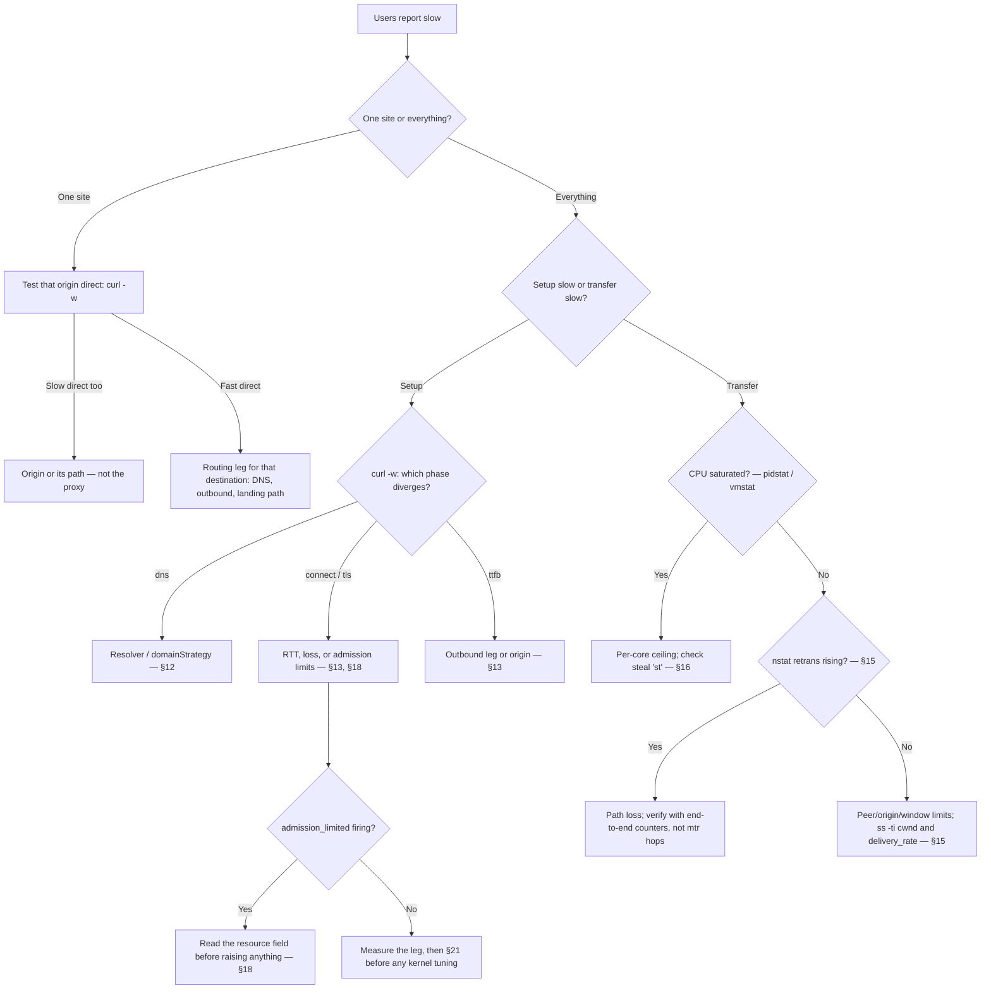

# Capacity Planning, Tuning and Troubleshooting

English | [简体中文](tuning.zh-CN.md)

This guide is for operators who run rust-reality on a Linux VPS and need to
pick a machine size, set capacity limits safely, and diagnose slowdowns
without reading the source code. It assumes basic Linux administration
(systemd, `journalctl`, editing JSON) and nothing about the implementation.

Every load-bearing statement carries a confidence label:

- **VERIFIED** — confirmed in the v1.0.0 source tree or by the project's
  validation suite: configuration defaults, field names, reload boundaries,
  log event names, and measured runtime behavior.
- **MEASURED-LOCAL** — measured on the project's validation host (Intel Core
  i3-8100 4C/4T, 16 GiB RAM, Debian 13, kernel 6.12, cgroup v2, loopback
  client). Machine classes (1C1G, 2C2G, ...) were emulated with cgroup v2
  CPU and memory limits, so they describe budgets, not any specific
  provider's product. Your hardware and network differ; treat these numbers
  as calibrated examples, not guarantees.
- **DERIVED** — arithmetic or direct reasoning from verified and measured
  inputs.
- **UNVERIFIED-EXTERNAL** — depends on real WAN paths, other providers, or
  hardware the project did not test. Validate on your own path before
  acting on these.

## 1. Sixty-second quick start

If you just rented a VPS and want a defensible starting point, use the
tuned profile for your machine class:

| Your VPS | `runtime.resourceMode` | Set `policy.resourceGovernor.maxConnections` **and** `policy.directBarrier.maxConcurrent` both to | Basis (MEASURED-LOCAL) |
| --- | --- | --- | --- |
| 1 vCPU / 1 GiB ("1C1G") | `dedicated` | `8000` | 12000 sessions verified clean at ~694 MiB cgroup peak; shedding began ≈14000; 8000 ≈ 57% of the shed point |
| 1–2 vCPU / 2 GiB | `dedicated` | `16000` | 24000 verified clean at 1.12 GiB cgroup peak; recommendation = 2/3 of verified |
| 2–4 vCPU / 4 GiB | `dedicated` | `24000` | 24000 verified clean; capped at the verified level, not extrapolated |
| 4 vCPU / 8 GiB | `dedicated` | `24000` | 24000 verified clean; the loopback test port ceiling prevented testing higher |

The recommendation arithmetic is DERIVED; the clean/shed points are
MEASURED-LOCAL with `oom_kill=0` in every run.

Two rules before anything else:

1. **The defaults are safe on every machine above, but they cap you at 2048
   live sessions.** `policy.directBarrier.maxConcurrent` defaults to 2048,
   and a barrier permit is held for the whole session lifetime — session
   2049 is fast-rejected even though `maxConnections` defaults to 16384
   (VERIFIED, measured). Raising real session capacity means raising both
   values together, then restarting: both are restart-required (see §10).
2. **A policy block, when present, must be complete.** The validator
   rejects a `policy.resourceGovernor` object that contains only the keys
   you changed (VERIFIED with `check`). Edit values inside the full block
   that `config generate` emits; do not paste a two-key fragment.

Quick reference — first command for each symptom:

| Symptom | First command | What to look for |
| --- | --- | --- |
| Server will not start / reload rejected | `rust-reality check --config /etc/rust-reality/config.json` | The validator-owned JSON path in the error |
| Everything is slow | `vmstat 1` (5 samples) | `us`+`sy` near 100 (CPU), `st` above ~5 (noisy neighbors), `si`/`so` non-zero (swapping) |
| Connects slow, transfers fast | `curl -w` timing breakdown (§13) | Which phase (`dns`/`connect`/`tls`/`ttfb`) dominates |
| Rejections under load | `journalctl -u rust-reality --since -15min` | `admission_limited` and its `resource` field (§18) |
| Memory climbing | `cat /sys/fs/cgroup/system.slice/rust-reality.service/memory.current` (adjust scope) | `memory.current` vs `memory.max`, trend over minutes |
| Worked yesterday, "auth failed" today | `timedatectl` | `System clock synchronized: no` or a large offset (§20) |
| Throughput below the VPS plan | `nstat -az` before/after a transfer (§15) | `TcpRetransSegs` and `TcpExtTCPLostRetransmit` deltas |
| One site slow, everything else fast | Same `curl -w` test direct and through the tunnel | Whether the slowdown exists without the proxy (§24) |

## 2. Terminology

- **1C1G, 1H1G, and friends** are colloquial size names: 1 vCPU ("core" or
  "hardware thread") and 1 GiB RAM. Providers disagree about what a vCPU
  is; treat the class as a budget, not a promise.
- **Connections are not users.** One human with one phone can hold dozens
  of concurrent connections (an app refresh storm, a browser with many
  tabs). Size for concurrent *sessions*, not subscriber count.
- **Configured UUIDs are not connections.** Adding the 1000th user to the
  configuration costs routing-table memory, not per-user runtime slots. The
  validation suite measured 1000 UUIDs with 72 routing rules at the same
  setup rate as a minimal config (896 conn/s, MEASURED-LOCAL).
- **vCPU variability is real.** On shared hosts, hypervisor *steal time*
  (the `st` column in `vmstat`) is CPU your VPS paid for but did not get.
  Two "1 vCPU" plans from different providers can differ measurably
  (UNVERIFIED-EXTERNAL — see §16 for how to check).

## 3. How capacity works

At any moment, the effective concurrent-session ceiling is:

```
min( admission ceiling,  FD budget,  memory budget,  CPU-for-your-SLO,  network )
```

Whichever term is smallest wins, and raising any other term changes
nothing. Concretely:

- **Admission ceiling** — the smaller of
  `policy.resourceGovernor.maxConnections` (default 16384) and
  `policy.directBarrier.maxConcurrent` (default 2048). The barrier permit is
  held for the entire session lifetime, not just during connect, so with
  default policy the *effective* ceiling is 2048 sessions regardless of
  `maxConnections` (VERIFIED, measured: session 2049 is fast-rejected with
  `maxConnections` left at 16384).
- **FD budget** — the server derives a descriptor budget at startup from
  `RLIMIT_NOFILE`, minus fixed reserves and safety headroom, and reports it
  once as `descriptor_budget_report` (§6). Steady state costs ≈2 FDs per
  live session (MEASURED-LOCAL: 48015 peak FDs at 24000 sessions).
- **Memory budget** — each idle session costs ≈47 KiB of cgroup memory
  (MEASURED-LOCAL). Base cost is small: ≈5.7 MiB idle RSS, ≈33 MiB with the
  geo assets loaded (assets alone ≈27 MiB). Buffer pool growth adds up to ≈200–300 MiB (DERIVED from pool ceilings)
  transiently during 32-connection bulk transfer (all MEASURED-LOCAL).
- **CPU for your SLO** — setup costs ≈0.6 ms of server CPU per connection
  and framed relay costs ≈0.55 CPU-s per GiB moved (MEASURED-LOCAL). CPU
  buys *rate* (setups per second, GiB per second); it does not buy *session
  count*.
- **Network** — your plan's bandwidth and the path's RTT/loss. Frequently
  the real ceiling on cheap plans (§24, case study 1).

The scaling consequence: **CPU and RAM buy different things.** CPU scales
handshake, crypto, and framed-relay work; RAM and FDs scale live-connection
count. A 1C4G machine is not better than 2C2G for setup rate — both have
the memory for far more sessions than one vCPU can set up, and 2C2G has
twice the CPU. Conversely, 8C1G is still memory- and FD-bound: 1 GiB holds
≈12000–16000 sessions (DERIVED from 47 KiB/session plus pools and assets)
no matter how many cores sit idle.

Measured anchors (MEASURED-LOCAL, identical across all classes 1C1G→4C8G):
≈800 conn/s setup churn, ≈1.6 GB/s framed with 32 connections, ≈1 GB/s
single-stream. These were harness-client-bound — CPU was *not* the binding
constraint in those tests — so do not read them as per-class ceilings.

## 4. Machine profiles

Validated profiles, all in `dedicated` mode inside cgroup v2 scopes, with
`oom_kill=0` in every run (MEASURED-LOCAL):

| Class | Default policy | Tuned profile (`maxConnections` = `directBarrier.maxConcurrent`) | Verified clean | First shedding/pressure | Peak cgroup memory at verified level |
| --- | --- | --- | --- | --- | --- |
| 1C1G | safe, ≤2048 sessions | **8000** | 12000 | ≈14000 | 694 MiB @ 12000 |
| 1C2G | safe, ≤2048 sessions | **16000** | 24000 | none observed | 1.12 GiB @ 24000 |
| 2C2G | safe, ≤2048 sessions | **16000** | 24000 | none observed | 1.12 GiB @ 24000 |
| 2C4G | safe, ≤2048 sessions | **24000** | 24000 | none observed | 1.12 GiB @ 24000 |
| 4C4G | safe, ≤2048 sessions | **24000** | 24000 | none observed | 1.13 GiB @ 24000 |
| 4C8G | safe, ≤2048 sessions | **24000** | 24000 | none observed | 1.12 GiB @ 24000 |

Notes on reading this table:

- **"Verified clean"** means the full load level completed with no
  admission shedding, no pressure events, and no OOM. **Recommendations are
  deliberately below the breaking point**: 8000 ≈ 57% of the 1C1G shed
  point; 16000 = 2/3 of the 2 GiB verified level; 24000 is capped at the
  verified level and never extrapolated (DERIVED policy).
- **4C8G is not a stronger claim than 4C4G.** The loopback harness ran out
  of ephemeral ports before the server ran out of anything. Higher session
  counts on bigger memory are plausible but UNVERIFIED-EXTERNAL.
- **Conservative vs balanced.** The tuned profiles above are the balanced
  choice: they trade the synthetic maximum for headroom that absorbs
  connection bursts, kernel memory the process does not control, and noisy
  neighbors. If you value stability over peak numbers, run one class lower
  than your hardware. If you run above the tuned profile, you are in
  unverified territory — watch `resource_pressure_changed` and
  `memory.current` continuously.
- **Standard mode on 1 GiB is the trap to avoid.** It survived 23000
  sessions in testing, but pinned at `memory.max` with zero headroom
  (MEASURED-LOCAL). On small instances, use `dedicated` mode with the 1C1G
  profile instead (§5).

## 5. `standard` vs `dedicated` resource mode

`runtime.resourceMode` (default `standard`) controls how the server sizes
itself. Hot-reloadable: no — changing it requires a restart (§10).

**`standard`** is for a shared host: rust-reality is one tenant among
several. It derives every budget from the inherited limits, conservatively:
descriptor safety headroom is `limit/16` of `RLIMIT_NOFILE`, and it does
not assume it owns the machine's memory (VERIFIED).

**`dedicated`** is for a VPS or cgroup that rust-reality owns. At startup
it (VERIFIED):

- reads the cgroup v2 CPU and memory budgets: `machine_report` shows
  `cpu_quota_us`/`cpu_period_us`, `available_cpus` derived from the quota,
  `memory_total` taken from the cgroup limit with
  `memory_source: "cgroup_v2"`;
- attempts to raise the soft `RLIMIT_NOFILE` toward the hard limit
  (`fd_soft_raise_attempted`, `fd_soft_limit_raised`,
  `fd_effective_soft_limit` in `machine_report`);
- relaxes descriptor safety headroom from `limit/16` to `limit/10`;
- runs the memory-pressure monitor against the cgroup limit.

**`dedicated` does not disable any limit.** Every admission limit, relay
memory ceiling, and pressure watermark still applies; the mode only changes
what the budgets are derived from.

What to check at startup (VERIFIED event names):

```
journalctl -u rust-reality --since -5min | grep -E 'machine_report|descriptor_budget_report'
```

- In `machine_report`: does `memory_source` say `cgroup_v2` and does
  `memory_total` match the VPS size (or the cgroup limit, if you set one)?
  Does `available_cpus` match what you paid for? If the provider gives you
  less CPU than the plan promises, this line shows it.
- In `descriptor_budget_report`: `fd_effective_budget` is the descriptor
  pool the server will actually use; `fd_clamped: true` means your
  configured peak exceeds the derived budget (§6).

## 6. File-descriptor capacity

The real per-session accounting (MEASURED-LOCAL): a live proxied session
holds **2 sockets** (client-facing and outbound) — 48015 peak FDs at 24000
sessions. On top of that come the listener sockets, log file, geo-asset
files, DNS sockets, and the relay pipe pool, plus the fixed reserve
(`fd_fixed_reserve`) and safety headroom (`fd_safety_headroom`: limit/16 in
`standard`, limit/10 in `dedicated`) that the server subtracts before
admitting any work.

Practical rules:

- **Trust `descriptor_budget_report`, not ulimit arithmetic.** The server
  measures `RLIMIT_NOFILE` at startup, subtracts reserves it alone knows
  about, and prints the result: `fd_effective_budget` is the number that
  governs admission. If `fd_clamped` is `true`, your configured
  `maxConnections` exceeds the budget and the server clamped it;
  `fd_recommended_soft_limit` tells you the soft limit that would avoid
  clamping (VERIFIED field names).
- **The systemd unit sets the ceiling, the server sets the budget.** The
  shipped unit (`deploy/rust-reality.service`) sets
  `LimitNOFILE=1048576` (VERIFIED). Raising it further is harmless; the
  server still derives its own, smaller budget. Verify what the process
  actually has:
  ```
  systemctl show rust-reality -p LimitNOFILE
  cat /proc/$(pgrep -x rust-reality)/limits | grep 'open files'
  ls /proc/$(pgrep -x rust-reality)/fd | wc -l   # current usage
  ```
- **Descriptor pressure with free RAM means the FD budget, not memory, is
  the binding term** — see the symptom table (§23).

## 7. Memory model

Four different numbers are all called "memory"; confusing them causes bad
tuning decisions:

- **Ceilings** — configured maxima: `maxRelayMemoryBytes` (default
  536870912 = 512 MiB), the pool sizes below, the cgroup `memory.max`.
  Nothing is allocated just because a ceiling exists.
- **Retained pools** — capacity the server keeps after first use instead of
  returning it: relay buffers and pipes. Reserved, not steady-state.
- **RSS** — what the process's pages report in `/proc/PID/status`
  (`VmRSS`) or `free -h`. Excludes some kernel memory held on the process's
  behalf.
- **cgroup memory** — `memory.current`: what the OOM killer actually
  judges. Includes page cache and **kernel pipe memory**, which is why
  `memory.current` can exceed RSS during heavy relay (VERIFIED mechanism;
  observed as a few hundred MiB of transient growth (DERIVED) during 32-connection bulk
  transfer, MEASURED-LOCAL).

The validator's relay-memory formula (VERIFIED):

```
buffered pool  = maxPooledBuffers × bufferBytes        = 4096 × 32768      = 128 MiB
pipe pool (pipePool=true)  = maxPooledPipes × 2 × 256 KiB = 512 × 2 × 256 KiB  = 256 MiB
pipe pool (pipePool=false) = maxSpliceRelays × 4 × 256 KiB = 256 × 4 × 256 KiB = 256 MiB
total required ≤ maxRelayMemoryBytes (default 512 MiB)
```

(The products are DERIVED arithmetic on the VERIFIED formula and defaults.)

A steady-state budget for planning (DERIVED from MEASURED-LOCAL inputs):

```
memory ≈ 33 MiB (server + geo assets)
       + 47 KiB × live sessions
       + up to ~300 MiB transient relay pools under bulk load
```

**When memory is tight, do not lower `bufferBytes` first.** A smaller
buffer buys almost nothing (the pool ceiling, not the buffer size,
dominates: 4096 × 32 KiB = 128 MiB) and costs throughput on high-BDP paths.
Reduce concurrency (`maxConnections`/`directBarrier.maxConcurrent`) or the
pool ceilings (`maxPooledBuffers`, `maxPooledPipes`) instead, and keep the
validator formula ≤ `maxRelayMemoryBytes`.

## 8. Replay and nonce capacity

Two bounded anti-replay tables exist, and they fail in different,
operationally important ways (VERIFIED against v1.0 source):

- **REALITY (client-facing):** `policy.resourceGovernor.maxReplayEntries`
  (default 65536) and `replayRetentionMs` (default 120000). An entry
  records a seen handshake for the retention window so a replayed handshake
  is rejected.
- **NXR (node-to-node):** `maxNonceEntries` (default 65536) and
  `nonceRetentionSeconds` (default 120) on the NXR inbound. Changing these
  two requires a restart (§10).

Operational rules:

- **Exhaustion behavior differs per protocol.** When the REALITY replay
  table cannot reserve an entry, the new handshake is *silently treated as
  camouflage traffic and relayed to the cover target* (consuming
  `maxFallbacks` slots) — there is no admission event. When the NXR nonce
  table is full, the connection is rejected with
  `connection_rejected reason: "authentication"`. Neither overwrites old
  entries.
- **Size the table for the window, not the second.** Arrivals accumulate
  over the whole retention window: at the measured ≈800 conn/s churn
  (MEASURED-LOCAL), 120 s needs ≈96,000 entries — *above* the 65536
  default, so the defaults sustain ≈550 conn/s of new authenticated
  connections continuously (DERIVED: 65536/120). Sustained churn above
  that, with `maxFallbacks` pressure or NXR `authentication` rejections,
  means either an abnormal handshake flood or a table sized too small for
  the load — raise `maxReplayEntries`/`maxNonceEntries` (restart) rather
  than shrinking the window.
- **Do not shrink the retention window to save memory.** The window *is*
  the replay protection: a replayed credential inside the window is only
  detectable because the entry is still there. The tables are bounded and
  small relative to session memory (47 KiB per live session dwarfs them).
  If you need the memory, take it from concurrency, not from anti-replay.

## 9. Timeouts are liveness controls

Every timeout in the policy exists to bound how long a stalled peer can
hold a limited slot — a handshake slot, a crypto slot, an FD. They are not
performance knobs.

Defaults (VERIFIED):

| Field | Default (ms) | Bounds |
| --- | --- | --- |
| `clientHelloTimeoutMs` | 3000 | Waiting for the client's first TLS message |
| `handshakeTimeoutMs` | 10000 | Whole authentication handshake |
| `connectTimeoutMs` | 10000 | Outbound connect to the destination/next hop |
| `fallbackTimeoutMs` | 120000 | A fallback (cover) connection's lifetime |
| NXR `authenticationTimeoutMs` | 3000 | NXR node authentication |
| NXR `connectTimeoutMs` | 10000 | Landing's connect to the destination |
| `dns.timeoutMs` | 5000 | One DNS resolution |

- **Raise** only for genuinely slow paths you have measured: high-RTT
  international links where 3 s is not enough for a ClientHello to arrive,
  or a resolver that legitimately answers in 2–4 s. Measure first (§13),
  then raise the specific timeout, modestly.
- **Lowering** a timeout does not make anything faster; it only kills
  slow-but-legitimate clients sooner.
- **Raising** a timeout when the real problem is loss or an overloaded
  upstream only hides the problem: stalled peers hold their slots longer,
  so admission limits fill *faster*. If you raised a timeout and
  `connection_rejected` (`timeout`) events increased, that is why (DERIVED mechanism).

## 10. Configuration workflow and reload boundaries

The safe edit cycle (VERIFIED command forms):

```
rust-reality config generate standalone --port 443 \
    --target www.example.com:443 --server-name www.example.com > config.json
# edit config.json: policy block, runtime block, users, routing
rust-reality config format --config config.json
rust-reality check --config config.json
rust-reality self-test --config config.json
# deploy, then reload or restart per the boundary table below
```

`check` validates structure and cross-field rules without starting the
server; `self-test` additionally probes the REALITY target and routing
assembly. Neither replaces watching the first minutes of real traffic.

**Reload boundaries** (VERIFIED):

| Hot-reloadable (`systemctl reload`) | Restart required |
| --- | --- |
| logging, assets, DNS timeout | listener topology (addresses, ports, inbound count) |
| VLESS users / REALITY state | `runtime` (including `resourceMode`) |
| outbounds / routing | `policy.resourceGovernor` |
| NXR keys and timeouts — only when replay capacity is unchanged | `policy.directBarrier`, `policy.relay` |
| | NXR `maxNonceEntries` / `nonceRetentionSeconds` |

A hot reload that passes validation logs `configuration_published` with the
new generation; a rejected one logs `configuration_rejected` with a
validator-owned JSON path and keeps the old configuration running (VERIFIED
events). After every reload, confirm which of the two you got.

**Worked example — complete tuned policy for 1C1G.** This block, embedded
in a generated standalone config with `"runtime": {"resourceMode":
"dedicated"}`, passes `check --config` (VERIFIED against the v1.0.0
validator). Only `maxConnections` and `maxConcurrent` differ from the
defaults; the rest is shown because a partial policy object is rejected.

```json
"policy": {
  "resourceGovernor": {
    "maxConnections": 8000,
    "maxHandshakes": 1024,
    "maxFallbacks": 512,
    "maxCryptoOperations": 128,
    "maxReplayEntries": 65536,
    "maxDnsLookups": 64,
    "replayRetentionMs": 120000,
    "clientHelloTimeoutMs": 3000,
    "handshakeTimeoutMs": 10000,
    "connectTimeoutMs": 10000,
    "fallbackTimeoutMs": 120000
  },
  "directBarrier": {
    "maxConcurrent": 8000,
    "maxPerSecond": 4096
  },
  "relay": {
    "bufferBytes": 32768,
    "maxPooledBuffers": 4096,
    "maxSpliceRelays": 256,
    "maxRelayMemoryBytes": 536870912,
    "splice": true,
    "pipePool": true,
    "maxPooledPipes": 512
  }
}
```

Note the relay block is untouched: on 1 GiB the default pools still fit
(§7 formula: 128 MiB + 256 MiB ≤ 512 MiB ceiling), because the memory
budget is dominated by sessions, not pools. Then restart — `policy` is
restart-required — and confirm `server_starting`, `machine_report`,
`descriptor_budget_report`, and `listener_started` in the journal.

## 11. REALITY cover selection

Three names that are easy to confuse (VERIFIED semantics):

- **`target`** (`streamSettings.realitySettings.target`): the real TLS
  server rust-reality connects to when a connection is *not* an
  authenticated client — the cover. Fallback traffic is proxied to it.
- **`serverNames`**: the SNI values an authenticated client is allowed to
  present. The client's SNI must match one entry.
- **Client SNI**: what you configure in the client app. It is matched
  against `serverNames`; it is never dialed by the server for authenticated
  sessions.

`serverNames` entries are exact names or **leftmost single-label
wildcards** (VERIFIED in `src/server_name.rs`): `*.example.com` matches
`www.example.com` and nothing else — not `example.com`, not
`a.b.example.com`, and a wildcard needs at least two suffix labels
(`*.example.com` valid, `*.com` rejected). If clients present the apex
name, list the apex explicitly.

**What makes a good target** — properties, not brand names. There is no
universal best-domain list; a domain that is ideal from one country can be
suspicious or slow from another (UNVERIFIED-EXTERNAL). Verify candidates
yourself:

- Speaks TLS 1.3 with a compatible key exchange, on port 443.
- Serves a valid certificate chain for the SNI your clients will present.
- Highly available and low-loss *from your VPS*: fallback borrows it live,
  so a flaky target degrades your cover.
- Plausible: a domain whose traffic profile does not make your server stand
  out.

**Pre-screening with OpenSSL** (tested forms). Run each candidate 10–20
times under `timeout` — one success means nothing:

```
for i in $(seq 1 15); do
  timeout 5 openssl s_client -connect HOST:443 -servername HOST -tls1_3 -brief </dev/null
done
```

Certificate and SAN inspection:

```
openssl s_client -connect HOST:443 -servername HOST -tls1_3 \
    -verify_hostname HOST -verify_return_error -brief </dev/null
openssl s_client -connect HOST:443 -servername HOST -showcerts </dev/null 2>/dev/null \
  | openssl x509 -noout -subject -issuer -dates -ext subjectAltName
openssl s_client -connect HOST:443 -servername HOST -tls1_3 -alpn 'h2,http/1.1' -brief </dev/null
```

**`probe-dest` is the final authority**, not OpenSSL: it checks the target
exactly the way the server will use it (VERIFIED form):

```
rust-reality probe-dest --target HOST:443 --server-name NAME [--timeout-ms 5000]
```

`self-test --config` runs the same probe for the configured target and
reports `compatible: true/false` per destination.

**Cover latency is not payload throughput.** The target is only dialed for
fallback (non-client) connections. Authenticated payload travels
client → rust-reality → your real destination; the cover's bandwidth and
distance never carry it (VERIFIED architecture). A cover 200 ms away costs
nothing on proxied flows; pick covers for plausibility and reliability, and
diagnose payload slowness on the real data path (§13).

## 12. Routing performance and structure

Route evaluation order (VERIFIED): `routing.globalRules` first, then the
matched user group's `rules` in order — **first match wins** — then the
group's `defaultOutbound`.

`domainStrategy` (VERIFIED semantics):

- **`AsIs`** — never resolve in the router. IP rules can only match targets
  that were already IP literals.
- **`IPIfNonMatch`** (default) — resolve only when no rule matched, to test
  IP rules against the result. Domain-rule hits never pay for DNS.
- **`IPOnDemand`** — resolve every domain target before rule evaluation, so
  IP rules always apply — and every connection pays for a lookup.

The measured cost of having DNS in the decision path is ≈0.12 ms per
connection (MEASURED-LOCAL); the measured cost of a large routing table is
nothing — 1000 UUIDs and 72 rules set up at 896 conn/s, the same as a
minimal config (MEASURED-LOCAL). Complexity is free; DNS round trips to a
slow resolver are not. If you use `IPOnDemand`, point `dns.servers` at a
fast resolver and keep `dns.timeoutMs` honest.

Validated example — three user groups: A direct, B China-direct with an NXR
landing default, C filtered through an upstream SOCKS5. The full config
(routing below plus matching `outbounds` and placeholder UUIDs) passes
`check --config` (VERIFIED). Matcher syntax: `geosite:`/`geoip:` labels
from the community DAT files, `domain:`/`full:`/`keyword:`/`regexp:`
prefixes for domains, CIDRs for IPs.

```json
"outbounds": [
  { "protocol": "direct", "tag": "direct" },
  { "protocol": "blackhole", "tag": "block" },
  { "protocol": "nxr", "tag": "nxr-landing",
    "settings": { "address": "10.0.0.2", "port": 7443,
                  "preSharedKey": "AAAAAAAAAAAAAAAAAAAAAAAAAAAAAAAAAAAAAAAAAAA" } },
  { "protocol": "socks5", "tag": "upstream-socks",
    "settings": { "address": "127.0.0.1", "port": 1080 } }
],
"routing": {
  "domainStrategy": "IPIfNonMatch",
  "globalRules": [
    { "name": "reject-private", "outbound": "block", "ip": ["geoip:private"] }
  ],
  "users": [
    { "name": "group-a-direct",
      "userIds": ["11111111-1111-4111-8111-111111111111"],
      "defaultOutbound": "direct", "rules": [] },
    { "name": "group-b-cn-direct",
      "userIds": ["22222222-2222-4222-8222-222222222222"],
      "defaultOutbound": "nxr-landing",
      "rules": [
        { "name": "cn-direct", "outbound": "direct",
          "domain": ["geosite:cn"], "ip": ["geoip:cn"] }
      ] },
    { "name": "group-c-filtered",
      "userIds": ["33333333-3333-4333-8333-333333333333"],
      "defaultOutbound": "upstream-socks",
      "rules": [
        { "name": "block-ads", "outbound": "block",
          "domain": ["geosite:category-ads-all"] }
      ] }
  ]
}
```

All three UUIDs are placeholders; replace them with the real client IDs.
Outbounds and routing are hot-reloadable, so group and rule changes do not
need a restart (§10).

## 13. Latency diagnosis

Where the time goes, end to end:

```
                 ┌────────────── line node ──────────────┐        ┌─ landing ─┐
client ──RTT A──▶│ REALITY setup │ routing/DNS │ outbound │─RTT B─▶│ NXR auth  │──▶ destination connect ──▶ origin response
                 └───────────────────────────────────────┘  (NXR)  └───────────┘
```

For a standalone deployment there is no RTT B leg; the outbound connect
goes straight to the destination. Every segment is measurable, and the fix
for each is different — so measure before tuning.

**The 60-second procedure:**

1. **Clock:** `timedatectl` — skew breaks authentication before it slows
   anything (§20).
2. **Load:** `vmstat 1 5` — CPU saturated (`us`+`sy`), stolen (`st`), or
   swapping (`si`/`so`)?
3. **Memory:** `free -h`, and `memory.current` vs `memory.max` in the
   service's cgroup (§17).
4. **Phase timing:** the `curl -w` breakdown below, direct and through the
   tunnel.

**Phase timing with curl** (validated form; the `env -u` stripping matters
because a proxy environment variable silently re-routes the "direct" test):

```
env -u HTTP_PROXY -u HTTPS_PROXY -u ALL_PROXY -u NO_PROXY \
    -u http_proxy -u https_proxy -u all_proxy -u no_proxy \
    curl -sS -o /dev/null \
    -w 'dns=%{time_namelookup} connect=%{time_connect} tls=%{time_appconnect} ttfb=%{time_starttransfer} total=%{time_total}\n' \
    https://TARGET/
```

Each field is cumulative from request start:

- `dns` — resolver time. Large here: resolver problem, not a proxy problem.
- `connect` — TCP handshake done. `connect − dns` ≈ one RTT to whatever
  curl dialed.
- `tls` — TLS handshake done. `tls − connect` ≈ the TLS round trips.
- `ttfb` — first response byte. `ttfb − tls` is everything after the
  handshake: routing/DNS inside the proxy, outbound connect, origin
  processing.
- `total` — full body. `total − ttfb` is transfer time (§14's territory).

Then run the same URL **through the tunnel** — via your client app's local
SOCKS port, e.g. `curl --socks5-hostname 127.0.0.1:1080 ...` with the same
`-w` string — and compare field by field. The field where the two diverge
names the guilty segment: divergence in `connect`/`tls` points at the
client↔line leg (RTT A, loss, admission delays); divergence only in `ttfb`
points at routing/DNS, the outbound leg, or the origin.

## 14. Throughput diagnosis

Climb the baseline ladder; stop at the first rung that is already slow —
everything above it will be slow too:

1. **Raw path:** `iperf3` between client network and VPS (or VPS and
   landing), no proxy involved.
2. **Origin direct:** download from the destination with plain `curl`,
   no proxy.
3. **rust-reality, direct outbound:** through the tunnel, one stream, then
   32 streams.
4. **Full path:** through the tunnel with the production routing — e.g.
   line → NXR → landing.
5. **The SOCKS5 variant** of the same path, if you run one, for comparison.
6. **The real application.**

The multi-hop model is approximately `min(legs)` (DERIVED): a chain is as
fast as its slowest leg, and each leg's single-stream speed is roughly its
window divided by its RTT. Two deployment facts to keep in mind:

- **The NXR two-hop tax is small**: ≈3–5% throughput and ≈+0.15 ms CPU per
  connection versus a direct outbound (MEASURED-LOCAL). If your two-hop
  path is 30% slower, the tax is not the cause — a leg is.
- **A slow origin caps every implementation.** If rung 2 is slow, no proxy
  tuning will fix rung 6; both rust-reality and any alternative inherit the
  origin's ceiling (VERIFIED measurement methodology lesson).

**NXR vs SOCKS5 for node-to-node links** (MEASURED-LOCAL, same endpoints):
NXR set up 18% faster at negligible RTT (880 vs 748 conn/s) and carried
11–13% more throughput; with 100 ms injected RTT the gap widened — 36 vs 19
conn/s, p50 setup 218 vs 413 ms (DERIVED: ≈2 RTT vs ≈4 RTT of setup
round trips). If your cross-region link is slow only during setup, and it
runs over SOCKS5, that is expected protocol behavior, not a fault; NXR is
the measured fix.

**Comparing implementations honestly:** match log levels, harness versions,
and payload shape before comparing numbers — at `debug`, per-connection
logging alone fabricated a 25% fallback deficit in the project's own A/B
testing (§19).

## 15. Loss and retransmission

Sample kernel TCP counters around a known transfer (validated commands):

```
nstat -az > /tmp/before.txt
# run the transfer
nstat -az > /tmp/after.txt
diff /tmp/before.txt /tmp/after.txt | grep -E 'TcpRetransSegs|TCPLostRetransmit|TCPFastRetrans'
```

- `TcpRetransSegs` — total retransmits sent; some are normal on any WAN.
- `TcpExtTCPLostRetransmit` — retransmits that were themselves lost: the
  strong signal of real path loss.
- `TcpExtTCPFastRetrans` — fast retransmits; routine loss recovery.

Per-connection state: `ss -ti` shows `rtt`/`rttvar`, `cwnd`, `retrans`,
and on newer kernels `delivery_rate` (field availability is
kernel-dependent). A connection with small `cwnd`, high `rttvar`, and
climbing `retrans` is loss-limited, not CPU-limited. `ss -s` summarizes
socket states; `ip -s link` shows interface drops/errors.

**mtr warning:** intermediate-hop loss in `mtr` is usually ICMP
deprioritization on the hop's control plane, not TCP loss — only the final
hop's loss and your end-to-end `nstat` deltas are evidence. `tracepath`
finds the path MTU; there is no universal correct MTU — measure yours,
especially if the tunnel adds encapsulation. `mtr`, `tracepath`,
`pidstat`, and `perf` are not on minimal Debian installs:
`apt install mtr iputils-tracepath sysstat linux-perf`.

## 16. CPU diagnosis

```
pidstat -p $(pgrep -x rust-reality) 1     # per-process CPU over time (sysstat)
mpstat -P ALL 1                           # per-core view: one core at 100%?
vmstat 1                                  # us/sy split, st (steal), si/so
sudo perf stat -p $(pgrep -x rust-reality) \
    -e task-clock,cycles,instructions,context-switches sleep 10
```

Interpretation:

- **Steal time (`st`)** — on a VPS, `st` persistently above ~5% means the
  hypervisor is not giving you the vCPU you configured; capacity math built
  on the nominal vCPU count will over-promise (UNVERIFIED-EXTERNAL how
  common this is per provider — measure yours). This is the first thing to
  check when a "bigger" VPS performs like a smaller one.
- **High CPU and line rate achieved** — the server is working as intended.
  The question is only whether your SLO is met; if yes, do nothing.
- **High CPU and below target** — you found the binding term. On one vCPU
  the framed relay costs ≈0.55 CPU-s/GiB (MEASURED-LOCAL), so ≈1.6 GB/s of
  framed traffic is about all one core moves; see case study 2 (§24).
- **Low CPU and slow** — the bottleneck is elsewhere: network loss (§15),
  DNS (§12), the peer, or the origin (§14). Adding cores will not help.

## 17. Memory pressure and OOM

```
free -h
grep -E 'VmRSS|VmHWM' /proc/$(pgrep -x rust-reality)/status
cd /sys/fs/cgroup/system.slice/rust-reality.service   # adjust for your scope
cat memory.current memory.max memory.high
cat memory.events          # oom_kill counter
grep -E '^(anon|file|kernel|sock)' memory.stat
```

Reading the evidence:

- **`memory.current` near `memory.max`** with rising
  `resource_pressure_changed` events: the server sees the pressure and is
  shedding load — that is the limits working (§18). If it sustains, your
  profile is too big for the cgroup: drop one class (§4).
- **An OOM kill is not automatically a leak.** Before suspecting one: was
  concurrent load above the validated profile for this class? Did the kill
  coincide with a bulk-transfer burst (the transient pool growth
  growth, §7)? Is the cgroup limit smaller than the RAM the profile
  assumed? Only if all three are clean does a leak investigation start
  (DERIVED decision order).
- **RSS vs cgroup:** pipe memory is kernel memory charged to the cgroup but
  not fully visible in RSS, so `memory.current` legitimately exceeds
  `VmRSS` under relay load (§7). Judge pressure by `memory.current`.
- **Swap:** a swap device as an emergency margin against brief spikes is
  acceptable; **active `si`/`so` in `vmstat` under normal load means the
  machine is undersized** — throughput collapses long before the OOM
  killer fires. Swap is never a substitute for correct limits and a
  correctly sized profile.

## 18. Pressure and log events

rust-reality emits structured JSON events on every sink (stderr, journald,
and file). The operational set (VERIFIED names):

| Event | Meaning | Normal? | Relevant config | Next measurement |
| --- | --- | --- | --- | --- |
| `server_starting` | Process startup began | once per start | — | — |
| `listener_started` | Inbound bound and ready (`tag`, `address`) | once per listener per start | `inbounds` | — |
| `machine_report` | Detected CPU/memory/FD view (dedicated mode) | once per start | `runtime.resourceMode` | `available_cpus`, `memory_total`, `memory_source` match the VPS? (§5) |
| `descriptor_budget_report` | Derived FD budget | once per start | `LimitNOFILE` | `fd_effective_budget`, `fd_clamped` (§6) |
| `relay_backend_report` | Per-backend relay capability, one line each | once per start | `policy.relay` | a backend `available: false` explains relay CPU |
| `configuration_published` | Hot reload accepted (`generation`) | per reload | hot set (§10) | — |
| `configuration_rejected` | Reload refused; old config still live (`field`) | only on bad edits | the JSON path named | fix and re-`check` |
| `connection_accepted` | TCP accept (debug only) | high volume at debug | `log.level` | — |
| `connection_completed` | Session finished normally (debug only) | high volume at debug | `log.level` | — |
| `connection_closed` | Connection closed (debug only) | high volume at debug | `log.level` | — |
| `connection_rejected` | Rejected, with fixed `reason` category | background noise on a public port | — | rate spikes → probe/attack or misconfig |
| `admission_limited` | The listener-level admission governor refused a new connection (`resource`: `connections`) | **can be the limits working correctly** | `maxConnections` | see below |
| `descriptor_pressure_changed` | FD usage crossed a watermark | only under load | FD budget | `ls /proc/PID/fd \| wc -l` vs `fd_effective_budget` |
| `resource_pressure_changed` | Combined FD/memory pressure state changed | only under load | profile vs class | `memory.current` vs `memory.max` (§17) |

**Do not reflexively raise a limit that is firing.** Refusals during a
connection flood are the governor protecting already-established sessions.
Note where each limit actually surfaces (VERIFIED against v1.0 source):

- `admission_limited` with `resource: "connections"` — the listener-level
  connection governor. Other limit categories currently surface as
  `connection_rejected` with a fixed `reason`, not as `admission_limited`:
- `reason: "outbound"` at ~2048 sessions with default policy → the
  session-lifetime barrier permit (`directBarrier.maxConcurrent`); raise it
  together with `maxConnections` if the machine profile allows (§3, §4).
- `reason: "resource_limit"` → an admission pool (handshakes, fallbacks,
  crypto work) or the FD budget is exhausted; correlate with
  `descriptor_pressure_changed` to tell FD pressure (§6) from governor
  pressure.
- `reason: "authentication"` → bad credentials, replayed nonce, or clock
  skew — a traffic/attack signal, not a capacity signal (§8, §20).
- `descriptor_pressure_changed` / `resource_pressure_changed` → FD or
  memory watermarks crossed; the server sheds new admissions before it
  breaks. Measure first (`ls /proc/PID/fd | wc -l`, `memory.current`),
  then decide whether the profile or the load is wrong.

## 19. Log levels

Run `info` (or `warn`) in production. `debug` is a temporary diagnostic:
the per-connection events above are emitted only at `debug`, and at high
churn the logging itself measurably distorts the workload — in the
project's own benchmarking, a fallback A/B run at `debug` fabricated a 25%
fallback deficit that vanished when levels were matched (VERIFIED lesson
from the measurement program).

Rules:

- **Match log levels before any A/B comparison.** Different levels =
  different workload = garbage numbers.
- Enable `debug` for a bounded window on a specific question, then return
  to `info`. Logging is hot-reloadable (§10), so no restart is needed.

## 20. Time synchronization

Both authentication schemes compare timestamps against the local clock:

- REALITY: `maxTimeDiffMs` default 60000 (±60 s).
- NXR: `maxTimeDifferenceSeconds` default 30 (±30 s).

**Clock skew looks exactly like an authentication failure** — valid
clients rejected, `connection_rejected` with an authentication reason. It
is also the classic "worked yesterday, broken today" after a VPS suspend,
migration, or a dead NTP source. Check first:

```
timedatectl        # want: System clock synchronized: yes
```

Fix the clock (`systemd-timesyncd` or `chrony`), on both nodes of a
line/landing pair. **Do not widen the time windows to hide skew** — the
window is the anti-replay guarantee; widening it to tolerate a broken clock
weakens every session to accommodate one misconfigured host (DERIVED
security reasoning from the VERIFIED window semantics).

## 21. High-latency WAN paths

**MEASURE FIRST.** Everything in this section is UNVERIFIED-EXTERNAL until
you reproduce it on your own path. Do not paste sysctl blocks from the
internet into a production proxy.

What to expect as RTT grows (DERIVED from the MEASURED-LOCAL 100 ms points
and round-trip arithmetic):

| Client↔server RTT | Setup feel | Why |
| --- | --- | --- |
| 20 ms | instant | setup round trips cost tens of ms |
| 50 ms | snappy | still well under a second |
| 100 ms | noticeable | measured: NXR p50 setup 218 ms, SOCKS5 p50 413 ms |
| 200 ms | sluggish setup, fine transfer | each setup round trip costs 200 ms; bulk transfer is RTT-insensitive once the window opens |

Single-stream throughput on long paths is window-limited:
`throughput ≈ window / RTT`. At 100 ms RTT, a 1 Gbps path needs ≈12.5 MB
in flight (DERIVED BDP); stock receive windows rarely allow that per
stream, so multi-stream transfer (32 connections reached ≈1.6 GB/s in
testing, MEASURED-LOCAL) or a larger window is how long paths get filled.

Diagnosis order, before touching any kernel setting:

1. `curl -w` breakdown — which phase is slow (§13)?
2. `nstat` retransmit deltas — is it loss rather than delay (§15)?
3. Compare the legs — client↔line vs line↔landing vs landing↔destination
   (§14 ladder).
4. Only then consider path-specific TCP tuning.

On socket buffers: this guide deliberately gives no `rmem`/`wmem` recipe.
Linux auto-tuning is usually right; only a measured window-limited path
(`throughput ≈ window / RTT` far below the link, no loss) justifies raising
them, and multi-stream transfer is the simpler fix to try first.

If — and only if — you have a measured loss-driven collapse (rising
`TcpExtTCPLostRetransmit` at low utilization, `ss -ti` showing chronically
small `cwnd`), a congestion-control change such as BBR and a matching qdisc
is a *reasonable experiment*: record the current values first
(`sysctl net.ipv4.tcp_congestion_control`, `tc qdisc show`), apply, re-run
the same measurement, and roll back if the numbers do not improve. This is
an OS-level change with fleet-wide blast radius; rust-reality itself never
mutates sysctls (VERIFIED), so nothing in the server requires or prevents
it.

## 22. Standalone vs line/landing roles

The deployment roles have different resource profiles; do not copy one
node's tuned numbers onto the other.

- **Standalone** — REALITY + VLESS + Vision + routing + direct outbound on
  one box. This is what the §4 profiles were measured on.
- **Line node** — everything standalone does, plus the NXR outbound: full
  TLS/REALITY crypto, geo assets, routing evaluation. The heaviest role;
  size it from §4.
- **Landing node** — NXR authentication, destination connect, raw relay.
  No REALITY handshake, no geo assets, no routing table: lighter per
  session, but it carries every byte of every flow it terminates, so its
  network and relay budget matter more than its TLS budget (DERIVED from
  the role definitions).

Measured on equal endpoints (MEASURED-LOCAL): the NXR leg adds ≈3–5%
throughput tax and ≈+0.15 ms CPU per connection over direct — small enough
that a landing node one class smaller than its line node is a reasonable
starting hypothesis, to be confirmed with your own `memory.current` and CPU
measurements (UNVERIFIED-EXTERNAL as a general rule).

## 23. Symptom → cause → action

| Symptom | Most likely cause | First check | Action |
| --- | --- | --- | --- |
| CPU 100%, throughput at line rate | Working as intended — CPU is the binding resource | `pidstat`, link utilization | None if SLO met; more cores or splice-friendly paths if not |
| Low CPU, low throughput, retransmits rising | Path loss, not the server | `nstat` deltas, `ss -ti` | §15; fix the path/MTU, not the config |
| `memory.current` near `memory.max` | Profile too big for the cgroup | §17 decision order | Drop one profile class; verify pool formula ≤ ceiling |
| Descriptor pressure with free RAM | FD budget binds before memory | `descriptor_budget_report`, `fd_clamped` | §6: raise `LimitNOFILE`, check `dedicated` mode, then concurrency |
| Setup slow, transfer fast | Per-connection cost: RTT, DNS-in-path, or pre-auth limits | `curl -w`: `connect`/`tls` vs `ttfb` | §13; check `domainStrategy`, `connection_rejected` |
| NXR setup slow but established flows fast | Setup round trips × line↔landing RTT; or clock skew | RTT between nodes; `timedatectl` both ends | Expected at high RTT (§14); fix skew; don't widen windows |
| Only IP-rule routing is slow | DNS in the decision path | `domainStrategy`, resolver latency | §12: `IPIfNonMatch`, faster `dns.servers` |
| Benchmark slow only at `debug` level | Logging overhead | `log.level` in both configs | §19: match levels, re-measure |
| One site slow, all tests fast | That origin or its path, not the proxy | `curl -w` direct to that site (§13) | Origin-side fix; the proxy inherits origin ceilings (§14) |

## 24. Case studies

All six condense validation-program findings into operational narratives.
Narrative framing is illustrative; every cited measurement is real and
MEASURED-LOCAL unless noted.

**Case 1 — "The server is slow": a 1C1G capped by its own network.**
An operator reported the proxy topping out near 60 Mbps with low CPU, low
memory, and clean logs. The ladder (§14) showed rung 1 — raw `iperf3`,
no proxy — also at ≈60 Mbps. The VPS plan's bandwidth cap was the ceiling;
every rung above inherited it. Lesson: always establish the raw-path rung
first. An hour of proxy tuning cannot fix a plan limit. (UNVERIFIED-EXTERNAL
that your provider caps the same way — measure yours.)

**Case 2 — 1C1G at 100% CPU on framed traffic.**
A 1-vCPU node plateaued at ≈1.6 GB/s with 32 connections, its single
core saturated (≈92% CPU measured). The arithmetic: framed relay costs ≈0.55 CPU-s/GiB, so 1.6 GB/s
consumes ≈0.9 of a core — the measured plateau *is* the single-core
framed ceiling, not a bug. Options: accept it (most 1C1G plans have far
less bandwidth than 1.6 GB/s anyway), move to 2 vCPU, or prefer paths that
use the splice/pipe relay backends, which move bytes in the kernel and cost
less CPU — check `relay_backend_report` at startup to confirm those
backends are `available: true` on your kernel.

**Case 3 — 2C2G line node: NXR setup slow, flows fast.**
Setups through a line→landing pair took seconds while established flows
ran at full speed. `curl -w` isolated the delay to the connect phase; the
line↔landing RTT was in the 100 ms class and the landing's resolver added
hundreds of milliseconds per new destination because the line ran
`IPOnDemand` against a distant resolver. The measured NXR setup cost at
100 ms RTT is ≈2 round trips (p50 218 ms); the rest was DNS. Fix: closer
resolver and `IPIfNonMatch`. Setup dropped toward the measured floor.
Clocks were verified (`timedatectl` on both ends) before any tuning — skew
would have looked identical at the NXR layer (§20).

**Case 4 — 1 GiB node flapping under memory pressure.**
A 1C1G in `standard` mode ran 20000+ sessions, sat pinned at
`memory.max`, and logged repeated `resource_pressure_changed`
transitions while clients saw random fast-rejects. In validation, standard
mode on 1 GiB survived 23000 sessions but with zero headroom — alive, not
healthy. Fix applied: `dedicated` mode plus the 1C1G profile
(`maxConnections`/`maxConcurrent` 8000). Shedding stopped; peak cgroup
memory at 12000 sessions measured 694 MiB, leaving real margin. Lesson:
"it didn't crash" is not "it fits" — check `memory.current` headroom,
not just survival.

**Case 5 — the invisible 2048-session ceiling.**
An operator raised `maxConnections` to 16384 for a growing 2C2G node and
still watched clients rejected at ~2000 concurrent sessions:
`connection_rejected` with `reason: "outbound"` (measured in validation:
rejection #2049 onward, FD count flat at exactly 2×2048+15). The default
`directBarrier.maxConcurrent` of 2048 — whose permit is held for the whole
session — was the effective ceiling (§3). Fix: set both knobs to 16000 and
restart (both are restart-required, §10). Verified clean to 24000 sessions
at 1.12 GiB on 2 GiB. Lesson: after any capacity change, watch
`connection_rejected`'s `reason` field and the FD plateau — the binding
limit is not always the knob you edited.

**Case 6 — the comparison that wasn't.**
During the project's own benchmark program, a fallback A/B appeared to
show a 25% deficit for one variant. The deficit was fabricated by the
harness: the "slow" run had per-connection `debug` logging enabled, and at
high connection churn the logging itself was the bottleneck. Re-run at
matched `info` levels: no deficit. Lesson for every operator A/B: fix
*every* variable you are not testing — log level, harness version, payload
shape, time of day — before believing a number (§19).

## 25. Safe tuning workflow

One change at a time, each with evidence:

1. **Baseline**: record current config, version, and metrics (setup rate,
   throughput, `memory.current`, pressure events over a representative
   window).
2. **Hypothesis**: write down what you expect to improve and by roughly
   how much, citing the section of this guide that predicts it.
3. **Pick exactly one knob.** Two changes = no attribution.
4. **`config format`** the edited file.
5. **`check --config`** — never skip; the validator catches what eyes miss.
6. **`self-test --config`** — confirms the REALITY target and routing
   still assemble.
7. **Check the reload boundary** (§10): hot reload, or plan a restart
   window.
8. **Apply** in a low-traffic window where possible.
9. **Confirm the transition**: `configuration_published` on reload, or a
   clean `server_starting` → `machine_report` →
   `descriptor_budget_report` → `listener_started` sequence on restart.
10. **Watch 10–15 minutes**: `admission_limited`,
    `descriptor_pressure_changed`, `resource_pressure_changed`,
    `memory.current`.
11. **Re-measure** with the identical harness, payload, and log level as
    the baseline.
12. **Compare**: keep the change only if the expected metric improved *and*
    headroom (memory, FD budget) is intact.
13. **Roll back** otherwise — keep the previous config file; rollback is a
    file copy plus the same reload/restart boundary.
14. **Record** the change and its measured result in your own ops log, then
    return to step 1 for the next knob.

## 26. Limitations of this guide

- All MEASURED-LOCAL numbers come from one validation host (i3-8100,
  16 GiB, Debian 13, kernel 6.12) with machine classes emulated by cgroup
  v2 limits and traffic over loopback. Real providers, kernels, and NICs
  differ.
- WAN behavior — cross-country RTT, loss, provider throttling — is
  UNVERIFIED-EXTERNAL here. The 100 ms points in §14 were measured with
  injected latency on the harness, not on a real intercontinental path.
- Multi-host fleets, ≥8-core machines, and kernels other than the
  validated one are UNVERIFIED-EXTERNAL.
- Recommendations are sized for the validated workload shape (churn plus
  bulk transfer). A workload that is 100% long-lived bulk streams weights
  the memory model differently; re-derive from §7 if yours differs.

## 27. "Slow?" — decision tree



When the tree points at a limit, re-read the matching section before
changing it. When it points at the network, believe end-to-end counters
over traceroute aesthetics.
