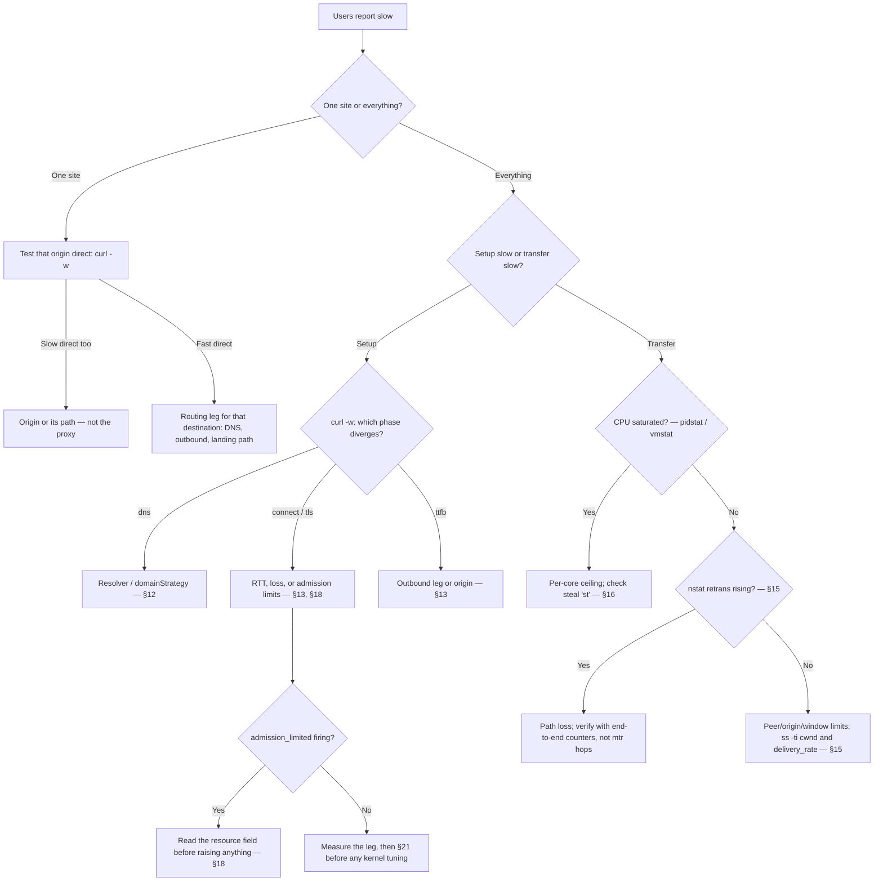

# 容量规划、性能调优与故障诊断

[English](tuning.md) | 简体中文

本文面向在 Linux VPS 上运行 rust-reality 的运维人员：如何选择机型规格、
安全地设定容量上限，以及在不读源码的情况下诊断变慢的原因。本文假设你具备
基本的 Linux 管理能力（systemd、`journalctl`、编辑 JSON），不要求了解任何
实现细节。

每一条承重论断都带有置信标签：

- **VERIFIED**（已验证）——在 v1.0.0 源码树或项目验证套件中得到确认：
  配置默认值、字段名、热更新边界、日志事件名和实测运行时行为。
- **MEASURED-LOCAL**（本机实测）——在项目验证主机上测得（Intel Core
  i3-8100 4C/4T、16 GiB 内存、Debian 13、内核 6.12、cgroup v2、loopback
  客户端）。机型档位（1C1G、2C2G……）是用 cgroup v2 的 CPU 和内存限额
  模拟出来的，因此它们描述的是资源预算，而不是某家厂商的具体产品。你的
  硬件和网络不同；把这些数字当作校准过的示例，而不是保证。
- **VERIFIED-CGROUP** —— 在 cgroup 限制的机型模拟下得到的 MEASURED-LOCAL
  结果：约束确实生效，但并未使用该机型的真实 VPS。
- **DERIVED**（推导）——由已验证和实测输入直接得出的算术或推理。
- **UNVERIFIED-EXTERNAL**（外部未验证）——依赖真实广域网路径、其他厂商
  或项目未测试的硬件。据其行动之前，先在你自己的链路上验证。

## 1. 六十秒快速上手

如果你刚租好 VPS、想要一个站得住脚的起点，直接采用你机型档位对应的
调优档位：

| 你的 VPS | `runtime.profile` | 把 `advanced.limits.resourceGovernor.maxConnections` 设为 | 依据（MEASURED-LOCAL） |
| --- | --- | --- | --- |
| 1 vCPU / 1 GiB（"1C1G"） | `dedicated` | `8000` | 12000 会话验证干净，cgroup 峰值约 694 MiB；≈14000 开始弃载；8000 ≈ 弃载点的 57% |
| 1–2 vCPU / 2 GiB | `dedicated` | `16000` | 24000 验证干净，cgroup 峰值 1.12 GiB；推荐值 = 验证值的 2/3 |
| 2–4 vCPU / 4 GiB | `dedicated` | `24000` | 24000 验证干净；就停在验证值上，不做外推 |
| 4 vCPU / 8 GiB | `dedicated` | `24000` | 24000 验证干净；loopback 测试的端口上限使更高水平无法测试 |

推荐值的算术是 DERIVED；干净点/弃载点是 MEASURED-LOCAL，且每次运行
`oom_kill=0`。

这些是**在被测 standalone/Direct 工作负载上验证过的起始档位**（建连
churn + 512 MiB 批量传输 + 空闲连接阶梯），对应拓扑中每条会话都路由到
direct 出站。它们不是普适的生产容量：更强的论断需要先做一个混合工作
负载的验证阶段。`directBarrier.maxConcurrent` 无需随档位调整：它限制
的是并发 Direct 拨号尝试，已建立的会话不持有 barrier 许可（§3）。§28
讲解如何为一台具体主机推导每个值。

动手之前先记住两条规则：

1. **默认值在上述所有机器上都是安全的，会话上限就是
   `maxConnections`。** `advanced.limits.resourceGovernor.maxConnections` 默认
   16384。`advanced.limits.directBarrier.maxConcurrent`（默认 2048）只限制并发
   Direct 拨号尝试：许可在拨号完成时立即释放，已建立的会话不占用
   barrier 容量。（v1.0.0 会在整个 Direct 会话期间持有许可，所以在
   standalone/Direct 节点上，即使 `maxConnections` 为 16384，第 2049 个
   会话也会被快速拒绝——issue #26，已在 v1.0.0 之后修复。）提高真实
   会话容量只需调大 `maxConnections` 并重启（它是冷设置，见 §10）。
2. **policy 块一旦写就必须写全。** 校验器会拒绝只包含你改过的几个键的
   `advanced.limits.resourceGovernor` 对象（已用 `check` 确认，VERIFIED）。请在
   `config generate` 生成的完整块内改值；不要粘贴只有两个键的片段。

### 自动测量的起始策略

上表是可移植的手工基线。v1.3 可以在实际部署主机上推导更具体的起始 policy，
并且不改动身份与安全配置：

```shell
sudo -u rust-reality rust-reality config autotune \
  --config /etc/rust-reality/config.json \
  --output /etc/rust-reality/config.tuned.json \
  --report /var/lib/rust-reality/autotune.json \
  --scratch-directory /var/lib/rust-reality
rust-reality check --config /etc/rust-reality/config.tuned.json
diff -u /etc/rust-reality/config.json /etc/rust-reality/config.tuned.json
```

仅当服务独占主机或所属 cgroup 时才加 `--dedicated`。该命令观察 affinity/cgroup
CPU、cgroup 内存、继承的 FD 限额、协议热点、scratch 文件系统吞吐，以及 TCP
loopback 双向性能。它只修改 `advanced.limits.resourceGovernor`、
`advanced.limits.directBarrier` 和 `advanced.limits.relay`；UUID 及其 short ID、私钥、监听、
路由、日志、伪装目标和全部超时值在 JSON 解码意义下保持一致。原文件永不
覆盖，两个输出都是仅所有者可读写的原子文件，报告记录所有输入和最终选择
（VERIFIED）。

自动调优只是经过测量的**起始策略**，不是生产负载测试。loopback 看不到 WAN
RTT/丢包、厂商限速、目标站行为和你的流量组合。审查 diff、保留报告、执行
`check`/`self-test`，再用 §28 的手工方法和灰度负载提高任何上限。自动调优
刻意不会启用 VLESS Encryption，也不会改变任何线协议或安全协议。

速查表——每种症状的第一条命令：

| 症状 | 第一条命令 | 看什么 |
| --- | --- | --- |
| 服务端起不来 / reload 被拒 | `rust-reality check --config /etc/rust-reality/config.json` | 错误信息中校验器给出的 JSON 路径 |
| 什么都慢 | `vmstat 1`（5 个样本） | `us`+`sy` 接近 100（CPU），`st` 高于 ~5（噪声邻居），`si`/`so` 非零（换页） |
| 建连慢、传输快 | `curl -w` 分阶段计时（§13） | 哪个阶段（`dns`/`connect`/`tls`/`ttfb`）占主导 |
| 负载下出现拒绝 | `journalctl -u rust-reality --since -15min` | `admission_limited` 及其 `resource` 字段（§18） |
| 内存攀升 | `cat /sys/fs/cgroup/system.slice/rust-reality.service/memory.current`（按你的 scope 调整路径） | `memory.current` 对 `memory.max`，分钟级趋势 |
| 昨天正常，今天"认证失败" | `timedatectl` | `System clock synchronized: no` 或较大偏移（§20） |
| 吞吐低于 VPS 套餐 | 传输前后各跑一次 `nstat -az`（§15） | `TcpRetransSegs` 和 `TcpExtTCPLostRetransmit` 的差值 |
| 一个站点慢，其他都快 | 同一个 `curl -w` 测试，直连和过隧道各跑一次 | 不走代理时慢是否依然存在（§24） |

## 2. 术语

- **1C1G、1H1G 之类的名字**是口语化的规格叫法：1 个 vCPU（"核"或
  "硬件线程"）加 1 GiB 内存。各家厂商对 vCPU 的定义并不一致；把档位
  当作预算，而不是承诺。
- **连接数不是用户数。** 一个人一部手机就能持有几十个并发连接（应用
  刷新风暴、开了几十个标签页的浏览器）。容量要按并发*会话*数规划，
  而不是按订户数。
- **配置的 UUID 数不是连接数。** 往配置里加第 1000 个用户消耗的是
  路由表内存，而不是按用户分配的运行时槽位。验证套件实测：1000 个
  UUID 加 72 条路由规则，建连速率与最小配置相同（896 conn/s，
  MEASURED-LOCAL）。
- **vCPU 的差异是真实存在的。** 在共享宿主机上，hypervisor 的*窃取
  时间*（`vmstat` 里的 `st` 列）是你的 VPS 付了钱却没拿到的 CPU。
  两家厂商的"1 vCPU"套餐可能有可测量的差距（UNVERIFIED-EXTERNAL——
  检查方法见 §16）。

## 3. 容量如何构成

任一时刻，有效的并发会话上限是：

```
min( admission ceiling,  FD budget,  memory budget,  CPU-for-your-SLO,  network )
```

哪一项最小，哪一项说了算；调大其他任何项都不会改变结果。具体说：

- **admission 上限** —— `advanced.limits.resourceGovernor.maxConnections`
  （默认 16384）是全局已接纳会话上限。
  `advanced.limits.directBarrier.maxConcurrent`（默认 2048）只限制*正在进行中的*
  Direct 拨号尝试：许可只在 direct 出站路径上获取，拨号完成即释放，
  已建立的会话不占用 barrier 容量；路由到 SOCKS5 或 NXR 出站的会话
  从不获取它（VERIFIED，`src/server/outbound.rs`）。（v1.0.0 会在整个
  Direct 会话期间持有许可，使 2048 成为 standalone/Direct 节点的有效
  会话上限——issue #26，已在 v1.0.0 之后修复；"第 2049 个会话被快速
  拒绝"的实测平台期就是在该行为下录得的。）
- **FD 预算** —— 服务端在启动时从 `RLIMIT_NOFILE` 推导出一个描述符
  预算，减去固定预留和安全余量，并通过 `descriptor_budget_report`
  报告一次（§6）。稳态下每个活跃会话约占 2 个 FD（MEASURED-LOCAL：
  24000 会话时峰值 48015 个 FD）。
- **内存预算** —— 每个空闲会话约占 47 KiB cgroup 内存
  （MEASURED-LOCAL）。基础开销很小：空闲 RSS ≈5.7 MiB，加载 geo
  资产后 ≈33 MiB（仅资产 ≈27 MiB）。32 连接批量传输期间缓冲池会
  瞬时增长可达 ≈200–300 MiB（DERIVED，由池上限推导）。
- **支撑你 SLO 的 CPU** —— 每次建连约耗 0.6 ms 服务端 CPU，framed
  中继每搬运 1 GiB 约耗 0.55 CPU-s（MEASURED-LOCAL）。CPU 买的是
  *速率*（每秒建连数、每秒 GiB 数），买不来*会话数*。
- **网络** —— 套餐带宽和路径的 RTT/丢包。廉价套餐上这经常是真正的
  天花板（§24 案例 1）。

由此得出的扩容结论：**CPU 和内存买的是不同的东西。** CPU 扩展握手、
加密和 framed 中继的工作量；内存和 FD 扩展活跃连接数。1C4G 并不比
2C2G 更适合高建连速率——两者的内存都远超一个 vCPU 能建起来的会话
数，而 2C2G 有两倍 CPU。反过来，8C1G 仍然受内存和 FD 限制：1 GiB 上的实测证据是 12000 个会话
干净、≈14000 开始弃载（MEASURED-LOCAL，1C1G），有多少核闲置都改变不了
这一点。

实测锚点（MEASURED-LOCAL，1C1G→4C8G 各档位一致）：≈800 conn/s 建连
churn，32 连接 framed ≈1.6 GB/s，单流 ≈1 GB/s。这些数字受测试客户端
限制——CPU 在这些测试中并*不是*瓶颈——所以不要把它们读成各档位的
上限。

## 4. 机型档位

VERIFIED-CGROUP **起始档位，针对被测的 standalone/Direct 工作负载**
（在每条会话都路由到 direct 出站的节点上做建连 churn + 512 MiB 批量
传输 + 空闲连接阶梯），全部在 cgroup v2 scope 内以 `dedicated` 模式
运行，每次运行 `oom_kill=0`（MEASURED-LOCAL）：

| 机型 | 默认 policy | 调优档位（`maxConnections`） | 验证干净 | 首次弃载/压力 | 验证档位下的 cgroup 内存峰值 |
| --- | --- | --- | --- | --- | --- |
| 1C1G | 安全 | **8000** | 12000 | ≈14000 | 694 MiB @ 12000 |
| 1C2G | 安全 | **16000** | 24000 | 未观察到 | 1.12 GiB @ 24000 |
| 2C2G | 安全 | **16000** | 24000 | 未观察到 | 1.12 GiB @ 24000 |
| 2C4G | 安全 | **24000** | 24000 | 未观察到 | 1.12 GiB @ 24000 |
| 4C4G | 安全 | **24000** | 24000 | 未观察到 | 1.13 GiB @ 24000 |
| 4C8G | 安全 | **24000** | 24000 | 未观察到 | 1.12 GiB @ 24000 |

读表须知：

- **证据的适用范围。** 这些是起始档位，不是普适的生产容量。被测拓扑中
  每条会话都走 Direct 路径，且测量是在 v1.0.0 的"许可在整个会话期间
  持有"行为下录得的（issue #26）。拨号阶段修复后，barrier 不再限制
  已建立的会话，所以调优档位只需调大 `maxConnections`；
  `directBarrier.maxConcurrent` 保持默认即可，除非你的拨号*速率*确实
  需要更大（§3、§28）。比这更强的论断需要先做一个混合工作负载的
  验证阶段。
- **"验证干净"** 指完整负载水平跑完，且没有 admission 弃载、没有压力
  事件、没有 OOM。**推荐值刻意低于崩坏点**：8000 ≈ 1C1G 弃载点的
  57%；16000 = 2 GiB 验证值的 2/3；24000 停在验证值上、绝不做外推
  （DERIVED 策略）。
- **4C8G 并不是比 4C4G 更强的论断。** loopback 测试框架先把临时端口
  用光了，服务端什么都没缺。更大内存上更高的会话数是合理的推测，但
  属于 UNVERIFIED-EXTERNAL。
- **保守与均衡。** 上面的调优档位是均衡选择：用合成最大值换余量，用来
  吸收连接突发、进程控制不了的内核内存和噪声邻居。如果你把稳定性看得
  比峰值数字重，就按比硬件低一档来跑。如果你跑在调优档位之上，就进入
  了未验证地带——持续盯 `resource_pressure_changed` 和
  `memory.current`。
- **1 GiB 上的 standard 模式是要避开的陷阱。** 测试中它扛过了 23000
  个会话，但全程顶在 `memory.max` 上、余量为零（MEASURED-LOCAL）。
  小机型请改用 `dedicated` 模式加 1C1G 档位（§5）。

## 5. `standard` 与 `dedicated` 资源模式

`runtime.profile`（`shared`/`dedicated`，或 `auto` 探测）控制服务端如何
给自己定预算。可热更新：否——修改需要重启（§10）。

**`standard`** 面向共享宿主机：rust-reality 是多个租户之一。它从继承
到的限制保守地推导所有预算：描述符安全余量是 `RLIMIT_NOFILE` 的
`limit/16`，并且不假设自己独占机器内存（VERIFIED）。

**`dedicated`** 面向 rust-reality 独占的 VPS 或 cgroup。启动时它会
（VERIFIED）：

- 读取 cgroup v2 的 CPU 和内存预算：`machine_report` 显示
  `cpu_quota_us`/`cpu_period_us`、由配额推导的 `available_cpus`，以及
  取自 cgroup 限额的 `memory_total` 和 `memory_source: "cgroup_v2"`；
- 尝试把 `RLIMIT_NOFILE` 软限制提升到硬限制（`machine_report` 中的
  `fd_soft_raise_attempted`、`fd_soft_limit_raised`、
  `fd_effective_soft_limit`）；
- 预留更大的描述符安全余量：`limit/10` 而不是 `limit/16`（这是更大的
  安全余量，不是放宽）；
- 以 cgroup 限额为基准运行内存压力监控器。

**`dedicated` 不会关闭任何限制。** 所有 admission 上限、中继内存天花板
和压力水位线照常生效；该模式改变的只是预算从什么推导。

启动时检查什么（VERIFIED 事件名）：

```
journalctl -u rust-reality --since -5min | grep -E 'machine_report|descriptor_budget_report'
```

- 在 `machine_report` 里：`memory_source` 是否是 `cgroup_v2`，
  `memory_total` 是否与 VPS 规格（或你设置的 cgroup 限额）一致？
  `available_cpus` 是否与你付费购买的一致？如果厂商给的 CPU 比套餐
  承诺的少，这一行会显示出来。
- 在 `descriptor_budget_report` 里：`fd_effective_budget` 是服务端实际
  使用的描述符池；`fd_clamped: true` 表示你配置的峰值超过了推导出的
  预算（§6）。

## 6. 文件描述符容量

真实的每会话账目（MEASURED-LOCAL）：一个活跃代理会话持有 **2 个套接
字**（面向客户端的和出站的）——24000 会话时峰值 48015 个 FD。在此之上
还有监听套接字、日志文件、geo 资产文件、DNS 套接字和中继 pipe 池，
以及服务端在接纳任何工作之前减去的固定预留（`fd_fixed_reserve`）和
安全余量（`fd_safety_headroom`：`standard` 下 limit/16，`dedicated`
下 limit/10）。

实操规则：

- **信 `descriptor_budget_report`，别信 ulimit 算术。** 服务端在启动时
  测量 `RLIMIT_NOFILE`，减去只有它自己知道的预留，然后打印结果：
  `fd_effective_budget` 才是决定 admission 的那个数。如果 `fd_clamped`
  为 `true`，说明你配置的 `maxConnections` 超过了预算、服务端已将其
  钳制；`fd_recommended_soft_limit` 告诉你避免钳制所需的软限制
  （VERIFIED 字段名）。
- **systemd 单元定天花板，服务端定预算。** 自带的单元
  （`deploy/rust-reality.service`）设置 `LimitNOFILE=1048576`
  （VERIFIED）。再往上调无害；服务端仍会推导出自己更小的预算。确认
  进程实际拿到的值：
  ```
  systemctl show rust-reality -p LimitNOFILE
  cat /proc/$(pgrep -x rust-reality)/limits | grep 'open files'
  ls /proc/$(pgrep -x rust-reality)/fd | wc -l   # 当前用量
  ```
- **内存空闲却出现描述符压力，说明绑定项是 FD 预算而不是内存** ——
  见症状表（§23）。

## 7. 内存模型

四个不同的数字都叫"内存"；混淆它们会导致错误的调优决策：

- **天花板** —— 配置的最大值：`maxRelayMemoryBytes`（默认
  536870912 = 512 MiB）、下面的池规模、cgroup `memory.max`。天花板
  存在不代表就会分配。
- **保留池** —— 服务端首次使用后保留而不归还的容量：中继缓冲区和
  pipe。是预留，不是稳态占用。
- **RSS** —— 进程页面在 `/proc/PID/status`（`VmRSS`）或 `free -h`
  中的报告值。不含一部分由内核代进程持有的内存。
- **cgroup 内存** —— `memory.current`：OOM killer 真正据此裁判的
  数字。包含页缓存和**内核 pipe 内存**，这就是重度中继时
  `memory.current` 能超过 RSS 的原因（VERIFIED 机制；实测为 32 连接
  批量传输期间有数百 MiB 的瞬时增长（DERIVED））。

校验器的中继内存公式（VERIFIED）：

```
buffered pool  = maxPooledBuffers × bufferBytes        = 4096 × 32768      = 128 MiB
pipe pool (pipePool=true)  = maxPooledPipes × 2 × 512 KiB = 256 × 2 × 512 KiB  = 256 MiB
pipe pool (pipePool=false) = maxSpliceRelays × 4 × 512 KiB = 256 × 4 × 512 KiB = 512 MiB
total required ≤ maxRelayMemoryBytes (default 512 MiB)
```

（乘积是对 VERIFIED 公式和默认值做的 DERIVED 算术。注意在默认
`maxSpliceRelays` 下，`pipePool=false` 一行会超出默认
`maxRelayMemoryBytes`：关闭管道池需要提高预算或降低
`maxSpliceRelays`。）

用于规划的稳态预算（由 MEASURED-LOCAL 输入推导，DERIVED）：

```
memory ≈ 33 MiB (server + geo assets)
       + 47 KiB × live sessions
       + up to ~300 MiB transient relay pools under bulk load
```

**内存紧张时，不要先降 `bufferBytes`。** 更小的缓冲区几乎省不下什么
（主导项是池上限而不是缓冲区大小：4096 × 32 KiB = 128 MiB），还会
牺牲高 BDP 路径上的吞吐。改降并发（`maxConnections`）或池上限（`maxPooledBuffers`、
`maxPooledPipes`），并保持校验器公式 ≤ `maxRelayMemoryBytes`。

## 8. 重放与 nonce 容量

存在两张有界的防重放表，但两者耗尽时的表现不同，这一点在运维上很重要
（VERIFIED，对照 v1.0 源码）：

- **REALITY（面向客户端）：** `advanced.limits.resourceGovernor.maxReplayEntries`
  （默认 65536）和 `replayRetentionMs`（默认 120000）。条目在保留窗口
  内记录一次已见过的握手，以便拒绝重放的握手。
- **NXR（节点间）：** NXR 入站上的 `maxNonceEntries`（默认 65536）和
  `nonceRetentionSeconds`（默认 120）。修改这两个值需要重启（§10）。

运维规则：

- **两个协议的耗尽行为不同。** REALITY 重放表无法预留条目时，新握手
  会被*静默当作伪装流量转发到 cover 目标*（占用 `maxFallbacks` 额度），
  不产生 admission 事件；NXR nonce 表满时，连接以
  `connection_rejected reason: "authentication"` 被拒绝。两者都不会覆盖
  旧条目。
- **按窗口而不是按秒来规划表容量。** 条目在整个保留窗口内累积：实测
  ≈800 conn/s churn（MEASURED-LOCAL）下，120 秒需要约 96,000 个条目——
  *超过* 65536 的默认值，因此默认规格可持续承受约 550 conn/s 的新认证
  连接（DERIVED：65536/120）。持续超过该速率、伴随 `maxFallbacks` 压力
  或 NXR `authentication` 拒绝，说明要么有异常握手洪峰，要么表容量对
  负载来说太小——调大 `maxReplayEntries`/`maxNonceEntries`（需重启），
  而不是缩短窗口。
- **不要为省内存而缩短保留窗口。** 这个窗口*本身*就是重放保护：窗口
  内重放的凭据之所以能被检测出来，正是因为条目还在。表是有界的，
  相对会话内存很小（每个活跃会话 47 KiB 远超它们）。需要内存就从
  并发上省，别从防重放上省。

## 9. 超时是活性控制

policy 里每个超时存在的意义，都是给一个停滞的对端能占住有限槽位的
时间划界——握手槽位、加密槽位、FD。它们不是性能旋钮。

默认值（VERIFIED）：

| 字段 | 默认值 (ms) | 约束 |
| --- | --- | --- |
| `clientHelloTimeoutMs` | 3000 | 等待客户端的第一条 TLS 消息 |
| `handshakeTimeoutMs` | 10000 | 整个认证握手 |
| `connectTimeoutMs` | 10000 | 到目标/下一跳的出站连接 |
| `fallbackTimeoutMs` | 120000 | 伪装（fallback）连接的生命周期 |
| NXR `authenticationTimeoutMs` | 3000 | NXR 节点认证 |
| NXR `connectTimeoutMs` | 10000 | 落地端到目标的连接 |
| `dns.timeoutMs` | 5000 | 一次 DNS 解析 |

- **调大**只用于你实测过的确实慢的路径：3 秒不够 ClientHello 到达的
  高 RTT 国际链路，或确实要 2–4 秒才应答的解析器。先测量（§13），
  再适度调大对应的那个超时。
- **调小**不会让任何东西变快；只会让慢但合法的客户端更早被掐死。
- 当真正的问题是丢包或上游过载时，**调大**超时只会掩盖问题：停滞的
  对端占槽更久，admission 上限反而填满得*更快*。如果你调大了某个
  超时后 `connection_rejected`（`timeout` 类）变多，原因就在这里（DERIVED 机制）。

## 10. 配置工作流与热更新边界

安全的修改循环（VERIFIED 命令形式）：

```
rust-reality config generate standalone --port 443 \
    --target www.example.com:443 --server-name www.example.com > config.json
# 编辑 config.json：policy 块、runtime 块、用户、路由
rust-reality config format --config config.json
rust-reality check --config config.json
rust-reality self-test --config config.json
# 部署，然后按下表的边界 reload 或重启
```

`check` 在不启动服务端的情况下验证结构和跨字段规则；`self-test`
另外探测 REALITY 目标和路由装配。两者都不能替代观察真实流量的最初
几分钟。

**热更新边界**（VERIFIED）：

| 可热更新（`systemctl reload`） | 需要重启 |
| --- | --- |
| 日志、资产、DNS 超时 | 监听拓扑（`mode`、地址、端口、入站数量） |
| VLESS 用户 / REALITY 状态 | `runtime`（含 `profile` 和 `statusFile`） |
| outbounds / 路由 | `network.dial`、`advanced.limits.resourceGovernor` |
| NXR 密钥和超时——仅当重放容量不变时 | `advanced.limits.directBarrier`、`advanced.limits.relay` |
| | NXR `maxNonceEntries` / `nonceRetentionSeconds` |

通过验证的热更新会记录带新 generation 的 `configuration_published`；
被拒绝的会记录带校验器给出的 JSON 路径的 `configuration_rejected`，
并继续运行旧配置（VERIFIED 事件）。每次 reload 之后，确认你得到的
是哪一个。

**完整示例——1C1G 的完整调优 limits。** 这个块嵌入生成的 standalone
配置（含 `"runtime": {"profile": "dedicated", "tuning": {"mode":
"fixed"}}`）后能通过 `check --config`。与默认值不同的只有
`maxConnections`；其余照列是因为每个标注"对象存在时必填"的字段在
其对象出现时都必须提供。

```json
"advanced": {
  "limits": {
    "resourceGovernor": {
      "maxConnections": 8000,
      "maxHandshakes": 1024,
      "maxFallbacks": 512,
      "maxCryptoOperations": 128,
      "maxReplayEntries": 65536,
      "maxDnsLookups": 64,
      "replayRetentionMs": 120000,
      "clientHelloTimeoutMs": 3000,
      "handshakeTimeoutMs": 10000,
      "connectTimeoutMs": 10000,
      "fallbackTimeoutMs": 120000
    },
    "directBarrier": {
      "maxConcurrent": 2048,
      "maxPerSecond": 4096
    },
    "relay": {
      "bufferBytes": 32768,
      "maxPooledBuffers": 4096,
      "maxSpliceRelays": 256,
      "maxRelayMemoryBytes": 536870912,
      "splice": true,
      "pipePool": true,
      "maxPooledPipes": 256
    }
  }
}
```

注意 relay 块原样未动：1 GiB 上默认池仍然放得下（§7 公式：128 MiB +
256 MiB ≤ 512 MiB 天花板），因为内存预算由会话主导而非池。然后重启
——`advanced.limits` 需要重启——并在日志中确认 `server_starting`、
`machine_report`、`descriptor_budget_report` 和 `listener_started`。

## 11. REALITY 伪装目标选择

三个容易混淆的名字（VERIFIED 语义）：

- **`target`**（`streamSettings.realitySettings.target`）：当连接*不是*
  已认证客户端时，rust-reality 实际连接的真实 TLS 服务器——伪装对象。
  fallback 流量被代理到它。
- **`serverNames`**：已认证客户端被允许出示的 SNI 值。客户端的 SNI
  必须匹配其中一项。
- **客户端 SNI**：你在客户端应用里配置的东西。它与 `serverNames`
  做匹配；对认证会话，服务端从不会拨号它。

`serverNames` 条目是精确名称或**最左单标签通配符**（VERIFIED 于
`src/server_name.rs`）：`*.example.com` 只匹配 `www.example.com`，
不匹配其他任何东西——不匹配 `example.com`，也不匹配
`a.b.example.com`；通配符至少需要两个后缀标签（`*.example.com`
合法，`*.com` 被拒绝）。如果客户端出示 apex 名，请显式列出 apex。

**什么样的 target 算好** —— 看属性，不看品牌。不存在通用的最佳域名
清单；从一个国家看很理想的域名，从另一个国家看可能可疑或缓慢
（UNVERIFIED-EXTERNAL）。自己验证候选：

- 在 443 端口讲 TLS 1.3，密钥交换兼容。
- 能为你的客户端将出示的 SNI 提供有效证书链。
- *从你的 VPS 看*高可用、低丢包，并且距离近：fallback 实时借用它，
  每次认证建连也要借用它的 ServerHello——不稳定或遥远的 target 既
  拖累你的伪装，也拖慢每条连接的建连。
- 合理自然：流量画像不会让你的服务器显得突兀的域名。

**用 OpenSSL 预筛**（已测试的命令形式）。每个候选在 `timeout` 下跑
10–20 次——一次成功什么也说明不了：

```
for i in $(seq 1 15); do
  timeout 5 openssl s_client -connect HOST:443 -servername HOST -tls1_3 -brief </dev/null
done
```

证书与 SAN 检查：

```
openssl s_client -connect HOST:443 -servername HOST -tls1_3 \
    -verify_hostname HOST -verify_return_error -brief </dev/null
openssl s_client -connect HOST:443 -servername HOST -showcerts </dev/null 2>/dev/null \
  | openssl x509 -noout -subject -issuer -dates -ext subjectAltName
openssl s_client -connect HOST:443 -servername HOST -tls1_3 -alpn 'h2,http/1.1' -brief </dev/null
```

**`probe-dest` 才是最终裁决**，OpenSSL 不是：它按服务端实际使用
target 的方式做检查（VERIFIED 形式）：

```
rust-reality probe-dest --target HOST:443 --server-name NAME [--timeout-ms 5000]
```

`self-test --config` 对配置的 target 做同样的探测，并逐目标报告
`compatible: true/false`。

**伪装目标在每次建连的路径里，而不在稳态载荷路径里。** 每条连接——
包括已认证的——在 REALITY 建连期间都会拨号伪装目标并读取它的
ServerHello，服务端用它来构建 REALITY 服务端飞行（flight），然后才
等待 ClientFinished（VERIFIED，`src/server/reality.rs`）。因此伪装
目标影响三件事：建连延迟（200 ms 外的伪装大致给*每一次*建连加上一个
伪装往返）、握手兼容性（探测失败的目标会把认证建连退化成 fallback）、
以及 fallback 流量。伪装*不*承载已认证的稳态载荷：会话建立后，字节走
客户端 → rust-reality → 你的真实目标，伪装的带宽和距离不再重要
（VERIFIED 架构）。按合理性、可靠性和与你 VPS 的距离选伪装；稳态变慢
到真实数据路径上诊断（§13）。

## 12. 路由性能与结构

路由求值顺序（VERIFIED）：先 `routing.globalRules`，然后按序匹配用户
组的 `rules`——**首个命中即胜**——最后是该组的 `defaultOutbound`。

`domainStrategy`（VERIFIED 语义，`src/server/routing.rs`
`select_with_dns`）。只有当适用的路由快照——全局规则*或*被选中用户
的规则——确实包含 IP 规则时，DNS 才会发生
（`needs_ip = global_has_ip_rules || user_has_ip_rules`）。在此前提下：

- **`AsIs`** —— 路由器永不解析。IP 规则只能匹配本来就是 IP 字面量
  的目标。
- **`IPIfNonMatch`**（默认）—— 先在内存中匹配；只有当决策落到用户
  默认出站时才解析，以便用结果测试 IP 规则。域名规则命中从不为 DNS
  付费。
- **`IPOnDemand`** —— 存在 IP 规则时，在规则求值前解析，IP 规则永远
  生效，而每条被解析的连接都为一次查找付费。

如果任何地方都**没有** IP 规则，三种策略的行为完全一致，完全不发生
DNS。

DNS 进入决策路径的实测成本是每连接 ≈0.12 ms（MEASURED-LOCAL）；大
路由表的实测成本在被测配置下低于测量灵敏度——1000 个 UUID 加 72 条
规则的建连速率 896 conn/s，与最小配置相同（MEASURED-LOCAL）。昂贵的
部分是到慢解析器的 DNS 往返。注意 v1.0 只接受
`dns.servers = ["system"]`——自定义解析器会被校验器拒绝（VERIFIED，
`src/config/validate.rs`）——所以请在 OS 层让 DNS 变快：运行本地缓存
存根（`systemd-resolved` 或同类），把 `/etc/resolv.conf` 指向它，并让
`dns.timeoutMs` 保持诚实。

已验证示例——三个用户组：A 直连，B 中国直连、默认走 NXR 落地，C 经
上游 SOCKS5 过滤。完整配置（下面的路由加上匹配的 `outbounds` 和占位
UUID）通过 `check --config`（VERIFIED）。匹配器语法：社区 DAT 文件的
`geosite:`/`geoip:` 标签，域名的 `domain:`/`full:`/`keyword:`/
`regexp:` 前缀，IP 的 CIDR。

```json
"outbounds": [
  { "protocol": "direct", "tag": "direct" },
  { "protocol": "blackhole", "tag": "block" },
  { "protocol": "nxr", "tag": "nxr-landing",
    "settings": { "address": "10.0.0.2", "port": 7443,
                  "preSharedKey": "AAAAAAAAAAAAAAAAAAAAAAAAAAAAAAAAAAAAAAAAAAA" } },
  { "protocol": "socks5", "tag": "upstream-socks",
    "settings": { "address": "127.0.0.1", "port": 1080 } }
],
"routing": {
  "domainStrategy": "IPIfNonMatch",
  "globalRules": [
    { "name": "reject-private", "outbound": "block", "ip": ["geoip:private"] }
  ],
  "users": [
    { "name": "group-a-direct",
      "userIds": ["11111111-1111-4111-8111-111111111111"],
      "defaultOutbound": "direct", "rules": [] },
    { "name": "group-b-cn-direct",
      "userIds": ["22222222-2222-4222-8222-222222222222"],
      "defaultOutbound": "nxr-landing",
      "rules": [
        { "name": "cn-direct", "outbound": "direct",
          "domain": ["geosite:cn"], "ip": ["geoip:cn"] }
      ] },
    { "name": "group-c-filtered",
      "userIds": ["33333333-3333-4333-8333-333333333333"],
      "defaultOutbound": "upstream-socks",
      "rules": [
        { "name": "block-ads", "outbound": "block",
          "domain": ["geosite:category-ads-all"] }
      ] }
  ]
}
```

三个 UUID 都是占位符；换成真实客户端 ID。outbounds 和路由可热更新，
改组和规则不需要重启（§10）。

## 13. 延迟诊断

端到端的时间花在哪：

```
                 ┌────────────── line node ──────────────┐        ┌─ landing ─┐
client ──RTT A──▶│ REALITY setup │ routing/DNS │ outbound │─RTT B─▶│ NXR auth  │──▶ destination connect ──▶ origin response
                 └───────────────────────────────────────┘  (NXR)  └───────────┘
```

上面的 "REALITY setup" 包含一次到伪装目标的拨号和它的 ServerHello
读取（服务端用它构建服务端飞行，§11）：伪装目标的 RTT 和可用性位于
*每条*连接——无论认证与否——的建连段内（VERIFIED，
`src/server/reality.rs`）。

standalone 部署没有 RTT B 段；出站连接直达目标。每一段都可测量，每一
段的修法都不同——所以先测量再调优。

**60 秒流程：**

1. **时钟：** `timedatectl` —— 时钟偏移先毁掉认证，然后才轮到变慢
   （§20）。
2. **负载：** `vmstat 1 5` —— CPU 打满（`us`+`sy`）、被窃取（`st`），
   还是在换页（`si`/`so`）？
3. **内存：** `free -h`，以及服务 cgroup 里的 `memory.current` 对
   `memory.max`（§17）。
4. **分阶段计时：** 下面的 `curl -w` 分解，直连和过隧道各跑一次。

**用 curl 做分阶段计时**（已验证形式；`env -u` 清除很重要，因为代理
环境变量会静默改道"直连"测试）：

```
env -u HTTP_PROXY -u HTTPS_PROXY -u ALL_PROXY -u NO_PROXY \
    -u http_proxy -u https_proxy -u all_proxy -u no_proxy \
    curl -sS -o /dev/null \
    -w 'dns=%{time_namelookup} connect=%{time_connect} tls=%{time_appconnect} ttfb=%{time_starttransfer} total=%{time_total}\n' \
    https://TARGET/
```

每个字段都是从请求开始累计的：

- `dns` —— 解析时间。这里大：解析器问题，不是代理问题。
- `connect` —— TCP 握手完成。`connect − dns` ≈ 到 curl 所拨对象的
  一次 RTT。
- `tls` —— TLS 握手完成。`tls − connect` ≈ TLS 的往返。
- `ttfb` —— 第一个响应字节。`ttfb − tls` 是握手之后的一切：代理内部
  的路由/DNS、出站连接、源站处理。
- `total` —— 完整响应体。`total − ttfb` 是传输时间（§14 的地盘）。

然后让同一个 URL **过隧道**——经客户端应用的本地 SOCKS 端口，如
`curl --socks5-hostname 127.0.0.1:1080 ...`，用同样的 `-w` 字符串——
逐字段对比。两边出现分化的那个字段指出了有罪的网段：`connect`/`tls`
分化指向客户端↔线路段（RTT A、丢包、admission 延迟）；只有 `ttfb`
分化指向路由/DNS、出站段或源站。

## 14. 吞吐诊断

沿基线梯子往上爬；在第一个已经变慢的横档停下——它之上的每一档都会
慢：

1. **裸路径：** 客户端网络与 VPS（或 VPS 与落地）之间的 `iperf3`，
   不经代理。
2. **源站直连：** 用普通 `curl` 从目标下载，不经代理。
3. **rust-reality、direct 出站：** 过隧道，单流，然后 32 流。
4. **完整路径：** 带生产路由过隧道——如 线路 → NXR → 落地。
5. **同路径的 SOCKS5 变体**（如果你在用），供对比。
6. **真实应用。**

多跳模型近似为 `min(legs)`（DERIVED）：一条链的速度等于其最慢一跳的
速度，每跳的单流速度大致是其窗口除以其 RTT。两个部署事实要记牢：

- **NXR 两跳税很小**：相比 direct 出站约 3–5% 吞吐和每连接 ≈+0.15 ms
  CPU（MEASURED-LOCAL）。如果你的两跳路径慢了 30%，那不是税的问题
  ——是某一跳的问题。
- **慢源站会封顶所有实现。** 如果第 2 档慢，任何代理调优都救不了第
  6 档；rust-reality 和任何替代品都继承源站的天花板（VERIFIED 的
  测量方法论教训）。

**节点间链路选 NXR 还是 SOCKS5**（MEASURED-LOCAL，相同端点）：可忽略
RTT 下 NXR 建连快 18%（880 对 748 conn/s），吞吐高 11–13%；注入 100
ms RTT 后差距拉大——36 对 19 conn/s，p50 建连 218 对 413 ms
（DERIVED：≈2 RTT 对 ≈4 RTT 的建连往返）。如果你的跨区域链路只是
建连慢且跑在 SOCKS5 上，那是预期的协议行为，不是故障；NXR 是实测的
修法。

**诚实地比较实现：** 比数字之前先对齐日志级别、测试框架版本和载荷
形状——在项目自己的 A/B 里，仅 `debug` 级按连接日志就凭空制造了
25% 的 fallback 劣势（§19）。

## 15. 丢包与重传

在一段已知传输前后采样内核 TCP 计数器（已验证命令）：

```
nstat -az > /tmp/before.txt
# 执行传输
nstat -az > /tmp/after.txt
diff /tmp/before.txt /tmp/after.txt | grep -E 'TcpRetransSegs|TCPLostRetransmit|TCPFastRetrans'
```

- `TcpRetransSegs` —— 发出的重传总数；任何广域网上有一些都正常。
- `TcpExtTCPLostRetransmit` —— 重传本身又丢了：真实路径丢包的强
  信号。
- `TcpExtTCPFastRetrans` —— 快速重传；常规丢包恢复。

按连接状态：`ss -ti` 显示 `rtt`/`rttvar`、`cwnd`、`retrans`，较新内核
还有 `delivery_rate`（字段是否可用取决于内核）。`cwnd` 小、`rttvar`
高、`retrans` 持续攀升的连接是受丢包限制的，不是受 CPU 限制。
`ss -s` 汇总套接字状态；`ip -s link` 显示接口丢包/错误。

**mtr 警告：** `mtr` 里中间跳的丢包通常是该跳控制平面对 ICMP 降优先
级，而不是 TCP 丢包——只有最后一跳的丢包和你端到端的 `nstat` 差值
才是证据。`tracepath` 找路径 MTU；没有普适的正确 MTU——自己测，尤其
是隧道加了封装时。`mtr`、`tracepath`、`pidstat`、`perf` 不在最小化
Debian 安装里：`apt install mtr iputils-tracepath sysstat linux-perf`。

## 16. CPU 诊断

```
pidstat -p $(pgrep -x rust-reality) 1     # 进程级 CPU 随时间变化（sysstat）
mpstat -P ALL 1                           # 按核查看：是否有单核 100%？
vmstat 1                                  # us/sy 占比、st（steal）、si/so
sudo perf stat -p $(pgrep -x rust-reality) \
    -e task-clock,cycles,instructions,context-switches sleep 10
```

解读：

- **窃取时间（`st`）** —— VPS 上 `st` 持续高于 ~5%，说明 hypervisor
  没把你配置的 vCPU 给足；建立在名义 vCPU 数上的容量数学会过度承诺
  （各厂商有多常见属 UNVERIFIED-EXTERNAL——自己测）。"更大"的 VPS
  表现像更小的 VPS 时，第一个查这个。
- **CPU 高且跑满线速** —— 服务端按预期工作。问题只剩 SLO 是否达标；
  达标就什么都不用做。
- **CPU 高且低于目标** —— 你找到了绑定项。单 vCPU 上 framed 中继
  成本 ≈0.55 CPU-s/GiB（MEASURED-LOCAL），所以 ≈1.6 GB/s 的 framed
  流量大约就是一个核的全部能耐；见案例 2（§24）。
- **CPU 低且慢** —— 瓶颈在别处：网络丢包（§15）、DNS（§12）、对端
  或源站（§14）。加核没用。

## 17. 内存压力与 OOM

```
free -h
grep -E 'VmRSS|VmHWM' /proc/$(pgrep -x rust-reality)/status
cd /sys/fs/cgroup/system.slice/rust-reality.service   # 按你的 scope 调整
cat memory.current memory.max memory.high
cat memory.events          # oom_kill 计数器
grep -E '^(anon|file|kernel|sock)' memory.stat
```

读懂证据：

- **`memory.current` 接近 `memory.max`** 且 `resource_pressure_changed`
  事件增多：服务端看到了压力，正在弃载——这是限制在工作（§18）。
  如果持续，说明你的档位对 cgroup 来说太大：降一档（§4）。
- **OOM kill 不自动等于泄漏。** 怀疑泄漏之前先问：并发负载是否超过
  该机型的验证档位？kill 是否与批量传输突发（瞬时池增长
  增长，§7）同时发生？cgroup 限额是否比档位假设的内存小？三个答案
  都干净才开始查泄漏（DERIVED 决策顺序）。
- **RSS 对 cgroup：** pipe 内存是计入 cgroup 但不完全体现在 RSS 里的
  内核内存，所以中继负载下 `memory.current` 合理地超过 `VmRSS`
  （§7）。判断压力以 `memory.current` 为准。
- **Swap：** swap 设备作为应对短暂突发的应急余量可以接受；**正常负载
  下 `vmstat` 里 `si`/`so` 活跃说明机器规格不够** —— 早在 OOM killer
  开火之前吞吐就已崩塌。Swap 永远替代不了正确的限制和正确的档位。

## 18. 压力与日志事件

rust-reality 在所有输出位置（stderr、journald、文件）都发出结构化 JSON
事件。运维相关集合（VERIFIED 名称）：

| 事件 | 含义 | 正常吗 | 相关配置 | 下一步测量 |
| --- | --- | --- | --- | --- |
| `server_starting` | 进程启动开始 | 每次启动一次 | — | — |
| `outbound_network_initialized` | 缓存的路由可用性与初始出站主族 | 每次启动一次 | `network.dial` | 探测地址族与主机路由表一致吗？ |
| `listener_topology_active` | 某入站准确的活动/不可用地址族 | 每入站每次启动一次 | `inbounds[].listen` | `auto` 降级符合预期吗？ |
| `listener_family_unavailable` | `auto` 无法绑定一个确实不可用的地址族 | 仅单族主机 | `inbounds[].listen` | 核对 errno 与活动族。 |
| `listener_started` | 入站已绑定就绪（`tag`、`address`） | 每次启动每个监听器一次 | `inbounds` | — |
| `machine_report` | 探测到的 CPU/内存/FD 视图（dedicated 模式） | 每次启动一次 | `runtime.profile` | `available_cpus`、`memory_total`、`memory_source` 与 VPS 一致吗？（§5） |
| `descriptor_budget_report` | 推导的 FD 预算 | 每次启动一次 | `LimitNOFILE` | `fd_effective_budget`、`fd_clamped`（§6） |
| `relay_backend_report` | 各后端中继能力，每个后端一行 | 每次启动一次 | `advanced.limits.relay` | 某后端 `available: false` 可解释中继 CPU |
| `configuration_published` | 热更新被接受（`generation`） | 每次 reload | 热更新集合（§10） | — |
| `configuration_rejected` | reload 被拒；旧配置仍在运行（`field`） | 仅在改错时 | 被指名的 JSON 路径 | 修复后重新 `check` |
| `connection_accepted` | TCP accept（仅 debug） | debug 下量大 | `log.level` | — |
| `connection_completed` | 会话正常结束（仅 debug） | debug 下量大 | `log.level` | — |
| `connection_closed` | 连接关闭（仅 debug） | debug 下量大 | `log.level` | — |
| `connection_rejected` | 被拒绝，带固定 `reason` 类别 | 公网端口上的背景噪声 | — | 速率尖峰 → 探测/攻击或配置错误 |
| `admission_limited` | 监听器级 admission 调节器拒绝了新连接（`resource`：`connections`） | **可能是限制在正确工作** | `maxConnections` | 见下文 |
| `descriptor_pressure_changed` | FD 用量越过水位线 | 仅在负载下 | FD 预算 | `ls /proc/PID/fd \| wc -l` 对 `fd_effective_budget` |
| `resource_pressure_changed` | FD/内存综合压力状态变化 | 仅在负载下 | 档位对机型 | `memory.current` 对 `memory.max`（§17） |
| `adaptive_ceiling_changed` | 自适应控制器移动了一个软上限（`knob`、`reason`、`from`→`to`、`floor`、`ceiling`） | 仅 `adaptive` 调谐模式，每次调整一条 | `runtime.tuning.mode` | 稳态不发事件；反复出现 `low-utilization` 说明方案高估了这台主机（§29） |
| `adaptive_status_write_failed` | 控制器无法重写 `runtime.statusFile` | 仅路径出错时 | `runtime.statusFile` | 检查父目录与权限 |

**不要条件反射式地调高正在触发的限制。** 连接洪峰期间的拒绝是调节器
在保护已建立的会话。注意每类限制实际出现的位置（VERIFIED，对照 v1.0
源码）：

- `admission_limited` 带 `resource: "connections"` —— 监听器级连接调节器。
  其他限制以两种方式出现：
- `admission_limited` 带 `resource: "direct_connections"` 并伴随
  `connection_rejected reason: "resource_limit"` → Direct 拨号 barrier
  （并发、速率或危急压力）拒绝了一次拨号。只有当你的 Direct 拨号速率
  确实需要时才调大 `directBarrier.maxConcurrent`/`maxPerSecond`（§3、
  §28）；barrier 从不限制已建立的会话。
- 不带 admission 事件的 `reason: "resource_limit"` → 某个 admission 池
  （握手、伪装转发、密码学工作）或 FD 预算耗尽；结合
  `descriptor_pressure_changed` 区分 FD 压力（§6）与调节器压力。
- `reason: "authentication"` → 在 **NXR** 入站上：密钥错误、nonce 重放
  或时钟偏移——这是流量/攻击信号，不是容量信号（§8、§20）。在面向客户
  端的 **REALITY** 入站上，凭据错误通常*不会*产生这个事件：预检的认证、
  重放和时间失败会被刻意转为伪装 fallback——客户端被转发到伪装目标、
  占用 `maxFallbacks` 额度（VERIFIED，`src/server/reality.rs`）。在那里
  要盯 fallback 压力，而不是拒绝日志。
- `descriptor_pressure_changed` / `resource_pressure_changed` → FD 或内存
  越过水位线；服务器会先拒绝新 admission 而不是崩溃。先测量
  （`ls /proc/PID/fd | wc -l`、`memory.current`），再判断是档位错了还是
  负载错了。

## 19. 日志级别

生产环境跑 `info`（或 `warn`）。`debug` 是临时诊断手段：上面的按连接
事件只在 `debug` 发出，而高 churn 下日志本身会可测量地扭曲负载——
项目自己的基准测试中，`debug` 级的 fallback A/B 凭空制造了 25% 的
fallback 劣势，级别对齐后即消失（VERIFIED 的测量项目教训）。

规则：

- **任何 A/B 对比先对齐日志级别。** 级别不同 = 负载不同 = 垃圾数字。
- 针对具体问题开一个有界时间窗的 `debug`，然后回到 `info`。日志可
  热更新（§10），无需重启。

## 20. 时间同步

两种认证方案都拿时间戳跟本地时钟比：

- REALITY：`maxTimeDiffMs` 默认 60000（±60 秒）。
- NXR：`maxTimeDifferenceSeconds` 默认 30（±30 秒）。

**时钟偏移看起来和认证失败一模一样**，但症状因协议而异：在 NXR 节点
链路上，偏移的对端会以 `connection_rejected reason: "authentication"`
被拒绝；在面向客户端的 REALITY 端口上，时钟偏移但凭据合法的客户端
会在预检认证失败后被静默转发到伪装目标——用户报告"我打开的是伪装
网站而不是代理"，服务端唯一的痕迹是 fallback 流量，而不是拒绝事件
（VERIFIED，§18）。它也是 VPS 挂起、迁移或 NTP 源死掉之后经典的
"昨天还好好的，今天坏了"。先查：

```
timedatectl        # 期望：System clock synchronized: yes
```

修时钟（`systemd-timesyncd` 或 `chrony`），线路/落地对的两个节点都要
修。**不要靠加宽时间窗口掩盖偏移** —— 窗口就是防重放保证；为迁就
一台配错的主机而加宽窗口，会削弱每一个会话（由 VERIFIED 窗口语义
推导的 DERIVED 安全推理）。

## 21. 高延迟广域网路径

**先测量。** 本节的一切在你自己的路径上复现之前都是
UNVERIFIED-EXTERNAL。不要把互联网上的 sysctl 块粘进生产代理。

RTT 增大时可以预期什么（由 MEASURED-LOCAL 的 100 ms 数据点和往返算术
推导，DERIVED）：

| 客户端↔服务端 RTT | 建连感受 | 原因 |
| --- | --- | --- |
| 20 ms | 即时 | 建连往返花费几十 ms |
| 50 ms | 轻快 | 仍远低于一秒 |
| 100 ms | 可感知 | 实测：NXR p50 建连 218 ms，SOCKS5 p50 413 ms |
| 200 ms | 建连拖沓，传输正常 | 每个建连往返花 200 ms；已建立的传输不再支付建连往返，但单流吞吐仍受 BDP/拥塞/丢包影响（窗口 ÷ RTT） |

长路径上的单流吞吐受窗口限制：`throughput ≈ window / RTT`。100 ms
RTT 下，1 Gbps 路径需要在途 ≈12.5 MB（DERIVED BDP）；默认接收窗口
很少允许单流这么多，所以填满长路径靠多流传输（测试中 32 连接达到
≈1.6 GB/s，MEASURED-LOCAL）或更大窗口。

动任何内核设置之前的诊断顺序：

1. `curl -w` 分解——哪个阶段慢（§13）？
2. `nstat` 重传差值——是丢包而不是延迟吗（§15）？
3. 对比各跳——客户端↔线路 对 线路↔落地 对 落地↔目标（§14 梯子）。
4. 然后才考虑针对路径的 TCP 调优。

关于 socket 缓冲区：本指南刻意不提供 `rmem`/`wmem` 配方。Linux 自动
调节通常是对的；只有当测得窗口受限路径（`吞吐 ≈ 窗口 / RTT` 远低于
链路且无丢包）才有理由调大，而多流并发是更简单的首选方案。

当——且仅当——你测到了丢包驱动的崩塌（低利用率下
`TcpExtTCPLostRetransmit` 上升，`ss -ti` 显示长期很小的 `cwnd`），
把拥塞控制换成 BBR 并配上匹配的 qdisc 是一个*合理的实验*：先记录
当前值（`sysctl net.ipv4.tcp_congestion_control`、`tc qdisc show`），
应用，重跑同样的测量，数字没改善就回滚。这是 OS 级改动，爆炸半径
覆盖全机队；rust-reality 自身从不动 sysctl（VERIFIED），所以服务端
既不要求也不阻止它。

## 22. standalone 与线路/落地角色

各部署角色的资源画像不同；不要把一个节点的调优数字抄到另一个角色上。

- **Standalone** —— 一台机器上的 REALITY + VLESS + Vision + 路由 +
  direct 出站。§4 的档位就是在它上面测的。
- **线路节点** —— standalone 的一切，外加 NXR 出站：完整 TLS/REALITY
  加密、geo 资产、路由求值。最重的角色；以 §4 为起点定规格——但
  `directBarrier.maxConcurrent` 要按路由决策为 direct 出站的会话份额
  来定，纯 NXR 出站的线路节点上这个份额可能是零（§3、§28）。
- **落地节点** —— NXR 认证、目标连接、裸中继。没有 REALITY 握手、
  没有 geo 资产、没有路由表：每会话更轻，但它承载所终结的每条流的
  每一个字节，所以它的网络和中继预算比 TLS 预算更要紧（由角色定义
  DERIVED）。

采用 **Handoff** 拓扑时角色发生变化：线路机在一次性转移之后卸下逐字节
TLS/Vision 工作，变成原始密文 splice 中继；落地机重建会话并承担完整 TLS
工作负载和目标连接。

- **Handoff 线路节点** —— 会话边界之前是 REALITY + VLESS + Vision，
  之后是纯 splice。§4 主机档位上的 loopback 实测：下载约 98 ms CPU/GiB，
  而 NXR 线路角色为 549（MEASURED-LOCAL，单机，无 cgroup 隔离）。其稳态
  成本由系统调用速率的 splice 工作决定，与密码学无关——按中继而不是
  TLS 终结者来规划。
- **Handoff 落地节点** —— 继承 standalone TLS 预算的全部内容：记录层
  AEAD、Vision framing、目标连接和中继（同一 loopback 实测中下载约
  517 ms CPU/GiB）。按 §4 把它当作被转移会话的 standalone 节点来规划，
  再加上它自己的监听器限制（由角色定义和 §4 profile DERIVED）。

两种拓扑的链路系统总 CPU 大致持平（该 loopback A/B 中下载 −5.6%），
所以选择的是 CPU 花在哪台机器上，而不是总量；实测表及其标注见
[performance.md](performance.zh-CN.md#handoff-线路机卸载实测单机)。

相同端点上实测（MEASURED-LOCAL）：NXR 段相比 direct 增加 ≈3–5% 吞吐
税和每连接 ≈+0.15 ms CPU——小到足以让"落地节点比线路节点低一档"成为
合理的初始假设，再用你自己的 `memory.current` 和 CPU 测量确认（作为
普遍规则属 UNVERIFIED-EXTERNAL）。

## 23. 症状 → 原因 → 行动

| 症状 | 最可能的原因 | 第一项检查 | 行动 |
| --- | --- | --- | --- |
| CPU 100%，吞吐达线速 | 按预期工作——CPU 是绑定资源 | `pidstat`、链路利用率 | SLO 达标则不动；不达标就加核或走 splice 友好的路径 |
| CPU 低、吞吐低、重传上升 | 路径丢包，不是服务端 | `nstat` 差值、`ss -ti` | §15；修路径/MTU，不是修配置 |
| `memory.current` 接近 `memory.max` | 档位对 cgroup 太大 | §17 决策顺序 | 降一档；验证池公式 ≤ 天花板 |
| 内存空闲却描述符压力 | FD 预算先于内存成为绑定项 | `descriptor_budget_report`、`fd_clamped` | §6：调大 `LimitNOFILE`、检查 `dedicated` 模式，再动并发 |
| 建连慢、传输快 | 按连接成本：RTT、路径内 DNS 或认证前限制 | `curl -w`：`connect`/`tls` 对 `ttfb` | §13；查 `domainStrategy`、`connection_rejected` |
| NXR 建连慢但已建立的流快 | 建连往返 × 线路↔落地 RTT；或时钟偏移 | 节点间 RTT；两端 `timedatectl` | 高 RTT 下属预期（§14）；修偏移；别加宽窗口 |
| 只有 IP 规则路由慢 | DNS 在决策路径里 | `domainStrategy`、解析器延迟 | §12：`IPIfNonMatch`、更快的 OS 解析器（本地缓存存根） |
| 基准只在 `debug` 级别慢 | 日志开销 | 两边配置的 `log.level` | §19：对齐级别，重新测 |
| 一个站点慢，所有测试都快 | 那个源站或它的路径，不是代理 | 对该站点直连 `curl -w`（§13） | 源站侧修复；代理继承源站天花板（§14） |

## 24. 案例研究

六个案例都把验证项目的发现浓缩成运维叙事。叙事框架是示意性的；引用
的每个测量都是真实的、除非注明均为 MEASURED-LOCAL。

**案例 1 ——"服务器很慢"：1C1G 被自己的网络封顶。**
一位运维报告代理封顶在 60 Mbps 附近，CPU 低、内存低、日志干净。梯子
（§14）显示第 1 档——裸 `iperf3`、不经代理——也是 ≈60 Mbps。VPS
套餐的带宽上限就是天花板；上面的每一档都继承它。教训：永远先确立
裸路径那一档。一小时的代理调优修不好套餐限制。（你的厂商是否同样
限速属 UNVERIFIED-EXTERNAL——自己测。）

**案例 2 ——1C1G 在 framed 流量上跑满 100% CPU。**
一个单 vCPU 节点在 32 连接下平台期在 ≈1.6 GB/s，单核饱和（实测约 92%）。算术：
framed 中继成本 ≈0.55 CPU-s/GiB，所以 1.6 GB/s 消耗 ≈0.9 个核——
实测的平台期*就是*单核 framed 天花板，不是 bug。选项：接受它（多数
1C1G 套餐的带宽远低于 1.6 GB/s）、换 2 vCPU，或优先走 splice/pipe
中继后端的路径——它们在内核里搬字节、CPU 成本更低——启动时查
`relay_backend_report` 确认这些后端在你的内核上是 `available: true`。

**案例 3 ——2C2G 线路节点：NXR 建连慢，流很快。**
经线路→落地对的建连要数秒，而已建立的流全速。`curl -w` 把延迟隔离
到 connect 阶段；线路↔落地 RTT 在 100 ms 量级，而落地端的解析器给
每个新目标加上数百毫秒，因为线路端对一个遥远的解析器跑着
`IPOnDemand`。100 ms RTT 下实测的 NXR 建连成本是 ≈2 个往返（p50
218 ms）；其余是 DNS。修法：更近的解析器和 `IPIfNonMatch`。建连回落
到实测下限。任何调优之前先验证时钟（两端 `timedatectl`）——偏移在
NXR 层看起来一模一样（§20）。

**案例 4 ——1 GiB 节点在内存压力下抖动。**
一台 `standard` 模式的 1C1G 跑着 20000+ 会话，钉在 `memory.max` 上，
反复记录 `resource_pressure_changed` 跃迁，客户端看到随机快速拒绝。
验证中 standard 模式在 1 GiB 上扛过 23000 会话但余量为零——活着，
不健康。修复：`dedicated` 模式加 1C1G 档位（`maxConnections`
8000）。弃载停止；12000 会话时 cgroup 峰值实测 694
MiB，留下真实余量。教训："没崩"不等于"放得下"——看
`memory.current` 余量，不只看存活。

**案例 5 ——2048 会话平台期（v1.0.0，历史）。** 在 v1.0.0 上，一位运维把
`maxConnections` 调到 16384，仍在约 2048 并发会话处看到拒绝，FD 数恰好
停在 2×2048+15：barrier 许可在整个 Direct 会话期间被持有，于是
`directBarrier.maxConcurrent` 成了已建立会话的上限（issue #26）。拨号
阶段修复后，许可在拨号完成时即释放，平台期随之消失——现在的上限由
`maxConnections`、FD 预算和内存压力决定。保留的教训：任何容量变更后，
看 `connection_rejected` 的 `reason` 字段和 FD 平台期——实际绑定的限制
不一定是你改的那个。

**案例 6 ——不算数的对比。**
项目自己的基准项目中，一次 fallback A/B 看似显示某变体有 25% 劣势。
这个劣势是测试框架捏造的："慢"的那次运行开了按连接的 `debug` 日志，
高连接 churn 下日志本身就是瓶颈。对齐 `info` 级别重跑：没有劣势。
给每位运维做 A/B 的教训：相信任何数字之前，固定*每一个*你不测的
变量——日志级别、框架版本、载荷形状、一天中的时段（§19）。

## 25. 安全的调优工作流

一次一个改动，每个改动带证据：

1. **基线**：记录当前配置、版本和指标（代表性时间窗内的建连速率、
   吞吐、`memory.current`、压力事件）。
2. **假设**：写下你预期改善什么、大约改善多少，并引用本指南预测它
   的章节。
3. **恰好选一个旋钮。** 两个改动 = 无法归因。
4. **`config format`** 编辑后的文件。
5. **`check --config`** —— 永不跳过；校验器能抓到眼睛漏掉的东西。
6. **`self-test --config`** —— 确认 REALITY 目标和路由仍能装配。
7. **查热更新边界**（§10）：热更新，还是安排重启窗口。
8. **应用**，尽可能在低流量窗口。
9. **确认跃迁**：reload 看到 `configuration_published`，或重启看到
   干净的 `server_starting` → `machine_report` →
   `descriptor_budget_report` → `listener_started` 序列。
10. **观察 10–15 分钟**：`admission_limited`、
    `descriptor_pressure_changed`、`resource_pressure_changed`、
    `memory.current`。
11. **复测**，用与基线完全相同的框架、载荷和日志级别。
12. **对比**：只有预期指标改善*且*余量（内存、FD 预算）完好时才
    保留改动。
13. **否则回滚** —— 保留旧配置文件；回滚就是一次文件复制加同样的
    reload/重启边界。
14. **记录**改动及其实测结果到你自己的运维日志，然后回到第 1 步
    处理下一个旋钮。

## 26. 本指南的局限

- 所有 MEASURED-LOCAL 数字来自一台验证主机（i3-8100、16 GiB、Debian
  13、内核 6.12），机型档位用 cgroup v2 限额模拟，流量走 loopback。
  真实厂商、内核和网卡不同。
- 广域网行为——跨国 RTT、丢包、厂商限速——在这里是
  UNVERIFIED-EXTERNAL。§14 的 100 ms 数据点是在测试框架上注入延迟
  测的，不是真实的洲际路径。
- 多主机机队、≥8 核机器和验证内核以外的内核是
  UNVERIFIED-EXTERNAL。
- 推荐值按验证过的工作负载形状（churn 加批量传输）定规格。100% 长
  生命周期批量流的工作负载对内存模型的权重不同；如果你的负载不同，
  从 §7 重新推导。

## 27. "慢？"——决策树



决策树指向某个限制时，改动前重读对应章节。指向网络时，信端到端计数
器，别信 traceroute 的美观。

## 28. 为一台未知主机定制配置

§4 的档位是在一种特定 standalone/Direct 工作负载上验证过的起点。当
你的主机不符合那个画像时，本节就是为它推导配置的方法。下面每个数字
要么引用本指南的实测，要么指明用哪条命令测出来——没有"CPU×常数"
公式，因为不存在诚实的常数。

### 28.1 给主机做指纹采集

```
lscpu; nproc                                  # 插槽/核/线程数、型号
cat /sys/fs/cgroup/cpu.max                    # "MAX 100000" = 未限额；"50000 100000" = 半个核
cat /sys/fs/cgroup/cpuset.cpus.effective      # 你可以跑在哪些核上（cgroup v2）
cat /proc/pressure/cpu                        # PSI："some" = 有任务停滞，"full" = 全部停滞
vmstat 1 5                                    # us/sy 占比、st（steal）、si/so（换页）
grep MemAvailable /proc/meminfo               # 新工作真正可申领的内存
cat /sys/fs/cgroup/memory.current /sys/fs/cgroup/memory.high \
    /sys/fs/cgroup/memory.max /sys/fs/cgroup/memory.events
grep -E '^(anon|file|kernel|sock)' /sys/fs/cgroup/memory.stat
grep 'open files' /proc/self/limits           # 你的服务将继承的 RLIMIT_NOFILE
ip -s link                                    # 接口丢包/错误
ss -s                                         # 套接字状态汇总
ss -ti                                        # 按流的 rtt/cwnd/retrans/delivery_rate
```

cgroup 文件要在服务将运行的那个 scope *内部*读（systemd 服务就是它
在 `/sys/fs/cgroup/system.slice/...` 下的服务 cgroup）：`dedicated`
模式正是从这些数字推导预算的（§5），所以它们——而不是厂商的产品页
——才是真相。

### 28.2 盘点同居租户

```
systemctl list-units --state=running --type=service
ps -eo pid,comm,%cpu,rss --sort=-rss | head -20
systemd-cgtop -b -n 1                          # 按 cgroup 的 CPU/内存快照
```

你要找的是*此刻*还有谁占着 CPU 和 RSS，以及它们的负载是平稳的（工作
集稳定的数据库）还是突发的（CI runner、重度 cron 邻居）。

### 28.3 给主机分类

- **整机独占** —— 没有值得一提的同居租户、cgroup 未限额：
  `dedicated` 模式，从 §4 对应档位的档位起步。
- **共享主机上的独占 cgroup** —— 你拥有一个带硬限额的 slice（容器型
  VPS 的典型形态）：`dedicated` 模式在 cgroup *内部*有效；它读取的是
  cgroup 的 CPU 配额和内存限额（VERIFIED，`machine_report`）。按
  cgroup 限额定规格，不按整机。
- **共享但可预测** —— 有同居租户，但用量已测量且平稳：`standard`
  模式，或者更好——给 rust-reality 自己的 cgroup（28.4），按你测出
  的剩余量定规格。
- **共享且不可预测** —— steal 时间波动、邻居未知：用最小的站得住脚
  的信封，`standard` 模式或紧 cgroup，并且在相信任何数字之前，拐点
  标定（28.5）是强制步骤。

### 28.4 共享机器上的隔离（没有普适数字）

在任何共享机器上，把服务放进一个限额*由指纹采集推导出来*的 cgroup，
然后在里面跑 `dedicated` 模式。示例 drop-in
（`/etc/systemd/system/rust-reality.service.d/limits.conf`）——这些值
是一台"4C8G 带数据库"主机的示意，不是配方：

```ini
[Service]
CPUQuota=300%        # 4 核里的 3 核：租户盘点显示数据库约占 1 核
MemoryHigh=3500M     # 硬顶之下的节流警戒线
MemoryMax=4G         # 总共 8G − 实测数据库工作集 ≈3G − OS 余量
LimitNOFILE=1048576  # 覆盖 3 个 setup FD × 计划会话数再加预留（§6）
```

`CPUQuota` 来自你实际能让出的核数（28.1 + 28.2）；`MemoryMax` 来自
`MemAvailable` 减去同居租户的实测工作集；`MemoryHigh` 设在它之下，
让内核先节流而不是先杀；`LimitNOFILE` 覆盖每个计划会话双地址族 setup 的
3 个描述符峰值（setup 后为 2 个）加固定预留。`CPUWeight`（默认 100）只在争抢时有意义——如果代理必须
在与同居租户的 CPU 争抢中获胜，就调大它。

### 28.5 标定饱和拐点

§4 的档位正是这样找到的；在你的主机上重复一遍：

1. 阶梯式抬升代表性负载（建连 churn，然后并发批量流，然后空闲会话
   阶梯——用你自己的客户端，或项目的测试框架
   `scripts/validate-profiles.sh`）。
2. 每一档记录：吞吐、每秒新建连接数、建连 p50/p95/p99（`curl -w`，
   §13）、CPU（`pidstat`）、steal（`vmstat` 的 `st`）、RSS 和
   `memory.current`、FD 数（`ls /proc/PID/fd | wc -l`）、重传
   （`nstat`，§15），以及压力事件（`resource_pressure_changed`，§18）。
3. 找到**拐点**：继续加码不再产生有效吞吐、而延迟和压力急剧攀升的
   那一档——出现弃载、`memory.current` 钉在 `memory.max`、p99 与
   p50 分叉。
4. 生产容量定在拐点**之下**。项目给自己的起始档位取的是观测到的
   干净点/弃载点的 ≈57–67%（§4）；这个比例是合理的起步惯例，不是
   定律。

### 28.6 逐参数推导

Little 定律式推理：`在途量 ≈ 到达率 × 服务时间`，每个输入都在你的
主机上实测：

- **`maxConnections`** —— 由拐点（28.5）得出，并受内存（含 geo 资产
  的基础 33 MiB + 每活跃会话 ≈47 KiB + 批量负载下最多数百 MiB 的瞬时
  池增长，MEASURED-LOCAL）和 FD（每会话 ≈2 个，§6）约束。
- **`maxHandshakes`** —— ≥ 目标 CPS × 握手服务时间。先测服务时间
  （§13 的建连 p95）：500 CPS × 0.5 s ≈ 250 在途，默认 1024 有 4 倍
  余量；同样 CPS 在 3 秒高 RTT 路径上则需要 ≈1500。
- **`maxCryptoOperations`** —— 一次握手同一时间最多持有一个加密槽位，
  所以它永远不需要超过 `maxHandshakes`；当 CPU 本来就只能撑起
  ≈800 conn/s 时（MEASURED-LOCAL churn 锚点，受测试框架限制），默认
  128 很充裕。
- **`maxDnsLookups`** —— 只在 IP 规则把 DNS 放进决策路径时才有意义
  （§12）：触发 DNS 的份额 × CPS × 解析器延迟。500 CPS 的 20% 对
  50 ms 解析器 ≈ 5 在途；默认 64 足够。
- **`maxReplayEntries`** —— ≥ 新认证 CPS × `replayRetentionMs`：
  500 CPS × 120 s = 60 000，刚好低于 65 536 的默认值；在实测
  ≈800 conn/s churn 下默认值*不够*（§8）——按你的 CPS 定。
- **`directBarrier.maxConcurrent`** —— 进行中 Direct 拨号的并发数：
  拨号 CPS × 拨号耗时（毫秒级），默认 2048 几乎总是足够；纯 NXR 出站的
  线路节点从不使用它。SOCKS5 和 NXR 出站从不获取许可（VERIFIED）。
- **`directBarrier.maxPerSecond`** —— 预期 Direct 拨号速率：Direct
  份额 × CPS × 突发余量；取值须为 1 至 1,000,000,000，因为无锁门禁的纳秒整数
  时钟无法表示更细的补充间隔。
- **中继池** —— `maxPooledBuffers` ≥ *并发传输中*（不是空闲）的会话
  数；保持 §7 校验器公式 ≤ `maxRelayMemoryBytes`（默认 536 870 912）。
- **NXR `maxNonceEntries`** —— NXR CPS × `nonceRetentionSeconds`，再
  加余量；需要重启（§10）。

### 28.7 五个完整推导示例

**(A) 1C1G，整机独占，standalone/Direct。** 直接采用实测的 §4 档位：
`maxConnections` = **8000**（拨号阶段 barrier 无需调大——默认 2048
足以覆盖进行中的拨号；issue #26 的会话期持有问题已在 v1.0.0 之后修复）
—— 12000 验证干净、
cgroup 峰值 694 MiB、≈14000 开始弃载，8000 ≈ 弃载点的 57%。为什么
放得下：33 MiB 基础 + 47 KiB × 8000 ≈ 366 MiB 会话内存 + 最多
~300 MiB 瞬时池 ≈ 700 MiB < 1 GiB；2 × 8000 个 FD 远在自带单元允许
的预算之内（§6）。`maxReplayEntries` 65536 可持续 ≈550 conn/s 新连接
（§8）——高于这台主机的实测 churn 锚点，默认值保留。

**(B) 同一台 1C1G，但与其他服务共享。** 租户盘点显示，比如说，有
300 MiB 和半个核被稳定占用。两个诚实的选项：`standard` 模式（保守
推导，§5），或者设 `MemoryMax=768M`、`CPUQuota=75%` 的 cgroup 并在
里面跑 `dedicated`。768 MiB 之内：768 − 33 − ~300 瞬时 ≈ 435 MiB 给
会话 ≈ 按内存 9000——但 0.75 个 vCPU 会更早触及拐点，所以
`maxConnections` 先从 **4000** 起步（(A) 的一半，
一个刻意保守选取的未测点），只有在你自己跑过拐点标定（28.5）之后才
上调。其余参数按 28.6 由你实测的 CPS 推导。

**(C) 与数据库共享的 4C8G。** 按 28.4 隔离（`CPUQuota=300%`、
`MemoryMax=4G`、`LimitNOFILE=1048576`），cgroup 内跑 `dedicated`，
采用 §4 中 4 GiB 档位的档位：`maxConnections` =
**24000** —— 在 1.12 GiB cgroup 峰值下验证干净，且刻意停在验证值上
不外推。内存核对：33 MiB + 47 KiB × 24000 ≈ 1.1 GiB + ~300 MiB 瞬时
≈ 1.4 GiB ≪ 4 GiB，cgroup 有真实余量；高于 24000 的论断需要你自己的
验证（项目的测试框架在那里先撞上了端口上限，§4）。

**(D) 2C2G 线路节点，以 NXR 出站为主。** 路由把约 90% 的会话送往
NXR 落地、约 10% 走 direct。`maxConnections` = **16000**，即 2C2G
standalone 的已验证起点，作为更重的线路角色的初始假设接受（NXR 段
增加 ≈3–5% 吞吐税和每连接 ≈+0.15 ms CPU，MEASURED-LOCAL）。
`maxConcurrent`：只有 Direct 拨号获取许可，且只在拨号期间持有——
即使全部走 Direct、每秒数百次建连，**默认 2048 也绰绰有余**；纯 NXR
出站的线路节点根本不会用到这个 barrier。`maxPerSecond`：10% × 你的 CPS（500 → 50/s）≪ 默认
4096。如果该线路还*终结*来自其他节点的 NXR，则 `maxNonceEntries`
≥ NXR CPS × 120 s。

**(E) 2C2G 落地节点。** 没有 REALITY 握手、没有 geo 资产（约 27 MiB
从不加载）、没有路由，而且 NXR 落地路径从不触及 direct barrier——
`maxConcurrent` 在这里无关紧要。按中继 FD 和内存定规格：同样的
≈47 KiB + 2 FD/会话锚点适用，16000 个会话约耗 750 MiB + 池（上限
512 MiB，瞬时）——放进 2 GiB 有余量，与 §22"落地可以比线路低一档"
的观察一致。真正会绑定的参数是防重放：`maxNonceEntries` ≥ NXR CPS ×
`nonceRetentionSeconds`——在实测 ≈800 conn/s churn 和 120 s 默认值下
约为 96 000，*超过* 65536 的默认值，所以调大它（需重启）或限制接入的
NXR churn（§8）。

## 29. 自适应上限（`runtime.tuning.mode: "adaptive"`）

默认的 `startup` 调谐模式在启动时推导一次数值策略，并在进程生命周期内保持
不变。`adaptive` 运行同样的推导，随后由控制器在启动推导的边界内移动*软*
准入上限与直连拨号速率，使服务器在持续饱和时收紧准入、在主机恢复余量后
重新放宽——且绝不超出启动推导已证明对这台机器安全的范围（VERIFIED 机制，
`src/runtime/adaptive.rs`）：

- **会动的**：六个 `resourceGovernor` 上限（`maxConnections`、
  `maxHandshakes`、`maxFallbacks`、`maxCryptoOperations`、
  `maxReplayEntries`、`maxDnsLookups`）和两个 `directBarrier` 限制
  （`maxConcurrent`、`maxPerSecond`）。软上限只能在已构建的池尺寸之下收紧
  准入；已持有的许可绝不会被回收，已建立的会话不受影响。
- **绝不动的**：所有超时与 `replayRetentionMs`（协议安全参数）、relay
  缓冲区/池尺寸、描述符预算、监听器拓扑、DNS 策略以及资源 profile。它们在
  热更新时仍然需要重启，与其他模式完全一致（§10）。
- **边界**：每个旋钮的上界是其启动推导值，下界是该字段的 v1.5 内置默认值
  （当运维钉死值低于默认值时下界降至启动值），因此服务器始终保有可响应的
  最小容量，运维钉死被严格尊重。
- **节奏**：5 秒一个 tick，与 1 秒的压力监控器解耦。利用率连续 3 个 tick
  ≥85% 时上调，连续 6 个 tick ≤40% 时下调——保护要快、放松要慢——同一旋钮
  相邻两次调整至少间隔 30 秒。步长为启动值的 ±25%，按量子取整（计数类 64、
  拨号速率 16），小池也能动、大池不抖动。
- **Critical 压力**：只要有一个 tick 处于 critical 资源压力，所有旋钮一步
  钳到下界——保护绝不等待迟滞。恢复时按正常的 3-tick 迟滞与 30 秒驻留逐步
  走回。

可观测性以变化为单位：每次旋钮变动发出一条 `adaptive_ceiling_changed` 事件
（§18），逐 tick 不记日志。设置了 `runtime.statusFile` 时，控制器还会在启动时
以及每次上限或压力状态变化时原子化重写一份 JSON 快照；用
`rust-reality runtime report --status-file <PATH> [--json]` 读取——该命令只读
文件，绝不接触运行中的进程。决策读取的是准入路径本就维护的无锁计数器，热路径
上不增加任何开销。

何时使用：共享或突发负载的主机——静态推导方案在高峰时段过于乐观、在空闲
时段又过于保守的场合。需要精确、可复现的数值时（容量认证、A/B 基准），留在
`fixed` 或 `startup`：自适应上限会移动，而基准比较的是配置，不是移动的
目标。
